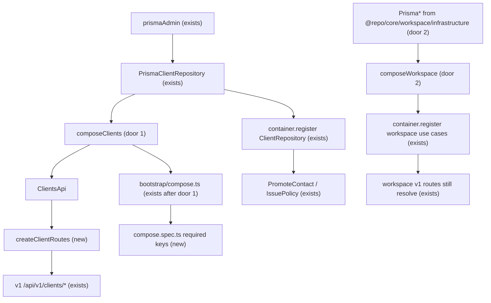

# Phase 2 — Composition foundation (clients template)

Sources:

- `docs/architecture-refactoring-roadmap.md` §12–§13 T2.1 T2.2 T2.3, ADR-2, §5 Composition (target), §8 Dependency Rules, §14 T2.1 first architectural code change, PR 2 — what this phase must change
- `apps/server/src/lib/workspace-queries.ts` — live explicit-composition pattern to copy (`new ResolveMembership(prisma)`, no container)
- `packages/core/src/modules/client/**` — eight application classes plus `PrismaClientRepository` still `@injectable()` / `@inject('ClientRepository')`
- `apps/server/src/routes/v1/clients/**` — every handler `container.resolve`s a client use case; `LgpdDeleteClient` is resolved but **not** registered in `container-registrations.ts` (auto-wired today)
- `apps/server/src/container-registrations.ts` — already `new PrismaClientRepository(prismaAdmin)` then re-registers classes so routes can `resolve`; `PromoteContact` and `IssuePolicy` still `@inject('ClientRepository')`
- `packages/core/src/modules/workspace/index.ts` — still exports `PrismaOrganizationRepository`, `PrismaMemberRepository`, `PrismaInvitationRepository`
- `packages/core/package.json` `exports` — `.`, `./container`, `./notification`, `./legal` only; no infrastructure subpath
- `apps/server/src/__tests__/helpers/mock-use-case.ts` — client route specs mock `container.resolve`
- Confirmed lesson L-002 — not applicable (HTTP bodies stay frozen; this phase does not map new error payloads)
- AD-001, AD-002 — keep roadmap sequencing (explicit composition, not abstract-class tokens); keep cruiser at warn; do not introduce `eslint-plugin-boundaries`

## Problem

HTTP handlers and tests for `clients` still depend on a process-wide `container`. The composition root already constructs `PrismaClientRepository` with `new`, then registers the same objects so routes can `container.resolve(GetClient)`. Dependencies are string tokens (`@inject('ClientRepository')`), so another module can take the client repo without importing the module’s public API. `LgpdDeleteClient` is not even in `container-registrations.ts` — it only works because `@injectable()` auto-wires it. Every later module PR will copy whichever pattern lands here. The evidence the roadmap gives: ~100 routes like `get-client.ts`; workspace queries already avoid the container; ADR-2 replaces MOD-1 abstract-class tokens; T2.1 is the first architectural code change.

When this ships, client v1 routes receive a `ClientsApi` object; `GetClient` has no tsyringe import; a boot spec fails if `composeClients` omits `deleteClient`; `from '@repo/core'` cannot import `PrismaMemberRepository`. Other modules stay on tsyringe. HTTP contracts stay frozen.

## Out of scope

| Excluded | Why |
| --- | --- |
| T6.1 deleting tsyringe / `container.resolve` from remaining modules | This phase is the template; one module at a time |
| Stripping `@injectable` from workspace, contact, policy, or other modules | T2.1: keep other modules on tsyringe |
| Removing `PrismaClientRepository` from `modules/client/index.ts` | T6.2; T2.3 is workspace only |
| Deleting the `'ClientRepository'` container token | `PromoteContact` and `IssuePolicy` still inject it |
| T3.x folder merges | Move-only later; not a composition PR |
| T4.x Prisma out of internal/worker edges | Internal `update-client` already writes Prisma directly; T4.3; needs T1.2 |
| Changing HTTP URLs, `operationId`s, status codes, or OpenAPI bodies | Principle 11; `generate:api` zero unintended diff |
| Flipping cruiser rules to `error` | T6.3 |
| Full `bens-ddd-module` rewrite off `@injectable` | T9.1; this phase only records that `modules/client` is the compose template |
| Chat-server’s six `registerInstance` tokens | T6.1 |
| Subpath exports for `@repo/core/clients` / deleting the root barrel | T6.2 |
| Rewriting CLAUDE.md stack lines that still describe live tsyringe | Accurate until T6.1 |

## Assumptions

| Assumption | Chosen default | Rationale | Confirmed? |
| --- | --- | --- | --- |
| Phase boundary | T2.1 + T2.2 + T2.3 in this feature, three slices, one PR (roadmap PR 2) | User asked for the next phase; Phase 1 is verified; T2.1 depends on T0.2, not on unpushed Phase 1 PRs (those block T3.1 / T4.x, not this) | n |
| Delivery | One PR, three commits: clients compose + routes; boot spec; workspace public surface | Matches “T2.1–T2.3 clients composition template”; each commit green | n |
| Route wiring | Pass `ClientsApi` into v1 client route functions. Do **not** leave client handlers on `container.resolve`. Do **not** only re-register the composed object | ADR-2 and §5 show `getClientRoute(app, clients)`. Re-registering alone preserves the service locator on the request path; later modules would copy the wrong template | n |
| Plugin shape | `createClientRoutes(clients: ClientsApi)` returns the Fastify plugin; `app.ts` does `authenticatedApp.register(createClientRoutes(clients))` | Matches live `createBillingRoutes(redis, asaasProvider)`; Fastify `register` takes a plugin, not `(app, deps)` | n |
| `composeClients` input | `(repo: ClientRepository) => ClientsApi` | T2.1 names a spec that constructs with a fake repo; server does `new PrismaClientRepository(prismaAdmin)` then `composeClients(clientRepo)` | n |
| `ClientsApi` keys | `createClient`, `listClients`, `getClient`, `updateClient`, `deleteClient`, `lgpdDeleteClient`, `exportClientsCsv`, `parseClientImport` — the eight classes v1 routes resolve today | `LgpdDeleteClient` is not in `container-registrations.ts`; omitting it from the API 500s that route once decorators are gone | n |
| Leftover container | Keep `container.register('ClientRepository', { useValue: clientRepo })`. Stop registering the eight client use-case **classes**. Do not touch `PromoteContact` / `IssuePolicy` wiring | Those two inject the token, not `GetClient`. Grep shows no leftover `container.resolve(GetClient\|…)` outside `routes/v1/clients` | n |
| Internal HMAC client routes | Unchanged | Internal `PUT /api/internal/clients/:id` writes Prisma in the route (T4.3), it does not resolve `UpdateClient` | n |
| Workspace compose | `composeWorkspace` takes the three Prisma repos plus collaborators (`cacheService`, `storageProvider`, `invitationEmailNotifier`) and returns the workspace use-case object. Workspace **routes** still `container.resolve`. `container-registrations.ts` registers the composed instances | T2.3 adds compose and stops exporting adapters; it does not migrate workspace routes (T6.1) | n |
| Temporary adapter export | `packages/core/package.json` `exports["./workspace/infrastructure"]` points at a barrel that re-exports the three `Prisma*Repository` classes. `container-registrations.ts` (and `bootstrap/compose.ts` if it news them) import from `@repo/core/workspace/infrastructure` | Package `exports` would otherwise block deep `src/` imports at runtime (tsup `start`); a named subpath is greppable and dies in T6.2 | n |
| Cruiser allowlist | New **warn** rule: `apps/server/src/**` must not import `packages/core/src/modules/.*/infrastructure` except `container-registrations.ts` and `apps/server/src/bootstrap/**`. Document the exception in `docs/architecture/forbidden-deps.md` | T2.3 “allowlisted in cruiser”; AD-002 keeps warn until T6.3 | n |
| Boot spec location | `apps/server/src/bootstrap/compose.ts` is the partial graph (`composeClients` today). `compose.spec.ts` builds it with a fake `ClientRepository` and registers `createClientRoutes` | T2.2 names that folder; expand the spec each later module | n |
| Agent guidance | One bounded edit: `bens-ddd-module` (and a CLAUDE.md skill bullet if it still mandates `@injectable` for new client work) states that `modules/client` uses `composeClients`, not tsyringe. Rest of the skill still describes other modules | AD-001: agents copy the wrong DI; T9.1 is the full rewrite | n |
| Profile | `light` (repo has no `tlc-spec-lean` declaration) | Skill default. Thin for a template every later module copies: light will not notice a test that passes under a wrong `ClientsApi`. Raise to `standard` if you want fault injection on the compose/boot surface | n |

**Open questions:** none - all resolved or logged above.

## Criteria

Grouped by slice - one observable outcome each, never a layer. Numbering runs across the whole plan.

### S1: Compose `clients` without tsyringe (T2.1) (P1)

**Acceptance Criteria**

1. The file `packages/core/src/modules/client/compose-clients.ts` SHALL export a function `composeClients` that accepts a `ClientRepository` and returns an object whose keys include `createClient`, `listClients`, `getClient`, `updateClient`, `deleteClient`, `lgpdDeleteClient`, `exportClientsCsv`, and `parseClientImport`.
2. WHEN `composeClients` is called with a fake `ClientRepository` THEN the returned `getClient` SHALL be an instance whose `execute` method is the `GetClient` application class (same `execute({ id, organizationId })` contract as today).
3. The file `packages/core/src/modules/client/application/get-client.ts` SHALL NOT contain the strings `tsyringe`, `@injectable`, or `@inject`.
4. The system SHALL contain zero files under `packages/core/src/modules/client/` that import `tsyringe`.
5. WHEN `rg "container\\.resolve" apps/server/src/routes/v1/clients` runs THEN it SHALL print zero matching lines.
6. The function `getClientRoute` SHALL take a second parameter of the composed clients API and SHALL call `clients.getClient.execute` (not `container.resolve`).
7. The system SHALL pass the composed clients API into `createClientRoute`, `listClientsRoute`, `updateClientRoute`, `deleteClientRoute`, `lgpdDeleteClientRoute`, `exportClientsRoute`, and `importClientsRoutes`, and those files SHALL NOT import `container` from `@repo/core`.
8. WHEN `apps/server/src/app.ts` registers client HTTP routes THEN it SHALL pass the composed `ClientsApi` into that plugin and SHALL NOT call `clientRoutes(app)` with no clients argument.
9. The file `apps/server/src/container-registrations.ts` SHALL still contain `container.register('ClientRepository'` and SHALL NOT contain `container.register(GetClient`, `container.register(CreateClient`, `container.register(ListClients`, `container.register(UpdateClient`, `container.register(DeleteClient`, `container.register(ExportClientsCsv`, or `container.register(ParseClientImport`.
10. The existing client application specs under `packages/core/src/modules/client/application/*.spec.ts` SHALL still construct use cases with `new GetClient(repo)` (or the sibling class) and SHALL pass.
11. The v1 client route specs SHALL pass a fake `ClientsApi` into the route under test and SHALL NOT call `mockResolve` / `container.resolve` to stub the client use case.
12. WHEN `GetClient.execute` is invoked with an id that the repository does not find THEN it SHALL still throw `ClientNotFoundError` with the same `code` as today (`CLIENT_NOT_FOUND`).
13. The OpenAPI `operationId` values `getClient`, `listClients`, `createClient`, `updateClient`, `deleteClient`, `lgpdDeleteClient`, `exportClients`, `importTemplateClients` SHALL remain on the same method and URL as they have today.

**Independent test:** `pnpm --filter @repo/core exec vitest run src/modules/client/`; `pnpm --filter @app/server exec vitest run src/routes/v1/clients`; `rg` on client routes, `get-client.ts`, `container-registrations.ts`, `app.ts`.

### S2: Server boot composition spec (T2.2) (P1)

**Acceptance Criteria**

14. The file `apps/server/src/bootstrap/compose.ts` SHALL export a function that, given a `ClientRepository`, returns a graph object that includes the `ClientsApi` from `composeClients`.
15. The file `apps/server/src/bootstrap/compose.spec.ts` SHALL construct that graph with a fake `ClientRepository` and SHALL register `createClientRoutes` (or `getClientRoute`) on a Fastify instance without throwing.
16. WHEN the object returned by `composeClients` is missing the key `deleteClient` THEN `apps/server/src/bootstrap/compose.spec.ts` SHALL fail (the spec enumerates required keys including `deleteClient`).
17. IF `composeClients` omits `lgpdDeleteClient` THEN that same spec SHALL fail.

**Independent test:** `pnpm --filter @app/server exec vitest run src/bootstrap/compose.spec.ts`; temporarily drop `deleteClient` from the expected-key list’s counterpart in compose and watch the spec go red.

### S3: Workspace public API drops Prisma adapters (T2.3) (P1)

**Acceptance Criteria**

18. The file `packages/core/src/modules/workspace/index.ts` SHALL NOT export `PrismaOrganizationRepository`, `PrismaMemberRepository`, or `PrismaInvitationRepository`.
19. WHEN a TypeScript file contains `import { PrismaMemberRepository } from '@repo/core'` THEN `tsc` SHALL fail to resolve that named export.
20. The file `packages/core/package.json` `exports` SHALL contain the key `./workspace/infrastructure` whose target re-exports the three Prisma workspace repositories.
21. The file `apps/server/src/container-registrations.ts` SHALL import `PrismaOrganizationRepository`, `PrismaMemberRepository`, and `PrismaInvitationRepository` from `@repo/core/workspace/infrastructure` and SHALL NOT import those three names from `@repo/core`.
22. The file `packages/core/src/modules/workspace/compose-workspace.ts` SHALL export `composeWorkspace` that accepts the three workspace repositories plus the collaborators named in Assumptions and returns an object that includes `getOrganization`, `listMembers`, and `createInvitation`.
23. The file `.dependency-cruiser.cjs` SHALL contain a `forbidden` rule with `severity` `warn` whose `from` matches `apps/server/src` and whose `to` matches core module `infrastructure` paths, with `pathNot` (or equivalent) excluding `container-registrations.ts` and `apps/server/src/bootstrap`.
24. WHEN a file at `apps/server/src/routes/v1/canary-forbidden-infrastructure-import.ts` in an isolated fixture tree imports a core module `infrastructure` file THEN `depcruise --config .dependency-cruiser.cjs` on that tree SHALL report that new rule.
25. WHEN `depcruise` runs on `apps/server/src/container-registrations.ts` importing `@repo/core/workspace/infrastructure` THEN it SHALL NOT report that new rule for that file.
26. The file `docs/architecture/forbidden-deps.md` SHALL name the temporary allowlist (`container-registrations.ts`, `bootstrap/`) and SHALL state it clears when T6.1/T6.2 land.
27. The system SHALL keep workspace v1 route specs passing; those handlers MAY still call `container.resolve`.
28. The `bens-ddd-module` skill SHALL state that `packages/core/src/modules/client` is composed with `composeClients` and SHALL NOT require `@injectable` on new client use cases.

**Independent test:** `rg PrismaMemberRepository` on `workspace/index.ts` and `@repo/core` imports; `pnpm --filter @repo/core typecheck`; `pnpm --filter @app/server exec vitest run src/routes/v1/members src/routes/v1/organization src/routes/v1/invitations`; cruiser fixture; `rg composeClients` in the skill file.

## Traceability

| ID | Slice | Criteria | Status |
| --- | --- | --- | --- |
| COMP-01 | S1 | 1, 2, 16, 17 | Implementing |
| COMP-02 | S1 | 3, 4 | Implementing |
| COMP-03 | S1 | 5, 6, 7, 8 | Implementing |
| COMP-04 | S1 | 9 | Implementing |
| COMP-05 | S1 | 10, 11, 12 | Implementing |
| HTTP-01 | S1 | 13 | Implementing |
| BOOT-01 | S2 | 14, 15, 16, 17 | Implementing |
| SURF-01 | S3 | 18, 19, 20, 21 | Implementing |
| SURF-02 | S3 | 22 | Implementing |
| SURF-03 | S3 | 23, 24, 25, 26 | Implementing |
| SURF-04 | S3 | 27, 28 | Implementing |

**ID format:** `CATEGORY-NUMBER`. **Status:** Pending → In checks → Implementing → Verified.

## Observable

| Surface | Decision | Landing |
| --- | --- | --- |
| API `GET /api/v1/clients/:id` | error shape and codes | existing - `handleDomainError` + AC 12 (`CLIENT_NOT_FOUND`); HTTP status map unchanged |
| API `GET /api/v1/clients/:id` | who may call it | existing - `requireAbility('read', 'Client')` |
| API `GET /api/v1/clients/:id` | versioning | n/a - `/api/v1` frozen this phase (AC 13) |
| API `GET /api/v1/clients/:id` | rate limit | existing - global Fastify rate limit in `app.ts` |
| API `GET /api/v1/clients` | error shape and codes | existing - same list handler, `handleDomainError` |
| API `GET /api/v1/clients` | who may call it | existing - `requireAbility('read', 'Client')` |
| API `GET /api/v1/clients` | versioning | n/a - frozen (AC 13) |
| API `GET /api/v1/clients` | rate limit | existing - global limiter |
| API `POST /api/v1/clients` | error shape and codes | existing - `CLIENT_ALREADY_EXISTS` / validation via Zod + `handleDomainError` |
| API `POST /api/v1/clients` | who may call it | existing - `requireAbility('create', 'Client')` |
| API `POST /api/v1/clients` | versioning | n/a - frozen (AC 13) |
| API `POST /api/v1/clients` | rate limit | existing - global limiter |
| API `PUT /api/v1/clients/:id` | error shape and codes | existing - `handleDomainError` |
| API `PUT /api/v1/clients/:id` | who may call it | existing - `requireAbility('update', 'Client')` |
| API `PUT /api/v1/clients/:id` | versioning | n/a - frozen (AC 13) |
| API `PUT /api/v1/clients/:id` | rate limit | existing - global limiter |
| API `DELETE /api/v1/clients/:id` | error shape and codes | existing - `handleDomainError` |
| API `DELETE /api/v1/clients/:id` | who may call it | existing - `requireAbility('delete', 'Client')` |
| API `DELETE /api/v1/clients/:id` | versioning | n/a - frozen (AC 13) |
| API `DELETE /api/v1/clients/:id` | rate limit | existing - global limiter |
| API `POST /api/v1/clients/:id/lgpd-delete` | error shape and codes | existing - `handleDomainError`; AC 1/17 keep `lgpdDeleteClient` on the composed API |
| API `POST /api/v1/clients/:id/lgpd-delete` | who may call it | existing - ability preHandler on that route |
| API `POST /api/v1/clients/:id/lgpd-delete` | versioning | n/a - frozen (AC 13) |
| API `POST /api/v1/clients/:id/lgpd-delete` | rate limit | existing - global limiter |
| API `GET /api/v1/clients/export` | error shape and codes | existing - export handler + `handleDomainError` |
| API `GET /api/v1/clients/export` | who may call it | existing - `requireAbility` on that route |
| API `GET /api/v1/clients/export` | versioning | n/a - frozen (AC 13) |
| API `GET /api/v1/clients/export` | rate limit | existing - global limiter |
| API `POST /api/v1/clients/import` | error shape and codes | existing - `ParseClientImport` + CSV enqueue errors |
| API `POST /api/v1/clients/import` | who may call it | existing - `requireAbility` on that route |
| API `POST /api/v1/clients/import` | versioning | n/a - frozen (AC 13) |
| API `POST /api/v1/clients/import` | rate limit | existing - global limiter |
| command `composeClients` / boot spec | output format | AC 1, 14 - `ClientsApi` object |
| command `composeClients` / boot spec | flags and defaults | AC 1 - single `ClientRepository` argument, no extra flags |
| command `composeClients` / boot spec | exit codes | AC 15, 16, 17 - Vitest non-zero when a required key is missing or register throws |
| command `composeClients` / boot spec | prints when it fails halfway | existing - Vitest assertion message names the missing key |
| command `tsc` (`PrismaMemberRepository` from `@repo/core`) | error shape / codes | AC 19 - named export missing |
| command `tsc` (`PrismaMemberRepository` from `@repo/core`) | flags and defaults | n/a - package public types, not a CLI flag |
| command `tsc` (`PrismaMemberRepository` from `@repo/core`) | exit codes | AC 19 - `tsc --noEmit` non-zero |
| command `tsc` (`PrismaMemberRepository` from `@repo/core`) | prints when it fails halfway | AC 19 - TS2305 / no exported member |
| command `pnpm arch:check` (new infrastructure rule) | error shape / rule name | AC 23, 24 - warn, fixture reports the rule |
| command `pnpm arch:check` (new infrastructure rule) | flags and defaults | AC 23 - same `--config .dependency-cruiser.cjs` |
| command `pnpm arch:check` (new infrastructure rule) | exit codes | existing - warn mode still exits 0 (AD-002) |
| command `pnpm arch:check` (new infrastructure rule) | prints when it fails halfway | AC 24 - depcruise prints the rule name |
| document `docs/architecture/forbidden-deps.md` | structure | AC 26 - allowlist section |
| document `docs/architecture/forbidden-deps.md` | tone / depth | n/a - hotspot list, not a guide |
| document `docs/architecture/forbidden-deps.md` | what the reader does next | AC 26 - import adapters only from compose/container until T6.2 |
| document `bens-ddd-module` skill | structure | AC 28 - client compose vs remaining `@injectable` modules |
| document `bens-ddd-module` skill | tone / depth | n/a - one bounded correction, not T9.1 rewrite |
| document `bens-ddd-module` skill | what the reader does next | AC 28 - copy `composeClients` for client work |
| collection `ClientsApi` keys | grouping criterion | AC 1 - the eight v1-resolved use cases |
| collection `ClientsApi` keys | naming | AC 1, 6 - camelCase matching class intent (`getClient`, not `GetClient`) |
| collection `ClientsApi` keys | ordering | n/a - object key order is not part of the contract |
| collection `ClientsApi` keys | duplicates | n/a - one key per use case |
| collection `ClientsApi` keys | exception that does not fit | AC 9 - `'ClientRepository'` token stays in the container for contact/policy; not a `ClientsApi` key |
| collection workspace public exports | grouping criterion | AC 18 - use cases, errors, types; no Prisma adapters |
| collection workspace public exports | naming | AC 18, 19 - `PrismaMemberRepository` name gone from `@repo/core` |
| collection workspace public exports | ordering | n/a - barrel order |
| collection workspace public exports | duplicates | n/a - adapters move to the infrastructure subpath only |
| collection workspace public exports | exception that does not fit | AC 20, 21 - temporary `./workspace/infrastructure` export for the composition root |

## Flow

This reuses `workspace-queries.ts` (`new UseCase(prisma)`, no container) and the existing `createBillingRoutes(deps)` Fastify factory. Client application specs already `new GetClient(repo)` — they do not need a container. `container-registrations.ts` stays the composition root for every module except `clients` routes.

1. `prismaAdmin` -> `PrismaClientRepository` (exists) - constructed with `new`, handed to `composeClients`
2. `composeClients` (door 1) - returns `ClientsApi`; no tsyringe in `modules/client`
3. `createClientRoutes(clients)` (new - placement) - Fastify plugin; handlers call `clients.*.execute`
4. `'ClientRepository'` token (exists) - same repo instance, leftover consumers only
5. `@repo/core/workspace/infrastructure` (door 2) - composition root imports the three Prisma workspace repos
6. `composeWorkspace` (door 2) - returns workspace use cases; `container-registrations.ts` (exists) registers those instances; workspace routes still `resolve`
7. `bootstrap/compose.ts` (exists after door 1) + `compose.spec.ts` (new - placement) - fake repo, required keys include `deleteClient` and `lgpdDeleteClient`, plugin registers
8. out: HTTP unchanged; `from '@repo/core'` has no `PrismaMemberRepository`

## Relations

None - no stored-data shape change

## Surface

None - HTTP contracts frozen; no new external consumer. `ClientsApi` and `./workspace/infrastructure` are in-repo composition signatures (Landing), not published HTTP.

## Landing

| One-way door | Literal shape | Alternative rejected |
| --- | --- | --- |
| Explicit `ClientsApi` composition (the template later modules copy) | `composeClients(repo: ClientRepository): ClientsApi` in `packages/core/src/modules/client/compose-clients.ts`; `ClientsApi` keys exactly `createClient`, `listClients`, `getClient`, `updateClient`, `deleteClient`, `lgpdDeleteClient`, `exportClientsCsv`, `parseClientImport`; each value is `new ThatUseCase(repo)`; route factory `createClientRoutes(clients: ClientsApi)`; no `tsyringe` import under `modules/client/` | Keep tsyringe with abstract class tokens — ADR-2 rejected (still a global container, still decorators). Register only the composed object on the container and leave routes on `container.resolve` — request path still a service locator, so T6.1 copies the wrong template. Delete repository types — ADR-2 rejected (hurts fakes) |
| Workspace public index drops Prisma adapters | `modules/workspace/index.ts` has no `export { PrismaOrganizationRepository }`, `PrismaMemberRepository`, or `PrismaInvitationRepository`; `packages/core/package.json` `exports["./workspace/infrastructure"]` re-exports those three classes; server composition root imports `@repo/core/workspace/infrastructure`; cruiser **warn** rule `no-core-infrastructure-from-apps` with allowlist `container-registrations.ts` + `src/bootstrap/**` | Keep exporting Prisma adapters from the workspace index until T6.2 — T2.3 done-when fails and apps keep treating adapters as the public API. Deep `from '@repo/core/src/modules/...'` without an `exports` key — Node/tsup honor `exports` and the import breaks at runtime. `eslint-plugin-boundaries` — AD-002 |

- Nothing else in this change is hard to reverse (decorator deletion, spec helper swap, skill one-liner). Reversing the template after sales/servicing copy it is costly, which is why T2.1 is one module and a boot spec.

## Impact

| Front | What changes |
| --- | --- |
| domain | new term: `ClientsApi` — the object `composeClients` returns and v1 client routes take. Lives in `packages/core/src/modules/client`. Who copies it next: every T6.1 module PR |
| domain | existing term: `container.resolve` on a client v1 handler meant “the use case”. It now means a bug; those handlers receive `ClientsApi`. Who branches on it today: `mock-use-case.ts` (still used by non-client route specs), `apps/server/src/routes/v1/clients/__tests__/*` |
| domain | existing term: `PrismaMemberRepository` was a public `@repo/core` export. It now lives only at `@repo/core/workspace/infrastructure`. Who branches on it today: `apps/server/src/container-registrations.ts` |
| stored data | nothing to migrate |
