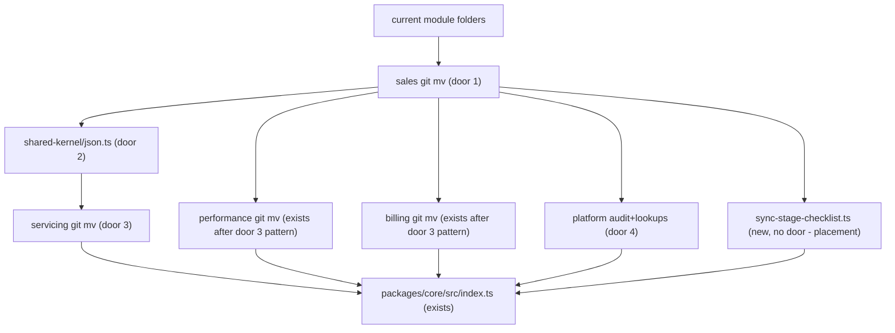

# Phase 3 — Module merges (sales, servicing, performance, billing, platform)

Sources:

- `docs/architecture-refactoring-roadmap.md` §7 Domain map, §12 Phase 3, §13 T3.1–T3.5, §14 order, PR 3 / 3b–3d / 4 — what this phase must change
- `packages/core/src/modules/{contact,proposal,policy,endorsement,claim,occurrence,assistance,goal,dashboard,subscription,ai-usage,audit,cep,vehicle-lookup}` — live folders and barrels
- `packages/core/src/index.ts` — root barrel `export *` from those module indexes
- `.dependency-cruiser.cjs` `no-circular` + `docs/architecture/forbidden-deps.md` cycle table — proposal⇄contact, proposal⇄policy, proposal⇄document, goal⇄dashboard
- `packages/core/src/modules/endorsement/domain/endorsement-repository.ts` imports `JsonObject` from occurrence; `occurrence-repository.ts` imports `JsonValue` from policy
- `packages/core/src/modules/proposal/application/create-proposal.ts` and `advance-proposal-stage.ts` — duplicated checklist `createMany` + auto-detect loops (`client_data`, `driver_license`, `vehicle_registration`)
- `packages/core/src/platform/storage/storage-provider.ts` — storage port already outside `modules/document`
- Confirmed lesson L-002 — not applicable (HTTP bodies stay frozen; no new mapped errors)
- AD-001, AD-002 — keep roadmap sequencing (explicit composition later, not this PR); keep cruiser at warn

## Problem

Sales is one language and one lifecycle (lead → proposal → policy → endorsement) split across four modules that import each other. Servicing (claim, occurrence, assistance) and performance (goal, dashboard) are the same fragmentation. Reviewers and agents treat CEP, vehicle-lookup, and audit as domains. Type-only `JsonValue` / `JsonObject` couple endorsement to occurrence and occurrence to policy, so a folder merge still leaves a cross-module type import. create-proposal and advance-proposal-stage each copy the checklist `createMany` + three-key auto-detect loop. The evidence the roadmap gives: production cycles proposal⇄contact, proposal⇄policy, goal⇄dashboard; ~70 files in the sales cluster; T3.1 is the highest-cohesion merge.

When this ships, those clusters live under `sales`, `servicing`, `performance`, `billing`, and `platform`; `shared-kernel/json.ts` owns JSON types; both proposal use cases call one unexported checklist helper; HTTP contracts and tsyringe on non-client modules stay as they are.

## Out of scope

| Excluded | Why |
| --- | --- |
| T4.2 invert documents → proposals (`AttachProposalDocument`) | Separate high-risk PR; document still imports `AutoCompleteChecklistItems` after the path update |
| T6.1 `composeSales` / stripping `@injectable` from merged modules | Phase 6; this phase is move-then-change, then one helper |
| T6.2 delete root barrel / subpath `@repo/core/sales` as the only import | Compatibility barrel stays |
| T5.3 `CreateCommissionForPolicy` / T5.4 money kernel | After sales exists; not a merge |
| T8.5 Claim/Assistance state machines into entities | After servicing merge, own task |
| Renaming ERP `Contact` → Lead in code, or chat Contact → Participant | Folder is `leads`; class/table stay `Contact`. ADR-6 is opportunistic on chat |
| Moving `R2StorageProvider` / `LocalStorageProvider` out of documents | Port type already lives in `platform/storage`; T3.4 parenthetical does not apply |
| Moving csv/cache from `packages/core/src/shared/` into `shared-kernel` | T3.2 is JSON types only |
| Changing HTTP URLs, `operationId`s, status codes, or OpenAPI bodies | Principle 11 |
| Flipping cruiser to `error` | T6.3 |
| Creating `packages/conversations` or extra packages | ADR-6, principle 1 |
| Fixing CSV/chat lead quirks, alert diacritics, or other product bugs | Principle 12 |

## Assumptions

| Assumption | Chosen default | Rationale | Confirmed? |
| --- | --- | --- | --- |
| Phase boundary | T3.1–T3.5 in this feature, five slices, four PRs | User asked for the next roadmap phase; Phase 2 is verified; roadmap PR 3 / 3c / 3d / 4. T3.2 rides with T3.1 (below) | n |
| Delivery | PR 3 = T3.1 + T3.2. PR 3c = T3.3. PR 3d = T3.4. PR 4 = T3.5 | T3.2 is 3–4 files; doing T3.1 without it retargets occurrence→policy to occurrence→sales and creates a new DAG edge. Roadmap listed PR 3b separately; same-PR is the smaller blast | n |
| Sales layout | `modules/sales/{leads,proposals,policies}` with endorsement at `policies/endorsement/` | T3.1 names those three plus endorsement under policies. Nested endorsement keeps it a policy sub-lifecycle, not a fourth peer. Class names stay `Contact`, `Proposal`, `Policy`, `Endorsement` | n |
| Servicing layout | `modules/servicing/{claims,occurrences,assistance}` | T3.3 names those three. Mirrors sales subfolders | n |
| Performance / billing layout | `modules/performance/{goals,dashboard}`; `modules/billing/{subscription,ai-usage}` | T3.4 merge pairs; subfolders preserve current files | n |
| Platform location | `packages/core/src/platform/{audit,lookups}` as a **sibling** of `modules/`, not `modules/platform`. `lookups/{cep,vehicle}` hold today’s cep and vehicle-lookup trees. Existing `platform/storage/` stays | Roadmap target tree puts platform next to modules. Putting it under `modules/platform` would make lookups a “domain module” again (H1) | n |
| Barrel compatibility | Each new `index.ts` re-exports the union of the old indexes with the **same symbol names**. `packages/core/src/index.ts` `export *` from the new indexes and drops the old paths. Apps keep `from '@repo/core'` | T3.1 “root barrel re-exports old names”; T6.2 is the later cut | n |
| Move then change | T3.1–T3.4 are `git mv` + import-path + barrel updates only. No use-case body edits, no tsyringe removal, no HTTP edits. T3.5 is the only logic slice | Roadmap “Move-only PRs. No logic edits” then T3.5 | n |
| Document path update | T3.1 updates `document/application/upload-document.ts` relative import to the new proposals path. Behaviour unchanged | File would not compile after `git mv` otherwise; T4.2 still owns the invert | n |
| Cruiser / hotspots | `no-circular` stays `warn`. `forbidden-deps.md` removes proposal⇄contact and proposal⇄policy as **cross-module** hotspots after T3.1 (they become intra-sales). proposal⇄document stays until T4.2. goal⇄dashboard clears at T3.4 | AD-002 keeps warn; the table is the human baseline | n |
| `generate:api` | Not run in this phase. Proof of frozen HTTP is: `apps/server/src/routes` has no changes to `method`, `url`, or `operationId` string literals (expected: zero route file edits) | Orval needs server :3001; move-only core folders cannot change OpenAPI if routes are untouched | n |
| Checklist helper | `sales/proposals/application/sync-stage-checklist.ts`, not exported from `sales/index.ts` or the root barrel. Both `CreateProposal` and `AdvanceProposalStage` call it for `createMany` + the three auto-detect keys | T3.5 names that file and “not exported” | n |
| Profile | `light` (repo has no `tlc-spec-lean` declaration) | Skill default. Thin for a merge: light will not notice a missing re-exported symbol. Raise to `standard` if you want the Coverage join recomputed over barrel names | n |

**Open questions:** none - all resolved or logged above.

## Criteria

Grouped by slice - one observable outcome each, never a layer. Numbering runs across the whole plan.

### S1: Merge sales folders (T3.1) (P1)

**Acceptance Criteria**

1. The directories `packages/core/src/modules/contact`, `packages/core/src/modules/proposal`, `packages/core/src/modules/policy`, and `packages/core/src/modules/endorsement` SHALL NOT exist.
2. The directories `packages/core/src/modules/sales/leads`, `packages/core/src/modules/sales/proposals`, `packages/core/src/modules/sales/policies`, and `packages/core/src/modules/sales/policies/endorsement` SHALL exist.
3. The file `packages/core/src/modules/sales/index.ts` SHALL export the names `CreateContact`, `CreateProposal`, `IssuePolicy`, and `CreateEndorsement` (the union of the four old public indexes, same symbol names).
4. The file `packages/core/src/index.ts` SHALL contain `export *` from `./modules/sales/index.js` and SHALL NOT contain `export *` from `./modules/contact/index.js`, `./modules/proposal/index.js`, `./modules/policy/index.js`, or `./modules/endorsement/index.js`.
5. WHEN a TypeScript file under `packages/core/src/modules/sales/proposals` imports `ContactRepository` THEN that import SHALL resolve under `modules/sales/leads` (not a path containing `modules/contact`).
6. WHEN a TypeScript file under `packages/core/src/modules/sales/policies` (excluding `endorsement/`) imports `ProposalRepository` THEN that import SHALL resolve under `modules/sales/proposals` (not a path containing `modules/proposal`).
7. WHEN `pnpm --filter @repo/core test` runs THEN it SHALL exit 0.
8. The files under `apps/server/src/routes` SHALL keep the `operationId` values `getProposal`, `createProposal`, `issuePolicy`, `createContact`, and `createEndorsement` on the same `method` and `url` they have today.
9. The file `packages/core/src/modules/sales/proposals/application/create-proposal.ts` SHALL still contain `@injectable` or `from 'tsyringe'` (move-only: tsyringe stays until T6.1).
10. The file `docs/architecture/forbidden-deps.md` SHALL NOT list `proposal⇄contact` or `proposal⇄policy` as live cross-module hotspots, and SHALL still list `proposal⇄document` as clearing at T4.2.

**Independent test:** `test -d` / `rg` on the four old dirs and `sales/index.ts`; `pnpm --filter @repo/core test`; `rg operationId` on the five route files; `rg` on forbidden-deps.md.

### S2: Shared JSON types (T3.2) (P1)

**Acceptance Criteria**

11. The file `packages/core/src/shared-kernel/json.ts` SHALL export the types `JsonValue` and `JsonObject`.
12. WHEN `rg "from ['\\\"].*occurrence" packages/core/src/modules/sales/policies/endorsement` runs THEN it SHALL print zero matching lines.
13. WHEN `rg "from ['\\\"].*policy-repository" packages/core/src/modules` (after T3.3: under `servicing/occurrences`) runs THEN occurrence SHALL NOT import `JsonValue` from a policy or sales path.
14. The file `packages/core/src/modules/sales/policies/domain/policy-repository.ts` SHALL import `JsonValue` from `shared-kernel/json` (or a relative path that ends at `shared-kernel/json`) rather than declaring a second `JsonValue` type alias.

**Independent test:** `rg JsonValue JsonObject` on shared-kernel and the endorsement/occurrence files; `pnpm --filter @repo/core test`.

### S3: Merge servicing (T3.3) (P1)

**Acceptance Criteria**

15. The directories `packages/core/src/modules/claim`, `packages/core/src/modules/occurrence`, and `packages/core/src/modules/assistance` SHALL NOT exist.
16. The directories `packages/core/src/modules/servicing/claims`, `packages/core/src/modules/servicing/occurrences`, and `packages/core/src/modules/servicing/assistance` SHALL exist.
17. The file `packages/core/src/modules/servicing/index.ts` SHALL export the names `CreateClaim`, `CreateOccurrence`, and `CreateAssistance`.
18. The file `packages/core/src/index.ts` SHALL contain `export *` from `./modules/servicing/index.js` and SHALL NOT contain `export *` from `./modules/claim/index.js`, `./modules/occurrence/index.js`, or `./modules/assistance/index.js`.
19. WHEN `create-occurrence.ts` imports `ClaimRepository` THEN that import SHALL resolve under `modules/servicing/claims`.
20. WHEN `pnpm --filter @repo/core test` runs after this slice THEN it SHALL exit 0.

**Independent test:** directory existence; `rg export` on servicing/index.ts; core tests.

### S4: Merge performance, billing, platform (T3.4) (P1)

**Acceptance Criteria**

21. The directories `packages/core/src/modules/goal` and `packages/core/src/modules/dashboard` SHALL NOT exist; `packages/core/src/modules/performance/goals` and `packages/core/src/modules/performance/dashboard` SHALL exist.
22. The directories `packages/core/src/modules/subscription` and `packages/core/src/modules/ai-usage` SHALL NOT exist; `packages/core/src/modules/billing/subscription` and `packages/core/src/modules/billing/ai-usage` SHALL exist.
23. The directories `packages/core/src/modules/audit`, `packages/core/src/modules/cep`, and `packages/core/src/modules/vehicle-lookup` SHALL NOT exist; `packages/core/src/platform/audit`, `packages/core/src/platform/lookups/cep`, and `packages/core/src/platform/lookups/vehicle` SHALL exist.
24. The file `packages/core/src/index.ts` SHALL `export *` from `./modules/performance/index.js`, `./modules/billing/index.js`, and the platform entry points that re-export today’s audit/cep/vehicle-lookup public names, and SHALL NOT `export *` from the seven old module paths listed in AC 21–23.
25. WHEN `rg "from ['\\\"].*dashboard" packages/core/src/modules/performance/goals` runs THEN matching imports SHALL resolve under `modules/performance/dashboard` (not `modules/dashboard`).
26. The file `docs/architecture/forbidden-deps.md` SHALL NOT list `goal⇄dashboard` as a live cross-module hotspot.
27. The directory `packages/core/src/platform/storage` SHALL still exist (already present; not moved in this slice).
28. WHEN `pnpm --filter @repo/core test` runs after this slice THEN it SHALL exit 0.

**Independent test:** directory existence; core barrel; forbidden-deps.md; core tests.

### S5: Deduplicate proposal checklist sync (T3.5) (P2)

**Acceptance Criteria**

29. The file `packages/core/src/modules/sales/proposals/application/sync-stage-checklist.ts` SHALL exist and SHALL NOT be exported from `packages/core/src/modules/sales/index.ts`.
30. WHEN `CreateProposal.execute` persists a new proposal whose checklist config returns items THEN it SHALL call the helper in `sync-stage-checklist.ts` (not a second inlined `checklistRepo.createMany` of `{ itemKey, label, isRequired }`).
31. WHEN `AdvanceProposalStage` regenerates checklist items THEN it SHALL call that same helper.
32. The helper SHALL still invoke auto-complete for the item keys `client_data`, `driver_license`, and `vehicle_registration` in that order.
33. WHEN the create-proposal characterization spec runs with config items `[{ itemKey: 'client_data', label: 'Dados do cliente', isRequired: true }]` THEN `checklistRepo.createMany` SHALL be called with that `itemKey`, `label`, and `isRequired` (same keys as today’s create-proposal spec).
34. The file `sync-stage-checklist.ts` SHALL NOT be a named export of `@repo/core`.

**Independent test:** `rg sync-stage-checklist` on sales/index.ts (zero); create-proposal.spec + advance-proposal-stage.spec still green; a spec that imports the helper from `@repo/core` fails to resolve.

## Traceability

| ID | Slice | Criteria | Status |
| --- | --- | --- | --- |
| SALE-01 | S1 | 1, 2 | Pending |
| SALE-02 | S1 | 3, 4 | Pending |
| SALE-03 | S1 | 5, 6 | Pending |
| SALE-04 | S1 | 7, 9 | Pending |
| HTTP-01 | S1 | 8 | Pending |
| SALE-05 | S1 | 10 | Pending |
| JSON-01 | S2 | 11, 12, 13, 14 | Pending |
| SERV-01 | S3 | 15, 16, 17, 18 | Pending |
| SERV-02 | S3 | 19, 20 | Pending |
| MERG-01 | S4 | 21, 22, 23, 24 | Pending |
| MERG-02 | S4 | 25, 26, 27, 28 | Pending |
| CHK-01 | S5 | 29, 30, 31, 34 | Pending |
| CHK-02 | S5 | 32, 33 | Pending |

**ID format:** `CATEGORY-NUMBER`. **Status:** Pending → In checks → Implementing → Verified.

## Observable

| Surface | Decision | Landing |
| --- | --- | --- |
| command `pnpm --filter @repo/core test` | output format | AC 7, 20, 28 - Vitest reporter, exit 0 |
| command `pnpm --filter @repo/core test` | flags and defaults | existing - package vitest config, no new flags |
| command `pnpm --filter @repo/core test` | exit codes | AC 7, 20, 28 - 0 on green |
| command `pnpm --filter @repo/core test` | prints when it fails halfway | existing - Vitest names the failing example |
| command `git` / directory layout | output format | AC 1, 2, 15, 16, 21, 22, 23 - paths exist or do not |
| command `git` / directory layout | flags and defaults | n/a - filesystem, not a CLI flag of this feature |
| command `git` / directory layout | exit codes | n/a - proofs are `test -d` / `rg`, not git-mv’s exit |
| command `git` / directory layout | prints when it fails halfway | n/a - move-only; a half-move fails typecheck (AC 7) |
| command frozen OpenAPI (`operationId`) | error shape / codes | n/a - no new HTTP errors; contracts frozen |
| command frozen OpenAPI (`operationId`) | flags and defaults | n/a - literals on existing route files |
| command frozen OpenAPI (`operationId`) | exit codes | AC 8 - `rg` finds the same method/url/operationId |
| command frozen OpenAPI (`operationId`) | prints when it fails halfway | n/a - static string check |
| document `docs/architecture/forbidden-deps.md` | structure | AC 10, 26 - cycle table rows |
| document `docs/architecture/forbidden-deps.md` | tone / depth | n/a - hotspot list, not a guide |
| document `docs/architecture/forbidden-deps.md` | what the reader does next | AC 10 - treat proposal⇄document as remaining until T4.2 |
| collection sales subfolders | grouping criterion | AC 2 - leads / proposals / policies / policies/endorsement |
| collection sales subfolders | naming | AC 2, 3 - folder `leads`, symbols still `Contact*` |
| collection sales subfolders | ordering | n/a - directory listing order is not a contract |
| collection sales subfolders | duplicates | n/a - old folders are deleted (AC 1), not aliased |
| collection sales subfolders | exception that does not fit | AC 9 - tsyringe remains inside the moved files |
| collection servicing subfolders | grouping criterion | AC 16 - claims / occurrences / assistance |
| collection servicing subfolders | naming | AC 17 - `CreateClaim` et al. unchanged |
| collection servicing subfolders | ordering | n/a - directory listing |
| collection servicing subfolders | duplicates | n/a - old folders deleted (AC 15) |
| collection servicing subfolders | exception that does not fit | n/a - no leftover module after the move |
| collection performance / billing / platform | grouping criterion | AC 21, 22, 23 - pairs plus platform sibling |
| collection performance / billing / platform | naming | AC 24 - public symbol names unchanged |
| collection performance / billing / platform | ordering | n/a - directory listing |
| collection performance / billing / platform | duplicates | n/a - old folders deleted |
| collection performance / billing / platform | exception that does not fit | AC 27 - `platform/storage` already existed |
| collection `JsonValue` / `JsonObject` | grouping criterion | AC 11 - both types in one file |
| collection `JsonValue` / `JsonObject` | naming | AC 11 - `JsonValue`, `JsonObject` |
| collection `JsonValue` / `JsonObject` | ordering | n/a - type export order |
| collection `JsonValue` / `JsonObject` | duplicates | AC 14 - policy stops declaring a second `JsonValue` |
| collection `JsonValue` / `JsonObject` | exception that does not fit | n/a - Prisma `InputJsonValue` stays Prisma-side |
| collection checklist auto-detect keys | grouping criterion | AC 32 - the three keys already used |
| collection checklist auto-detect keys | naming | AC 32 - `client_data`, `driver_license`, `vehicle_registration` |
| collection checklist auto-detect keys | ordering | AC 32 - that order |
| collection checklist auto-detect keys | duplicates | n/a - one pass per key |
| collection checklist auto-detect keys | exception that does not fit | n/a - empty config still skips createMany (existing create-proposal spec) |

## Flow

This reuses `git mv` plus the existing root barrel (`export *` of the same symbol names) so apps keep `from '@repo/core'`. Client `composeClients` is untouched. Document still calls `AutoCompleteChecklistItems` (path update only). Storage stays at `platform/storage`.

1. `git mv` contact/proposal/policy/endorsement -> `modules/sales/{leads,proposals,policies/endorsement}` (door 1) - intra-sales relative imports; `sales/index.ts` union; core barrel points at sales
2. `shared-kernel/json.ts` (door 2) - endorsement and occurrence (then servicing/occurrences) import JSON types from here; policy-repository stops declaring `JsonValue`
3. `git mv` claim/occurrence/assistance -> `modules/servicing/{claims,occurrences,assistance}` (door 3) - `create-occurrence` imports claims locally; servicing union index
4. `git mv` goal+dashboard -> `modules/performance/{goals,dashboard}`; subscription+ai-usage -> `modules/billing/{subscription,ai-usage}` (door 3 pattern, no new door)
5. `git mv` audit/cep/vehicle-lookup -> `platform/{audit,lookups/cep,lookups/vehicle}` (door 4) - sibling of `modules/`; `platform/storage` unchanged
6. `sync-stage-checklist.ts` (new - placement under proposals/application) - both proposal use cases call it; not on the public index
7. out: `@repo/core` symbol names unchanged; HTTP routes untouched; `forbidden-deps.md` cycle table matches remaining cross-module hotspots

## Relations

None - no stored-data shape change

## Surface

None - nothing consumed outside. HTTP frozen; `@repo/core` keeps the same exported names (Landing), not a new published contract.

## Landing

| One-way door | Literal shape | Alternative rejected |
| --- | --- | --- |
| Sales folder map (later modules copy this) | `packages/core/src/modules/sales/leads/`, `sales/proposals/`, `sales/policies/`, `sales/policies/endorsement/`; `sales/index.ts` re-exports the union of the four old indexes with unchanged names (`CreateContact`, `CreateProposal`, `IssuePolicy`, `CreateEndorsement`, …); ERP type/class `Contact` is not renamed | Four peer folders `sales/{contact,proposal,policy,endorsement}` — keeps the old UL split and a fourth public cluster. Rename `Contact` → `Lead` in the same PR — principle 10 (move, then change) and H7 is chat-side |
| JSON types in shared-kernel | `packages/core/src/shared-kernel/json.ts` exports `JsonValue` and `JsonObject`; endorsement and occurrence import from there; `policy-repository.ts` imports `JsonValue` from that file and does not declare another `JsonValue` alias | Keep `JsonValue` on `policy-repository` and have occurrence import sales after T3.1 — new servicing→sales type coupling. Put the types in existing `packages/core/src/shared/` — roadmap names `shared-kernel` for json/money, and `shared/` is the grab-bag (M3) |
| Servicing folder map | `packages/core/src/modules/servicing/claims/`, `servicing/occurrences/`, `servicing/assistance/`; `servicing/index.ts` union (`CreateClaim`, `CreateOccurrence`, `CreateAssistance`) | Leave claim/occurrence/assistance as top-level modules — H1 / T3.3 done-when fails. Fold occurrence into claims as a nested folder — occurrence is a peer write in the UL, not a claim field |
| Platform is a sibling of `modules/` | `packages/core/src/platform/audit/`, `platform/lookups/cep/`, `platform/lookups/vehicle/`; existing `platform/storage/` stays; not `modules/platform/` | `modules/platform` as an 11th domain module — H1 (lookups are not a domain). Keep cep/vehicle-lookup under `modules/` until a later cleanup — T3.4 done-when requires `modules/cep` gone |

- Nothing else in this change is hard to reverse (barrel `export *` retargets, forbidden-deps table, unexported helper). Reversing the sales/platform map after T4/T6 copy it is costly, which is why the layout is a door and the helper is not.

## Impact

| Front | What changes |
| --- | --- |
| domain | new term: `sales` — the module that owns leads, proposals, policies, endorsement. Lives in `packages/core/src/modules/sales`. Who copies it next: T4.1 `CaptureLead`, T6.1 `composeSales` |
| domain | new term: `servicing` — claims, occurrences, assistance. Lives in `modules/servicing`. Who copies it next: T5.6, T8.5 |
| domain | new term: `shared-kernel` — JSON (this phase), later money. Lives in `packages/core/src/shared-kernel`. Who branches on it today: endorsement + occurrence type imports |
| domain | existing term: folder `contact` meant the ERP lead module. The folder is now `sales/leads`. The class `Contact` still means the ERP lead aggregate. Who branches on it today: `PromoteContact`, chat HMAC lead route (unchanged), `forbidden-deps.md` |
| domain | existing term: `platform` meant only `storage-provider.ts`. It now also holds audit and lookups. Who branches on it today: `document/index.ts` re-export of `StorageProvider`; vehicle-lookup `logAudit` |
| stored data | nothing to migrate |
