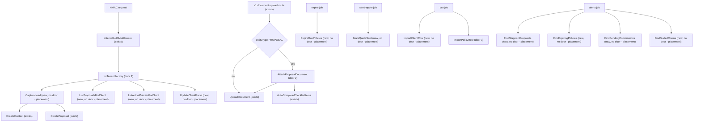

# Phase 4 — Edges use modules (Prisma out of internal routes, workers, CSV)

Sources:

- `docs/architecture-refactoring-roadmap.md` §3 C3/C4, §8 Dependency Rules, §12 Phase 4, §13 T4.1–T4.6, §14 order T4.2→T4.1→T4.3→T4.4→T4.6→T4.5 — what this phase must change
- `docs/architecture/2026-09-13-migration-plan.md` Steps 4.1–4.6 — characterization-before-move, D4 relocated not fixed, `updateMany` semantics, alert copy S20
- `docs/audits/2026-09-13-domain-analysis.md` D4 — CSV `IssuePolicy` bypass (synthetic POLICY_ISSUED, commission 0)
- `apps/server/src/routes/internal/leads/{create-lead,list-proposals,list-policies,update-client}.ts` — live HMAC Prisma + `container.resolve`
- `apps/server/src/routes/v1/documents/upload-document.ts` + `packages/core/src/modules/document/application/upload-document.ts` — documents→sales cycle
- `apps/worker/src/processors/{expire-policies-processor,send-quote-email-processor,csv-import-processor}.ts` and `processors/alerts/*` — live `prismaAdmin` writes/queries
- `apps/chat-worker/src/tools/capture-lead.ts` — HMAC consumer of `POST /api/internal/leads`
- `packages/core/test/db-harness.ts` + `prisma-client-repository.db.spec.ts` — T1.2 harness to copy for RLS proofs
- `apps/server/src/routes/v1/clients/index.ts` `createClientRoutes(clients)` — composition pattern to copy for HMAC edges
- Confirmed lesson L-002 — HTTP bodies stay frozen; when a response is claimed identical, assert `error.message` alongside `statusCode` and `code` for every mapped error
- AD-001, AD-002 — keep explicit composition (not abstract tokens); cruiser stays `warn`

## Problem

HMAC routes and BullMQ processors write and read sales, client, commission, and claim rows with Prisma. Chat lead capture, policy expiry, quote-sent stamps, CSV import, and alerts each have a second copy of “how this table is written,” and those copies skip the module that owns the table. Reviewers cannot tell whether a lead is tenant-scoped by RLS (`createTenantClient` in the route) or by `organizationId` on a `prismaAdmin` repository. The evidence the roadmap gives: C3 names `create-lead.ts`, `csv-import-processor.ts`, `expire-policies-processor.ts`, `send-quote-email-processor.ts`; C4 says HMAC keeps `createTenantClient`; D4 is CSV creating a policy without `IssuePolicy`; T4.2 is the remaining production cycle `proposal⇄document`; T1.2 is already verified so this work can have DB specs.

When this ships, those edges call named use cases on sales, clients, commissions, and servicing. Internal HMAC routes have no `@repo/db` import. Documents do not import sales. CSV still does not call `IssuePolicy`. Chat-worker still posts the same JSON to `/api/internal/leads`.

## Out of scope

| Excluded | Why |
| --- | --- |
| T5.6 `RegisterClaimFromChat` / internal `create-claim.ts` | Phase 5; preserve S9 `dataSaved: true` there, not here |
| Internal `search-clients.ts` and `update-proposal-details.ts` Prisma | Not in T4.1–T4.6 |
| T5.1–T5.2 chat-worker dropping `@repo/core` / `@repo/db` | Phase 5; this phase does not edit `capture-lead.ts` |
| T5.3 `CreateCommissionForPolicy` / T5.4 money kernel | After edges; CSV must not start calling `IssuePolicy` |
| T6.1 `composeSales` / stripping tsyringe from existing sales classes | New use cases are plain; `CreateProposal` stays injectable until T6.1 |
| Flipping cruiser to `error` or clearing the whole `routes/** → @repo/db` hotspot | Leftover HMAC files + other routes still import `@repo/db` |
| Fixing D4 (CSV should go through `IssuePolicy`) | Relocate, do not fix |
| Fixing S20 missing diacritics in alert copy (`estagio`, `Apolice`, `atualizacao`) | Processors keep the current strings |
| Starting to persist `create-lead` `notes` or internal-update `email` | Both are in the Zod schema today and unused by the handler |
| Adding a unique index on `contact.phone` | Would change product behaviour on concurrent duplicate phones |
| `workspace.findRecipientsByRoles` facade | T9.2 YAGNI; processors keep `member.findMany` |
| Changing HTTP URLs, `operationId`s, status codes, or OpenAPI bodies | Principle 11 |
| BullMQ payload shape | Migration strategy: payloads unchanged |

## Assumptions

| Assumption | Chosen default | Rationale | Confirmed? |
| --- | --- | --- | --- |
| Phase boundary | T4.1–T4.6 in this feature, six slices | User asked for the next roadmap phase; Phase 3 verification is PASS at `71b04b79`; STATE.md handoff was stale | y |
| Slice order | S1 T4.2, S2 T4.1, S3 T4.3, S4 T4.4, S5 T4.6, S6 T4.5 | Roadmap §14. T4.3 depends on T4.1. T4.5 last (hardest parity) | y |
| Delivery | Six PRs, one per task | Roadmap “one task ≈ one PR”; each slice is independently revertible | y |
| New use cases | Plain classes, no `@injectable` / `@inject`. Workers `new` them. HMAC routes receive a per-request factory. v1 upload route receives `uploadDocument` + `attachProposalDocument` | T6.1 “composed once”; ADR-2; workers already avoid the container | y |
| HMAC tenant client | Composition root `forTenant(organizationId)` calls `createTenantClient` and news Prisma repos + use cases. Routes never import `@repo/db` | C4: HMAC keeps RLS. §8: routes must not import Prisma; composition roots may pass the client | y |
| Worker Prisma | Processors that still need a client use `prismaAdmin` at their composition root and pass `organizationId` into the use case. `ExpireDuePolicies` is the exception: cross-tenant `updateMany` with no org filter, same as today | C4: workers keep `prismaAdmin`. T4.4 “same `updateMany` semantics” | y |
| `CaptureLead` collaborators | Calls existing `CreateContact` and `CreateProposal` (`new`, not `container.resolve`). Adds `ContactRepository.findByPhone` and `MemberRepository.findOldestActive` | Preserve checklist side-effects of `CreateProposal`. Phone dedup and oldest-member live in the route today | y |
| Internal lists | New queries `ListProposalsForClient` and `ListActivePoliciesForClient`, not reuse of dashboard `ListProposals` / `ListPolicies` | Dashboard lists are cursor pages for the ERP UI; HMAC returns max 10 rows with a chat-shaped payload | y |
| Internal client write | New `clients.UpdateClientFiscal` — not an extension of v1 `UpdateClient` | v1 `UpdateClient` has no document encryption and a different return type. Fiscal write includes `document` / `documentHash` / `documentEncrypted` | y |
| `AttachProposalDocument` | Lives in `sales/proposals/application`. Calls `UploadDocument` then `AutoCompleteChecklistItems`. Route dispatches `entityType === 'PROPOSAL'` here | T4.2; sales may import documents; documents must not import sales | y |
| CSV `origin: 'IMPORT'` | Comment / identifier in code only. No new column | Migration-plan 4.5 | y |
| Characterization | Existing route specs stay. CSV has no processor spec today — write the fixture spec in the same PR as the move, asserting counts/messages against the use cases; do not “fix” messages to make it prettier | T4.5; tests from checks, not from a rewritten processor | y |
| `generate:api` | Not run. Proof of frozen HTTP is unchanged `method` / `url` / `operationId` string literals on the five routes this phase touches | Orval needs server :3001 | y |
| Profile | `standard` | Phase 4 is the highest regression risk in the roadmap. Repo has no `tlc-spec-lean` declaration (skill default `light`). Light will not notice a test that passes under a wrong implementation. Raise is explicit so a silent extra pass is not confused with the floor | y |

**Open questions:** none - all resolved or logged above.

## Criteria

Grouped by slice - one observable outcome each, never a layer. Numbering runs across the whole plan.

### S1: Invert documents → proposals (T4.2) (P1)

**Acceptance Criteria**

1. The file `packages/core/src/modules/sales/proposals/application/attach-proposal-document.ts` SHALL export a class `AttachProposalDocument`.
2. WHEN `AttachProposalDocument.execute` runs with `entityType` `PROPOSAL` and `type` `DRIVER_LICENSE` THEN the system SHALL persist a document and SHALL call `AutoCompleteChecklistItems.execute` with `itemKey` `driver_license`.
3. WHEN `AttachProposalDocument.execute` runs with `entityType` `PROPOSAL` and `type` `VEHICLE_REGISTRATION` THEN the system SHALL call `AutoCompleteChecklistItems.execute` with `itemKey` `vehicle_registration`.
4. IF `AutoCompleteChecklistItems.execute` throws THEN `AttachProposalDocument.execute` SHALL still return the persisted document.
5. The file `packages/core/src/modules/document/application/upload-document.ts` SHALL NOT import `AutoCompleteChecklistItems` and SHALL NOT contain a path segment `modules/sales`.
6. WHEN `rg "from ['\\\"].*sales" packages/core/src/modules/document` runs THEN it SHALL print zero matching lines.
7. WHEN `POST /api/v1/documents/upload` runs with query `entityType=PROPOSAL` THEN the handler SHALL call `attachProposalDocument.execute` and SHALL NOT call `uploadDocument.execute`.
8. WHEN `POST /api/v1/documents/upload` runs with query `entityType=CLIENT` THEN the handler SHALL call `uploadDocument.execute` and SHALL NOT call `attachProposalDocument.execute`.
9. The route file `apps/server/src/routes/v1/documents/upload-document.ts` SHALL keep `operationId` `uploadDocument` on `POST` `/api/v1/documents/upload`.
10. The file `docs/architecture/forbidden-deps.md` SHALL NOT list `proposal⇄document` as a live cross-module hotspot.

**Independent test:** `upload-document.spec` + new `attach-proposal-document.spec` for CNH/CRLV/throw; `rg` on `modules/document`; route spec dispatch; `rg` on `forbidden-deps.md`.

### S2: `sales.CaptureLead` (T4.1) (P1)

**Acceptance Criteria**

11. The file `packages/core/src/modules/sales/leads/application/capture-lead.ts` SHALL export a class `CaptureLead`.
12. The type `ContactRepository` SHALL declare `findByPhone(phone: string, organizationId: string)` returning the non-deleted contact or `null`.
13. The type `MemberRepository` SHALL declare `findOldestActive(organizationId: string)` returning the active member with the earliest `createdAt`, or `null`.
14. WHEN `CaptureLead.execute` runs with a `clientPhone` that already has a non-deleted contact in that organization THEN it SHALL reuse that contact’s `id` and SHALL NOT call `CreateContact.execute`.
15. WHEN `CaptureLead.execute` runs with a `clientPhone` that has no contact THEN it SHALL call `CreateContact.execute` with `consentLgpd: true`, `salespersonId` equal to `findOldestActive.userId`, and `source` equal to the input `source` when present otherwise `'MANUAL'`.
16. WHEN `CaptureLead.execute` runs with `insuranceType` `TRAVEL` THEN it SHALL call `CreateProposal.execute` with `branch` `'OTHER'` and `boardType` `'NEW_INSURANCE'`.
17. IF `findOldestActive` returns `null` THEN `CaptureLead.execute` SHALL throw an error whose `code` is `NO_MEMBER` and whose `message` is `No active member in org`.
18. WHEN `POST /api/internal/leads` receives that `NO_MEMBER` error THEN the response SHALL be status `400` with JSON `error.code` `NO_MEMBER` and `error.message` `No active member in org`.
19. The file `apps/server/src/routes/internal/leads/create-lead.ts` SHALL NOT contain `from '@repo/db'` or `createTenantClient`.
20. The route SHALL keep `operationId` `createLead` on `POST` `/api/internal/leads` and a `201` body with keys `proposalId`, `contactId`, and `message` in the form `Lead registrado: ${contactName} - ${insuranceType}`.
21. WHEN a contact is saved for organization A THEN `findByPhone` invoked with a tenant client for organization B SHALL return `null`.
22. The file `apps/chat-worker/src/tools/capture-lead.ts` SHALL still contain the path `/api/internal/leads` and SHALL still send JSON keys `clientName`, `clientPhone`, `insuranceType`, `notes`, and `source`.
23. The system SHALL NOT persist the input field `notes` from `CaptureLead.execute` (the route does not persist it today).

**Independent test:** existing `create-lead.spec.ts` retargeted at the factory; `capture-lead.spec.ts` for reuse/TRAVEL/NO_MEMBER/notes; `*.db.spec.ts` for org B isolation; `rg` on chat-worker file.

### S3: Internal list/update through modules (T4.3) (P1)

**Acceptance Criteria**

24. The files `apps/server/src/routes/internal/leads/list-proposals.ts`, `list-policies.ts`, and `update-client.ts` SHALL NOT contain `from '@repo/db'` or `createTenantClient`.
25. WHEN `GET /api/internal/proposals` runs with neither `clientId` nor `phone` THEN the system SHALL respond `400` with `error.code` `MISSING_PARAMS` and `error.message` `At least one of clientId or phone is required`. WHEN `GET /api/internal/policies` runs with neither `clientId` nor `phone` THEN the system SHALL respond the same `400` `MISSING_PARAMS` payload.
26. WHEN `GET /api/internal/proposals` cannot resolve a client THEN the system SHALL respond `200` with `data.proposals` equal to `[]` and `data.total` equal to `0`.
27. WHEN `GET /api/internal/proposals` resolves a client THEN the system SHALL return at most `10` proposals, ordered by `createdAt` descending, each with keys `id`, `branch`, `stage`, `premiumValueInCents`, `coverageStartDate`, `createdAt`, `clientName`.
28. WHEN `GET /api/internal/policies` resolves a client THEN the system SHALL return only `status` `ACTIVE` policies, at most `10`, with `policyNumber` as a string.
29. WHEN `PUT /api/internal/clients/:id` runs for an id the tenant cannot see THEN the system SHALL respond `404` with `error.code` `CLIENT_NOT_FOUND` and `error.message` `Client not found`.
30. WHEN `PUT /api/internal/clients/:id` runs with `document` whose digit count is not `11` and not `14` THEN the system SHALL respond `400` with `error.code` `INVALID_DOCUMENT`.
31. WHEN `PUT /api/internal/clients/:id` runs with a document of `11` or `14` digits THEN the update SHALL persist `document`, `documentHash`, and `documentEncrypted`.
32. WHEN `PUT /api/internal/clients/:id` runs with only `email` THEN the use case SHALL NOT write an email field on `client` (the handler accepts and ignores `email` today).
33. The HMAC factory for these three routes SHALL construct repositories with `createTenantClient(organizationId)`, not `prismaAdmin`.
34. WHEN organization B’s tenant client lists proposals THEN it SHALL NOT include a proposal whose `organizationId` is A.
35. The three routes SHALL keep `operationId` values `listInternalProposals` on `GET` `/api/internal/proposals`, `listInternalPolicies` on `GET` `/api/internal/policies`, and `updateClientInternal` on `PUT` `/api/internal/clients/:id`.
36. WHEN `PUT /api/internal/clients/:id` succeeds THEN the system SHALL return `data.message` `Dados do cliente atualizados`.

**Independent test:** existing list/update route specs retargeted at the factory; `*.db.spec.ts` for org isolation; `rg` for `@repo/db` on the three files.

### S4: Worker sales writes (T4.4) (P1)

**Acceptance Criteria**

37. The class `ExpireDuePolicies` SHALL accept `{ now: Date }` and SHALL call a `PolicyRepository` method that runs `updateMany` with `where: { status: 'ACTIVE', endDate: { lt: now } }` and `data: { status: 'EXPIRED' }` with no `organizationId` filter.
38. The file `apps/worker/src/processors/expire-policies-processor.ts` SHALL NOT contain `prismaAdmin.policy`.
39. WHEN `ExpireDuePolicies` runs THEN an `ACTIVE` policy with `endDate` before `now` SHALL become `EXPIRED`, a `CANCELLED` policy SHALL stay `CANCELLED`, and an `ACTIVE` policy with `endDate` after `now` SHALL stay `ACTIVE`.
40. The class `MarkQuoteSent` SHALL set `sentToClientAt` to the `sentAt` Date passed in (not a `new Date()` inside the use case).
41. WHEN `send-quote-email-processor` finishes `emailProvider.send` successfully THEN it SHALL call `MarkQuoteSent` with that job’s `proposalId` and `organizationId`.
42. IF `emailProvider.send` throws THEN the processor SHALL NOT call `MarkQuoteSent`.
43. The file `apps/worker/src/processors/send-quote-email-processor.ts` SHALL NOT contain `prismaAdmin.proposal`.
44. IF `RESEND_API_KEY` is unset THEN the processor SHALL return without calling `MarkQuoteSent`.

**Independent test:** `expire-due-policies.db.spec.ts` at the three boundaries; processor spec that `MarkQuoteSent` is called only after send; `rg` on the two processor files.

### S5: Alert queries owned by modules (T4.6) (P1)

**Acceptance Criteria**

45. WHEN `FindStagnantProposals.execute({ organizationId, now, days: 15 })` runs THEN the system SHALL return proposals in that org whose `stage` is not `POLICY_ISSUED` or `LOST`, `deletedAt` is null, and `updatedAt` is before `now` minus 15 days.
46. WHEN `FindExpiringPolicies.execute({ organizationId, now, thresholds: [30, 15, 7] })` runs THEN the system SHALL return `ACTIVE` undeleted policies whose `endDate` falls on the calendar day `now + thresholdDays` for each threshold.
47. WHEN `FindPendingCommissions.execute({ organizationId, now, days: 7 })` runs THEN the system SHALL return commissions in that org with `status` `PENDING_COMMERCIAL`, `deletedAt` null, and `createdAt` before `now` minus 7 days.
48. WHEN `FindStalledClaims.execute({ organizationId, now, days: 7 })` runs THEN the system SHALL return claims in that org whose `status` is one of `REGISTERED`, `IN_ANALYSIS`, `AWAITING_DOCUMENT`, `PENDING_INSPECTION`, `deletedAt` null, and `updatedAt` before `now` minus 7 days.
49. The file `apps/worker/src/processors/alerts/check-proposals-stagnant.ts` SHALL NOT contain `prismaAdmin.proposal`.
50. The file `apps/worker/src/processors/alerts/check-policy-expiry.ts` SHALL NOT contain `prismaAdmin.policy`.
51. The file `apps/worker/src/processors/alerts/check-commissions-pending.ts` SHALL NOT contain `prismaAdmin.commission`.
52. The file `apps/worker/src/processors/alerts/check-claims-stalled.ts` SHALL NOT contain `prismaAdmin.claim`.
53. WHEN a stagnant proposal is enqueued THEN the notification `body` SHALL be `Proposta de ${clientName} parada no estagio ${stage} ha ${daysSinceUpdate} dias` (those exact unaccented words).
54. WHEN an expiring policy is enqueued with `days <= 7` THEN the notification `title` SHALL be `Apolice vencendo em breve!`; otherwise `Apolice expirando`; `body` SHALL be `Apolice ${policyNumber} vence em ${days} dias`.
55. WHEN a stalled claim is enqueued THEN the notification `body` SHALL be `Sinistro #${claimNumber} sem atualizacao ha ${daysSinceUpdate} dias`.
56. The system SHALL still call `hasExistingAlert` before enqueueing an alert, and `alerts/index.ts` SHALL still iterate organizations.

**Independent test:** `*.db.spec.ts` at the 15-day / 30-15-7-day / 7-day boundaries; processor specs for copy + idempotency; `rg` for table delegates on the four check files.

### S6: CSV import through clients + sales (T4.5) (P2)

**Acceptance Criteria**

57. The system SHALL have a characterization spec that, for a fixture of mixed new / duplicate / missing-client / missing-contact rows, asserts the `created`, `skipped`, and `failed` counts plus the messages `Cliente com CPF/CNPJ ${cpf} não encontrado` and `Cliente com CPF/CNPJ ${cpf} não tem Contact vinculado`.
58. WHEN `ImportClientRow` runs for a documentHash that already exists in the organization THEN it SHALL increment skipped and SHALL NOT create a second client.
59. WHEN `ImportClientRow` runs for a new document THEN it SHALL create a client and a contact with `source` `'IMPORT'` and `consentLgpd` `true`.
60. WHEN `ImportPolicyRow` runs for a `policyNumber` that already exists in the organization THEN it SHALL increment skipped and SHALL NOT create a proposal or policy.
61. `ImportPolicyRow` SHALL NOT call `IssuePolicy`. WHEN it creates a policy THEN it SHALL first create a proposal with `stage` `'POLICY_ISSUED'`, `boardType` `'NEW_INSURANCE'`, and `commissionPercentageInCents` `0`.
62. The file `apps/worker/src/processors/csv-import-processor.ts` SHALL NOT contain `from '@repo/db'` and SHALL NOT call `prismaAdmin.client`, `prismaAdmin.contact`, `prismaAdmin.proposal`, or `prismaAdmin.policy`.
63. The processor SHALL still slice rows with `IMPORT_BATCH_SIZE` (`50`) and SHALL still cap `progress.errors` at `MAX_IMPORT_ERRORS` (`100`).
64. WHEN the characterization fixture from AC 57 runs after the move THEN `created`, `skipped`, `failed`, and each `errors[].message` SHALL equal the values recorded before the move.

**Independent test:** characterization spec on the fixture; `import-policy-row.spec.ts` proving no `IssuePolicy` call and commission `0`; `rg` on the processor; same fixture after the move.

## Traceability

| ID | Slice | Criteria | Status |
| --- | --- | --- | --- |
| DOC-01 | S1 | 1, 2, 3, 4 | Pending |
| DOC-02 | S1 | 5, 6, 10 | Pending |
| DOC-03 | S1 | 7, 8, 9 | Pending |
| LEAD-01 | S2 | 11, 12, 13 | Pending |
| LEAD-02 | S2 | 14, 15, 16, 23 | Pending |
| LEAD-03 | S2 | 17, 18, 20 | Pending |
| LEAD-04 | S2 | 19, 22 | Pending |
| RLS-01 | S2, S3 | 21, 33, 34 | Pending |
| INT-01 | S3 | 24, 35 | Pending |
| INT-02 | S3 | 25, 26, 27, 28 | Pending |
| INT-03 | S3 | 29, 30, 31, 32, 36 | Pending |
| WRK-01 | S4 | 37, 38, 39 | Pending |
| WRK-02 | S4 | 40, 41, 42, 43, 44 | Pending |
| ALRT-01 | S5 | 45, 46, 47, 48 | Pending |
| ALRT-02 | S5 | 49, 50, 51, 52 | Pending |
| ALRT-03 | S5 | 53, 54, 55, 56 | Pending |
| CSV-01 | S6 | 57, 64 | Pending |
| CSV-02 | S6 | 58, 59, 60, 61 | Pending |
| CSV-03 | S6 | 62, 63 | Pending |

**ID format:** `CATEGORY-NUMBER`. **Status:** Pending → In checks → Implementing → Verified.

## Observable

| Surface | Decision | Landing |
| --- | --- | --- |
| API `POST /api/internal/leads` | error shape and codes | AC 17, 18 - `400` `NO_MEMBER` + `error.message`; Zod `400` `VALIDATION_ERROR` stays on the route |
| API `POST /api/internal/leads` | who may call | existing - HMAC `internalAuthMiddleware` + rate limit on `internalApp` |
| API `POST /api/internal/leads` | versioning | n/a - unversioned `/api/internal/*`, not `/api/v1` |
| API `POST /api/internal/leads` | rate limit | existing - `createInternalRateLimitHook` |
| API `POST /api/internal/leads` | empty / unauthorised | existing - HMAC `401`/`403` unchanged; no empty collection |
| API `GET /api/internal/proposals` | error shape and codes | AC 25 - `400` `MISSING_PARAMS` |
| API `GET /api/internal/proposals` | empty state | AC 26 - `200` `{ proposals: [], total: 0 }` |
| API `GET /api/internal/proposals` | who may call / versioning / rate limit | existing - same HMAC plugin as create-lead |
| API `GET /api/internal/policies` | error shape and codes | AC 25 - `400` `MISSING_PARAMS` |
| API `GET /api/internal/policies` | empty state | AC 26 pattern - empty `policies` array when client unresolved (existing list-policies spec) |
| API `GET /api/internal/policies` | who may call / versioning / rate limit | existing - same HMAC plugin |
| API `PUT /api/internal/clients/:id` | error shape and codes | AC 29, 30 - `404` `CLIENT_NOT_FOUND`, `400` `INVALID_DOCUMENT` |
| API `PUT /api/internal/clients/:id` | empty / unauthorised | n/a - no collection; HMAC as above |
| API `PUT /api/internal/clients/:id` | versioning / rate limit | existing - HMAC plugin |
| API `POST /api/v1/documents/upload` | error shape and codes | existing - `400` `FILE_REQUIRED`; `handleDomainError` for the rest |
| API `POST /api/v1/documents/upload` | who may call | existing - `requireAbility('create', 'Document')` |
| API `POST /api/v1/documents/upload` | empty / unauthorised | existing - no file → `FILE_REQUIRED`; CASL unauthorised unchanged |
| API `POST /api/v1/documents/upload` | versioning / rate limit | n/a - existing `/api/v1` auth; no new rate limit |
| API `POST /api/v1/documents/upload` | destructive confirm | n/a - upload is not destructive |
| command expire-policies processor | output / flags / exit | AC 37, 38, 39 - pino `expiredCount`; no new flags; BullMQ failure handler existing |
| command expire-policies processor | prints when it fails halfway | existing - `worker.on('failed')` |
| command send-quote processor | output / flags / exit | AC 41, 42, 43, 44 - skip without key; no stamp on send failure |
| command send-quote processor | prints when it fails halfway | existing - `worker.on('failed')`; email already sent is not rolled back (same as today) |
| command csv-import processor | output / flags / exit | AC 57, 63, 64 - `CsvImportProgress` counts + messages; batch `50`; error cap `100` |
| command csv-import processor | prints when it fails halfway | AC 58–60 - per-row catch; job continues |
| command alerts processors | output / flags / exit | AC 53–56 - notification copy; idempotency; org loop |
| command alerts processors | prints when it fails halfway | existing - per-org try/catch in `alerts/index.ts` |
| document `docs/architecture/forbidden-deps.md` | structure | AC 10 - cycle table drops `proposal⇄document` |
| document `docs/architecture/forbidden-deps.md` | tone / depth | n/a - hotspot list |
| document `docs/architecture/forbidden-deps.md` | what the reader does next | AC 10 - treat documents→sales as inverted; `routes/** → @repo/db` remains for leftovers |
| collection TRAVEL→OTHER | grouping / naming / ordering | AC 16 - `TRAVEL` maps to branch `OTHER` |
| collection TRAVEL→OTHER | duplicates / exception | n/a - one map; unknown types already fall through to `OTHER` in the live route (`?? 'OTHER'`) and stay that way inside `CaptureLead` |
| collection checklist keys on upload | grouping / naming / ordering | AC 2, 3 - `DRIVER_LICENSE`→`driver_license`, `VEHICLE_REGISTRATION`→`vehicle_registration` |
| collection checklist keys on upload | duplicates / exception | AC 4, 8 - auto-complete throw does not fail upload; non-`PROPOSAL` stays on `UploadDocument` |
| collection CSV pt-BR messages | grouping / naming | AC 57 - the two `não encontrado` / `não tem Contact vinculado` strings |
| collection CSV pt-BR messages | ordering / duplicates / exception | AC 63 - error cap `100`; duplicate policy number is skip not fail (AC 60) |
| collection alert copy | grouping / naming | AC 53, 54, 55 - unaccented `estagio`, `Apolice`, `atualizacao` |
| collection alert copy | ordering / duplicates / exception | AC 56 - `hasExistingAlert` skip; salesperson/manager fan-out stays in the processor |
| collection HMAC error codes | grouping / naming | AC 18, 25, 29, 30 - `NO_MEMBER`, `MISSING_PARAMS`, `CLIENT_NOT_FOUND`, `INVALID_DOCUMENT` |
| collection HMAC error codes | ordering / duplicates / exception | n/a - one code per response; L-002: assert `message` with `code` |

## Flow

This reuses `CreateContact`, `CreateProposal`, `UploadDocument`, `AutoCompleteChecklistItems`, `createTenantClient`, `hasExistingAlert`, the HMAC plugin, and the T1.2 db-harness. It does not add a second upload path or a second issuance path.

1. HMAC `POST /api/internal/leads` -> `internalAuthMiddleware` (exists) -> `forTenant` (door 1) -> `CaptureLead` (placement) -> `CreateContact` / `CreateProposal` (exists)
2. HMAC list/update -> `forTenant` (door 1) -> `ListProposalsForClient` / `ListActivePoliciesForClient` / `UpdateClientFiscal` (placement), persist via tenant-scoped repos
3. `POST /api/v1/documents/upload` -> `AttachProposalDocument` (door 2) or `UploadDocument` (exists)
4. expire / send-quote processors -> `ExpireDuePolicies` / `MarkQuoteSent` (placement) on `prismaAdmin` repos
5. csv processor -> `ImportClientRow` (placement) / `ImportPolicyRow` (door 3)
6. alerts processor -> `Find*` queries (placement); processors keep org loop, `hasExistingAlert` (exists), and copy
7. out: same HTTP JSON; chat-worker file untouched; `forbidden-deps.md` drops `proposal⇄document`

## Relations

None - no stored-data shape change

## Surface

None - nothing consumed outside. HTTP `operationId`s, status codes, and JSON keys stay; chat-worker keeps posting the same body to `/api/internal/leads`. That freeze is criteria, not a new published contract.

## Landing

| One-way door | Literal shape | Alternative rejected |
| --- | --- | --- |
| HMAC edges get a per-request tenant factory | `apps/server/src/bootstrap/` exports `forTenant(organizationId)` that calls `createTenantClient(organizationId)`, news the Prisma repos with that client, and returns `{ captureLead, listProposalsForClient, listActivePoliciesForClient, updateClientFiscal }`. `internalLeadRoutes(forTenant)` receives the factory. Route files do not import `@repo/db`. After approval this is AD-003 | Keep `createTenantClient` inside each route — §8 forbids routes → Prisma. Construct HMAC use cases once at boot with `prismaAdmin` — C4 / T4.1 risk: phone lookup and lists would lose RLS |
| Documents do not import sales | `AttachProposalDocument` in `packages/core/src/modules/sales/proposals/application/attach-proposal-document.ts` calls `UploadDocument` then `AutoCompleteChecklistItems`. `upload-document.ts` has no sales import. `POST /api/v1/documents/upload` dispatches `entityType === 'PROPOSAL'` to `AttachProposalDocument` | Keep auto-complete inside `UploadDocument` — leaves the `proposal⇄document` cycle (T4.2 done-when fails). Duplicate storage+create inside sales — two writers for `document` |
| CSV import relocates D4, does not fix it | `sales.ImportPolicyRow` creates `proposal` with `stage: 'POLICY_ISSUED'`, `boardType: 'NEW_INSURANCE'`, `commissionPercentageInCents: 0`, then `policy`. It does not call `IssuePolicy`. Flag is the identifier `ImportPolicyRow` / comment `origin: IMPORT` — no new column. After approval this is AD-004 | Call `IssuePolicy` from CSV — that *is* the D4 fix, forbidden this phase. Keep Prisma in the processor — T4.5 done-when fails |

- Nothing else in this change is hard to reverse (plain-class use cases, `findByPhone`, `findOldestActive`, expire/`sentAt` methods, alert queries). Reversing the tenant factory after T5.6 copies it, or reversing the document invert after more uploads land, is costly — that is why those two are doors.

## Impact

| Front | What changes |
| --- | --- |
| domain | new term: `CaptureLead` — HMAC chat intake that dedups by phone and creates contact+proposal. Lives in `sales/leads`. Who copies it next: T5.6 `RegisterClaimFromChat` |
| domain | new term: `AttachProposalDocument` — proposal-scoped upload that owns checklist auto-complete. Lives in `sales/proposals`. Who branches on it today: `upload-document.ts` (loses the trigger); `PromoteContact` still calls `AutoCompleteChecklistItems` directly |
| domain | new term: `ImportPolicyRow` — CSV policy writer that is *not* `IssuePolicy`. Lives in `sales/policies`. Who branches on it today: `csv-import-processor.ts` |
| domain | existing term: `UploadDocument` meant “store file + maybe complete proposal checklist”. It now means “store file only”. Who branches on it today: v1 upload route, `container-registrations.ts`, `upload-document.spec.ts` |
| stored data | nothing to migrate |
