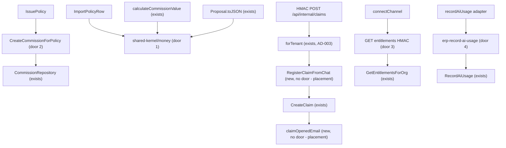

# Phase 5 — Isolation and money (chat/ERP HMAC, commissions handoff, templates, claim-from-chat)

Sources:

- `docs/architecture-refactoring-roadmap.md` §3 H6/M2, §10 ADR-4/ADR-7, §12 Phase 5, §13 T5.1–T5.6, §14 order T5.4→T5.3→T5.5→T5.6→T5.1→T5.2, §16 PR 5 / 12 / 13 — what this phase must change
- `docs/architecture/2026-09-13-migration-plan.md` Steps 5.1–5.4 and 6.1/6.4 — characterization-before-move, S9 `dataSaved: true` relocated not fixed, fail-the-same-way as today’s DB error, deploy server then chat-worker
- `packages/core/src/modules/commission/application/on-policy-issued.ts` + `sales/policies/application/issue-policy.ts` — live `OnPolicyIssued` coupling
- `packages/core/src/modules/commission/domain/commission-calculator.ts` + `sales/policies/application/import-policy-row.ts` (`Math.round(premioReais * 100)`) — live money math
- `packages/core/src/modules/sales/proposals/domain/proposal.ts` `toJSON()` spreads `props` including `commissionPercentageInCents`
- `apps/chat-worker/src/messaging/baileys-manager.ts` + `ai/record-ai-usage-adapter.ts` — Prisma via `@repo/core` / `@repo/db`
- `apps/server/src/routes/internal/leads/create-claim.ts` — 152-line HMAC Prisma + `container.resolve(CreateClaim)` + S9 responses
- `apps/server/src/bootstrap/compose.ts` `forTenant` — AD-003 pattern T5.6 copies
- `packages/core/src/modules/servicing/claims/application/create-claim.ts` + `commission/application/{approve-commission-admin,reject-commission}.ts` — templates from `notification/infrastructure`
- Confirmed lesson L-002 — HTTP bodies stay frozen; when a response is claimed identical, assert `error.message` alongside `statusCode` and `code` for every mapped error
- AD-001, AD-002, AD-003, AD-004 — explicit composition; cruiser stays `warn`; HMAC `forTenant` + `createTenantClient`; CSV still does not call `IssuePolicy`

## Problem

Chat-worker reads ERP Postgres for channel entitlements and AI usage, so a chat deploy cannot ship without the ERP schema. Issuance talks to commissions through a private `OnPolicyIssued` class that is not idempotent, so a retry after a crash between `policy.create` and `commission.save` cannot safely re-run the handoff. Commission rate is stored on Proposal under the name `commissionPercentageInCents` even though the number is basis points, and the same `Math.round` money math is copied in the calculator and CSV import. Claim and commission use cases import HTML from `notification/infrastructure`. Chat claim intake still writes Prisma in the HMAC route and returns `dataSaved: true` when nothing was persisted. The evidence the roadmap gives: H6 names `baileys-manager.ts` and `record-ai-usage-adapter.ts`; T5.3 names `OnPolicyIssued`; T5.4 names the cents/bp mix-up; T5.5 names the template imports; T5.6 names internal `create-claim.ts` and S9.

When this ships, chat-worker calls HMAC for entitlements and enqueues AI usage onto the ERP worker. `IssuePolicy` calls public `CreateCommissionForPolicy`. Money math lives in `shared-kernel/money.ts`. Commissions and servicing own their email HTML. Internal claim intake has no `@repo/db`. HTTP field `commissionPercentageInCents` and the S9 claim JSON stay.

## Out of scope

| Excluded | Why |
| --- | --- |
| T6.1 `composeSales` / stripping `@injectable` from `IssuePolicy` / `CreateClaim` | Phase 6; new commands are plain; existing classes stay injectable |
| T6.2 delete root barrel / subpath-only `@repo/core` | Compatibility barrel stays |
| T6.3 flip cruiser to `error` | Leftover HMAC files still import `@repo/db` |
| Partial unique index `commission(policyId) WHERE isReversal = false` | Roadmap optional follow-up after a prod duplicate query |
| Fixing S9 fake `dataSaved: true` | Relocate, do not fix |
| Calling `IssuePolicy` from CSV / changing D4 | AD-004 |
| Moving invitation, password-reset, email-verification, quote-sent, policy-expiring templates | T5.5 names commissions and servicing |
| `workspace.findRecipientsByRoles` / `MemberDirectory` | T9.2 YAGNI |
| Renaming chat Contact → Participant | ADR-6 opportunistic on a chat PR |
| Cache-aside inside `GetEntitlementsForOrg` / changing Redis key names | T5.1: cache keys unchanged; baileys today hits the use case, not `subscription-cache.ts` |
| Fail-open entitlements (`DEFAULT_PERMISSIVE_ENTITLEMENTS` on HTTP error) | T5.1: on failure behave as today (connection attempt fails) |
| Changing HMAC URLs, `operationId`s, status codes, or JSON keys of existing endpoints | Principle 11 |
| `generate:api` against a running server | Same as Phase 4; proof is frozen string literals |
| Prometheus / OpenTelemetry | ADR-9 |
| Extracting `packages/conversations` | ADR-6 |

## Assumptions

| Assumption | Chosen default | Rationale | Confirmed? |
| --- | --- | --- | --- |
| Phase boundary | T5.1–T5.6 in this feature, six slices | User asked for the next roadmap phase; Phase 4 verification is PASS at `535a78ab`; STATE.md next step was Phase 5 | y |
| Slice order | S1 T5.4, S2 T5.3, S3 T5.5, S4 T5.6, S5 T5.1, S6 T5.2 | Roadmap §14. Money before the commission handoff. Templates before claim-from-chat. Entitlements HMAC before dropping `@repo/db` | y |
| Delivery | Six PRs, one per task | Roadmap “one task ≈ one PR”. T5.1 must deploy server before chat-worker. T5.2 must deploy worker before chat-worker. Grouping T5.1+T5.2 (PR 13) hides that order | y |
| New commands | Plain classes, no `@injectable`. `CreateCommissionForPolicy`, `RegisterClaimFromChat`. `IssuePolicy` / `CreateClaim` stay injectable until T6.1 and receive the new command as a constructor arg | ADR-2; copies Phase 4 | y |
| HMAC tenant client | T5.6 extends `forTenant` (AD-003) with `registerClaimFromChat`. Route does not import `@repo/db`. Lookups use the tenant Prisma client already constructed in `forTenant` | C4; T5.6 “route has no Prisma” | y |
| Entitlements path | `GET /api/internal/billing/entitlements/:organizationId`. Path param must equal HMAC `request.organizationId` or the handler returns `403`. Body is the `Entitlements` projection JSON | T5.1 names that URL. Mismatch would let a signed org-A request read org-B quotas | y |
| Entitlements timeout / failure | chat-worker `AbortSignal.timeout(3000)`. HTTP error, timeout, missing `INTERNAL_API_URL` / `INTERNAL_API_SECRET`, or non-JSON body → throw (connection attempt fails). No reuse of a local cache | T5.1 3s + “behave as today”. Today a Prisma throw fails `connectChannel`. Permissive default on error would raise the Baileys cap | y |
| Entitlements producer | Route calls existing `GetEntitlementsForOrg` (no subscription row → `DEFAULT_PERMISSIVE_ENTITLEMENTS`, HTTP `200`). Redis keys unused on this path, therefore unchanged | Same object baileys constructs today. Moving cache into the use case is extra scope | y |
| AI usage queue | Name `erp-record-ai-usage`. Adapter keeps `@repo/ai` cost math, enqueues the already-computed record fields, swallows enqueue errors (today swallows Prisma errors). Worker `RecordAiUsage`. Idempotent skip when `messageIdHash` is a non-empty string and a row with that `organizationId` + `messageIdHash` already exists. No unique index | Existing ERP queues are `erp-*`. Roadmap name `billing.record-ai-usage` would be the first dotted queue | y |
| Money kernel | `packages/core/src/shared-kernel/money.ts` with branded `Cents` / `BasisPoints`, `applyBasisPoints`, `reaisToCents`. Calculator and CSV `ImportPolicyRow` call it. Rounding is `Math.round`, matching today’s two call sites | T5.4; table-driven specs lock current outputs | y |
| Domain vs API commission field | Domain prop + getter `commissionBasisPoints`. `Proposal.toJSON()` emits `commissionPercentageInCents` with that number. Prisma column and HTTP/Zod key stay `commissionPercentageInCents`. Mapper maps column ↔ domain prop | T5.4 “presenter alias”; `get-proposal.ts` sends `proposal.toJSON()` | y |
| `CreateCommissionForPolicy` | Public on commissions index. `percentageInBasisPoints <= 0` → no save, return `null`. Else `findNonReversalByPolicyId`; if found return it; else `Commission.create` + `save`. `IssuePolicy` calls it with `proposal.commissionBasisPoints`. `OnPolicyIssued` deleted | T5.3; existing skip-on-zero/negative | y |
| Templates | `git mv` `commission-approved.ts` / `commission-rejected.ts` → `commission/infrastructure/notifications/`; `claim-opened.ts` → `servicing/claims/infrastructure/notifications/`. `notification/index.ts` drops those three exports. Base layout import path updates. HTML bytes unchanged | T5.5 done-when | y |
| `RegisterClaimFromChat` | Copies the route: 11/14-digit document → `documentHash`; else phone on contact; latest-ending `ACTIVE` policy (`orderBy endDate desc`), optional `insuranceType` as branch; `priority: 'URGENT'`; S9 JSON and the three `message` strings byte-identical. Comment cites S9 / “do not fix”. Does not go through `ListActivePoliciesForClient` (that query caps 10 and is phone/`clientId` only) | T5.6; live `create-claim.ts` | y |
| `ContactSource` in shared | `packages/shared` exports the string union `'MANUAL' \| 'CHAT_WHATSAPP' \| 'CHAT_WIDGET' \| 'FORM_WEB' \| 'IMPORT' \| 'REFERRAL'`. chat-worker `capture-lead.ts` and `ai-bot-processor.ts` import it. Server Zod may keep Prisma `nativeEnum` | T5.2; values match `schema.prisma` enum `ContactSource` | y |
| `generate:api` | Not run. Frozen proof: `operationId` / `method` / `url` literals on `createInternalClaim` and `issuePolicy`; `_schemas.ts` still has `commissionPercentageInCents`. New entitlements route is allowed to appear in OpenAPI later | Orval needs :3001 | y |
| Profile | `standard` | Repo has no `tlc-spec-lean` declaration (skill default `light`). T5.1/T5.6 freeze chat contracts; T5.4 rounding; light will not notice a test that passes under a wrong implementation. Same raise as Phase 4 | y |

**Open questions:** none - all resolved or logged above.

## Criteria

Grouped by slice - one observable outcome each, never a layer. Numbering runs across the whole plan.

### S1: Money kernel (T5.4) (P1)

**Acceptance Criteria**

1. The file `packages/core/src/shared-kernel/money.ts` SHALL export branded types `Cents` and `BasisPoints` and functions `applyBasisPoints` and `reaisToCents`.
2. WHEN `applyBasisPoints` runs with cents `100000` and basis points `1500` and the default split THEN it SHALL return `15000`.
3. WHEN `applyBasisPoints` runs with basis points `0` THEN it SHALL return `0`.
4. WHEN `applyBasisPoints` runs with cents `100000` and basis points `10000` and the default split THEN it SHALL return `100000`.
5. WHEN `reaisToCents` runs with `0.285` THEN it SHALL return `28`.
6. The file `packages/core/src/modules/commission/domain/commission-calculator.ts` SHALL call `applyBasisPoints` and SHALL NOT contain the identifier `BASIS_POINTS_DIVISOR`.
7. WHEN `ImportPolicyRow` persists a premium THEN it SHALL pass `reaisToCents` of raw `'Premio (R$)'` and SHALL NOT contain `Math.round(premioReais * 100)`.
8. The domain type `ProposalProps` SHALL declare `commissionBasisPoints` and SHALL NOT declare `commissionPercentageInCents`.
9. WHEN `Proposal.toJSON()` runs THEN the returned object SHALL include key `commissionPercentageInCents` whose value equals `commissionBasisPoints` and SHALL NOT include key `commissionBasisPoints`.
10. The file `apps/server/src/routes/v1/proposals/_schemas.ts` SHALL keep the Zod key `commissionPercentageInCents` on the proposal detail object.
11. The Prisma mapping for a proposal row SHALL read and write column `commissionPercentageInCents` and SHALL assign it to domain `commissionBasisPoints`.

**Independent test:** table-driven money spec; `rg` on calculator/CSV/proposal; existing `get-proposal` spec still expects `body.data.commissionPercentageInCents`.

### S2: CreateCommissionForPolicy (T5.3) (P1)

**Acceptance Criteria**

12. The file `packages/core/src/modules/commission/index.ts` SHALL export `CreateCommissionForPolicy` and SHALL NOT export `OnPolicyIssued`.
13. The path `packages/core/src/modules/commission/application/on-policy-issued.ts` SHALL NOT exist.
14. WHEN `CreateCommissionForPolicy.execute` runs with `percentageInBasisPoints` `0` THEN it SHALL NOT call `save` and SHALL return `null`.
15. WHEN `CreateCommissionForPolicy.execute` runs with `percentageInBasisPoints` `-100` THEN it SHALL NOT call `save` and SHALL return `null`.
16. WHEN `CreateCommissionForPolicy.execute` runs twice with the same `policyId` and `organizationId` and `percentageInBasisPoints` `1500` THEN it SHALL call `save` once and the second result SHALL equal the first saved non-reversal commission.
17. WHEN `CreateCommissionForPolicy.execute` finds an existing row with `isReversal` `true` for that `policyId` and no non-reversal row THEN it SHALL `save` a new non-reversal commission.
18. WHEN `IssuePolicy.execute` creates a policy THEN it SHALL call `CreateCommissionForPolicy.execute` with `commissionPercentageInBasisPoints` equal to `proposal.commissionBasisPoints`.
19. The file `packages/core/src/modules/sales/policies/application/issue-policy.ts` SHALL NOT import `OnPolicyIssued`.
20. The route file `apps/server/src/routes/v1/policies/issue-policy.ts` SHALL keep `operationId` `issuePolicy` on `POST` `/api/v1/policies`.

**Independent test:** commission unit spec (zero / negative / double / reversal ignored); `IssuePolicy` spec; `rg OnPolicyIssued`.

### S3: Templates owned by commissions/servicing (T5.5) (P1)

**Acceptance Criteria**

21. The files `packages/core/src/modules/commission/infrastructure/notifications/commission-approved.ts` and `commission-rejected.ts` SHALL exist and SHALL export `commissionApprovedEmail` and `commissionRejectedEmail`.
22. The file `packages/core/src/modules/servicing/claims/infrastructure/notifications/claim-opened.ts` SHALL exist and SHALL export `claimOpenedEmail`.
23. The directory `packages/core/src/modules/notification/infrastructure/email-templates/` SHALL NOT contain `commission-approved.ts`, `commission-rejected.ts`, or `claim-opened.ts`.
24. WHEN `rg "notification/infrastructure" packages/core/src/modules/commission` runs THEN it SHALL print zero matching lines.
25. WHEN `rg "notification/infrastructure" packages/core/src/modules/servicing` runs THEN it SHALL print zero matching lines.
26. The file `packages/core/src/modules/notification/index.ts` SHALL NOT export `commissionApprovedEmail`, `commissionRejectedEmail`, or `claimOpenedEmail`.
27. WHEN `approve-commission-admin` / `reject-commission` / `create-claim` dispatch email THEN the HTML SHALL still be produced by those three moved functions (same export names).

**Independent test:** `test -f` / `rg`; existing commission/claim notification specs still assert `type` `COMMISSION_APPROVED` / `COMMISSION_REJECTED` / `CLAIM_OPENED`.

### S4: RegisterClaimFromChat (T5.6) (P1)

**Acceptance Criteria**

28. The file `packages/core/src/modules/servicing/claims/application/register-claim-from-chat.ts` SHALL export a class `RegisterClaimFromChat`.
29. WHEN `RegisterClaimFromChat.execute` does not resolve a client THEN it SHALL NOT call `CreateClaim.execute` and SHALL return `claimCreated` `false`, `claimNumber` `null`, `dataSaved` `true`, and `message` `Cliente não encontrado. Dados registrados para o corretor.`
30. WHEN a client exists and no `ACTIVE` policy matches THEN it SHALL NOT call `CreateClaim.execute` and SHALL return `claimCreated` `false`, `claimNumber` `null`, `dataSaved` `true`, and `message` `Nenhuma apólice ativa encontrada. Dados registrados para o corretor.`
31. WHEN a client and an `ACTIVE` policy exist THEN it SHALL call `CreateClaim.execute` with `priority` `'URGENT'` and SHALL return `claimCreated` `true`, `claimNumber` `SIN-` concatenated with `String(claim.claimNumber)`, `dataSaved` `false`, `claimData` `null`, and `message` `Sinistro ${claim.claimNumber} registrado com prioridade urgente.`
32. WHEN `phoneOrDocument` has 11 or 14 digits after `stripNonDigits` THEN client lookup SHALL use `documentHash` of those digits and SHALL NOT query contact by phone.
33. WHEN `phoneOrDocument` is not 11 or 14 digits THEN client lookup SHALL use contact `phone` equal to the raw string.
34. WHEN more than one `ACTIVE` policy exists for the client THEN the policy chosen SHALL be the one with the greatest `endDate`.
35. The file `apps/server/src/routes/internal/leads/create-claim.ts` SHALL NOT import `@repo/db` and SHALL NOT contain `createTenantClient`.
36. The route file SHALL keep `operationId` `createInternalClaim` on `POST` `/api/internal/claims`.
37. WHEN `POST /api/internal/claims` runs without `description` THEN the system SHALL respond `400`.
38. The file `register-claim-from-chat.ts` SHALL contain the substring `S9` in a comment.

**Independent test:** unit spec for the three bodies + document vs phone + latest `endDate`; route spec; `rg` on the route file.

### S5: HMAC entitlements (T5.1) (P1)

**Acceptance Criteria**

39. The file `apps/server/src/routes/internal/billing/get-entitlements.ts` SHALL register `GET` `/api/internal/billing/entitlements/:organizationId` with `operationId` `getInternalEntitlements`.
40. WHEN that handler runs with HMAC `organizationId` equal to the path param and a subscription row exists THEN it SHALL respond `200` with `success` `true` and `data.maxChannels` equal to the value `GetEntitlementsForOrg` returns for that org.
41. WHEN no subscription row exists THEN it SHALL respond `200` and `data` SHALL equal `DEFAULT_PERMISSIVE_ENTITLEMENTS` with `trialEndsAt` serialized as `null`.
42. IF the path `organizationId` is not equal to HMAC `request.organizationId` THEN the handler SHALL respond `403` with `error.code` `TENANT_MISMATCH`.
43. WHEN `rg "from ['\\\"]@repo/db" apps/server/src/routes/internal/billing` runs THEN it SHALL print zero matching lines.
44. The file `apps/chat-worker/src/messaging/baileys-manager.ts` SHALL NOT import `@repo/core` and SHALL NOT import `@repo/db`.
45. WHEN `getChannelLimitForOrg` calls the entitlements URL THEN the `fetch` SHALL use `AbortSignal.timeout(3000)` and HMAC headers `X-Signature`, `X-Timestamp`, `X-Tenant-Id`.
46. IF that `fetch` rejects, times out, or returns a non-OK status THEN `connectChannel` SHALL reject (no channel added to the in-memory map).
47. WHEN entitlements `maxChannels` is `null` THEN the effective limit SHALL be `CHAT_LIMITS.MAX_BAILEYS_CHANNELS_PER_ORG` (`10`).
48. WHEN entitlements `maxChannels` is `3` THEN the effective limit SHALL be `3`.
49. The Redis key helper `subscriptionCacheKey` and prefix `SUBSCRIPTION_CACHE_PREFIX` SHALL still be the strings exported from `@repo/shared` today (byte-identical names).

**Independent test:** internal route spec (HMAC, 200, 403); baileys unit spec with fetch fake (allowed / at cap / down); `rg` on baileys-manager and cache constants.

### S6: AI usage via ERP queue (T5.2) (P1)

**Acceptance Criteria**

50. The ERP worker SHALL consume BullMQ queue name `erp-record-ai-usage`.
51. WHEN the chat-worker usage adapter runs THEN it SHALL enqueue to `erp-record-ai-usage` and SHALL NOT import `@repo/core` and SHALL NOT import `@repo/db`.
52. IF enqueue throws THEN the adapter SHALL NOT rethrow (same swallow as today’s Prisma `catch`).
53. WHEN the worker processes a job whose `messageIdHash` is a non-empty string and a row already exists with that `organizationId` and `messageIdHash` THEN it SHALL NOT call `RecordAiUsage.execute`.
54. WHEN the worker processes a job whose `messageIdHash` is missing or `null` THEN it SHALL call `RecordAiUsage.execute` once.
55. The file `apps/chat-worker/package.json` SHALL NOT list `@repo/core` or `@repo/db` under `dependencies`.
56. The file `apps/chat-worker/tsup.config.ts` `noExternal` array SHALL NOT contain `'@repo/core'` or `'@repo/db'`.
57. The files `apps/chat-worker/src/tools/capture-lead.ts` and `apps/chat-worker/src/processors/ai-bot-processor.ts` SHALL import `ContactSource` from `@repo/shared` and SHALL NOT import `@repo/db`.
58. The `@repo/shared` `ContactSource` union SHALL be `'MANUAL' | 'CHAT_WHATSAPP' | 'CHAT_WIDGET' | 'FORM_WEB' | 'IMPORT' | 'REFERRAL'`.

**Independent test:** adapter spec (enqueue payload + swallow); worker processor spec (idempotent skip / missing hash); `rg` on package.json and tsup.

## Traceability

| ID | Slice | Criteria | Status |
| --- | --- | --- | --- |
| MONEY-01 | S1 | 1–11 | Pending |
| COMM-01 | S2 | 12–20 | Pending |
| TMPL-01 | S3 | 21–27 | Pending |
| CLAIM-01 | S4 | 28–38 | Pending |
| ENT-01 | S5 | 39–49 | Pending |
| USAGE-01 | S6 | 50–58 | Pending |

## Observable

| Surface | Decision | Landing |
| --- | --- | --- |
| API `GET /api/internal/billing/entitlements/:organizationId` | response shape | AC 40, 41 - `200` `{ success, data }` with `Entitlements` including `maxChannels`; no-row → permissive defaults |
| API `GET /api/internal/billing/entitlements/:organizationId` | error shape and codes | AC 42 - `403` `TENANT_MISMATCH`; HMAC `401` stays on `internalAuthMiddleware` |
| API `GET /api/internal/billing/entitlements/:organizationId` | who may call | existing - HMAC `internalAuthMiddleware` + rate limit on `internalApp` |
| API `GET /api/internal/billing/entitlements/:organizationId` | versioning | n/a - unversioned `/api/internal/*`, not `/api/v1` |
| API `GET /api/internal/billing/entitlements/:organizationId` | rate limit | existing - `createInternalRateLimitHook` |
| API `GET /api/internal/billing/entitlements/:organizationId` | empty / unauthorised | AC 41 - no subscription is `200` defaults, not empty list; unsigned is existing HMAC `401` |
| API `POST /api/internal/claims` | response shape | AC 29, 30, 31 - three frozen bodies including S9 `dataSaved: true` |
| API `POST /api/internal/claims` | error shape and codes | AC 37 - Zod `400` when `description` missing; L-002 on any mapped error this slice adds |
| API `POST /api/internal/claims` | who may call / versioning / rate limit | existing - same HMAC plugin as create-lead |
| API `POST /api/v1/policies` | response shape / operationId | AC 20 - `issuePolicy` frozen; body unchanged |
| API `POST /api/v1/policies` | who may call | existing - `requireAbility('create', 'Policy')` |
| API `GET /api/v1/proposals/:id` | response field name | AC 9, 10 - `commissionPercentageInCents` still on `toJSON()` and Zod |
| command baileys `connectChannel` | output / failure | AC 45–48 - 3s timeout; throw on down; cap `min(plan, 10)` |
| command baileys `connectChannel` | prints when it fails halfway | existing - pino warn then throw; no channel left in the map (AC 46) |
| command `erp-record-ai-usage` worker | output / flags / exit | AC 50, 53, 54 - queue name; skip duplicate `messageIdHash`; insert when hash missing |
| command `erp-record-ai-usage` worker | prints when it fails halfway | AC 52 - adapter swallows enqueue errors; worker `on('failed')` existing |
| document moved email templates | structure / tone | AC 21, 22, 27 - same export names, HTML produced by the moved functions |
| document moved email templates | what the reader does next | AC 24, 25 - commissions/servicing import from their `infrastructure/notifications` |
| collection `ContactSource` | grouping / naming | AC 58 - six Prisma enum values as a shared union |
| collection `ContactSource` | duplicates / exception | n/a - closed enum; no extra member this phase |
| collection money rounding | grouping / naming | AC 2–5 - 1500 bp → 15000; 0; 10000 bp → 100%; `0.285` → `28` (IEEE `Math.round`, same as live CSV) |
| collection money rounding | duplicates / exception | AC 6, 7 - one kernel; calculator and CSV both call it |
| collection HMAC error codes | grouping / naming | AC 42, 37 - `TENANT_MISMATCH`; claims Zod `400` |
| collection HMAC error codes | ordering / duplicates / exception | n/a - one code per response; L-002: assert `message` with `code` |

## Flow

This reuses `GetEntitlementsForOrg`, `CreateClaim`, `Commission.create`, `RecordAiUsage`, `calculateCostMicrocents`, `forTenant` / `createTenantClient`, HMAC `signRequest`, and `shared-kernel/json.ts`. It does not add a second entitlements builder or a second claim writer.

1. `IssuePolicy` (exists) -> `CreateCommissionForPolicy` (door 2) -> `CommissionRepository` (exists)
2. calculator / CSV / `Proposal.toJSON` -> `shared-kernel/money` (door 1)
3. HMAC `POST /api/internal/claims` -> `forTenant` (exists) -> `RegisterClaimFromChat` (placement) -> `CreateClaim` (exists)
4. `connectChannel` -> HMAC GET entitlements (door 3) -> `GetEntitlementsForOrg` (exists) -> in-memory cap
5. AI usage adapter -> enqueue `erp-record-ai-usage` (door 4) -> worker `RecordAiUsage` (exists)
6. out: frozen `issuePolicy` / `createInternalClaim` JSON; new entitlements JSON; chat-worker `package.json` without `@repo/core` / `@repo/db`

## Relations

None - no stored-data shape change

## Surface

| Route | In | Out | Status |
| --- | --- | --- | --- |
| `GET /api/internal/billing/entitlements/:organizationId` | path `organizationId`; HMAC headers | `maxChannels` · `maxUsers` · `aiEnabled` · `isActive` · `trialEndsAt` · remaining `Entitlements` keys | `200`, `401`, `403`, `429` |

Existing `POST /api/internal/claims` and `POST /api/v1/policies` keep their signatures; that freeze is criteria, not a new published contract.

## Landing

| One-way door | Literal shape | Alternative rejected |
| --- | --- | --- |
| Money math and the bp/cents name split | `packages/core/src/shared-kernel/money.ts` exports branded `Cents` / `BasisPoints`, `applyBasisPoints(cents, bp, splitBp = 10000)` using `Math.round((cents * bp * splitBp) / (10000 * 10000))`, and `reaisToCents(n) = Math.round(n * 100)`. Domain `ProposalProps.commissionBasisPoints`. `toJSON()` returns `commissionPercentageInCents` (not `commissionBasisPoints`). Prisma column stays `commissionPercentageInCents`. After approval this is AD-005 | Keep the field named `commissionPercentageInCents` on the domain — T5.4 done-when fails. Rename the HTTP key — Orval/web break (principle 11). Change rounding to banker's round — CSV/calculator outputs would drift |
| Public idempotent issuance handoff | `commissions.CreateCommissionForPolicy` is exported from `modules/commission/index.ts`. Lookup `findNonReversalByPolicyId(policyId, organizationId)` (ignore `isReversal: true`). Rate `<= 0` → `null`. `IssuePolicy` calls it. `OnPolicyIssued` deleted. No unique index this phase. After approval this is AD-006 | Keep `OnPolicyIssued` as a private application class — T5.3 done-when fails. Domain event / outbox — principle 8. Add the partial unique index now — optional follow-up, needs a prod duplicate query first |
| Chat entitlements are HMAC, not Prisma | `GET /api/internal/billing/entitlements/:organizationId` behind the existing HMAC plugin. chat-worker `fetch` with 3s abort; failure throws. Path org must equal HMAC org (`403` `TENANT_MISMATCH`). After approval this is AD-007 | Keep `PrismaSubscriptionRepository(prismaAdmin)` in baileys-manager — H6 / T5.1 done-when fails. Return `DEFAULT_PERMISSIVE_ENTITLEMENTS` on HTTP error — fail-open, raises the Baileys cap. Drop the org from the URL and trust only the header — roadmap names the path param; mismatch must be a 403 |
| AI usage is an ERP queue | Queue name `erp-record-ai-usage`. chat-worker enqueues computed fields; worker runs `RecordAiUsage`. Skip insert when `messageIdHash` is non-empty and already stored. chat-worker `package.json` loses `@repo/core` and `@repo/db`. `ContactSource` union lives in `@repo/shared`. After approval this is AD-008 | Name the queue `billing.record-ai-usage` — every other ERP queue is `erp-*` with hyphens. Write usage over a new HMAC POST — T5.2 names a queue so chat-worker does not block on ERP HTTP for every AI token. Unique index on `messageIdHash` — extra schema; application skip is enough for the done-when |

- Nothing else in this change is hard to reverse (template `git mv`, `RegisterClaimFromChat` as a plain class, S9 comment). Reversing the HMAC entitlements URL after chat-worker ships, or the queue name after jobs sit in Redis, is costly — that is why those two are doors.

## Impact

| Front | What changes |
| --- | --- |
| domain | new term: `CreateCommissionForPolicy` — public, idempotent-by-non-reversal-`policyId` command. Lives in `commissions`. Who branches on it today: `IssuePolicy` (loses `OnPolicyIssued`) |
| domain | new term: `RegisterClaimFromChat` — HMAC claim intake including S9 `dataSaved: true`. Lives in `servicing/claims`. Who branches on it today: `create-claim.ts` internal route |
| domain | existing term: `commissionPercentageInCents` on Proposal meant “basis points stored under a cents name”. Domain now says `commissionBasisPoints`; HTTP still says `commissionPercentageInCents`. Who branches on it today: `proposal.toJSON()` consumers (`get-proposal.ts` and every proposal route that returns `toJSON()`), `apps/web` Orval models, CSV `createImportedIssued` still writes the Prisma column name |
| domain | existing term: `OnPolicyIssued` is deleted. Who branches on it today: `IssuePolicy`, `container-registrations.ts`, `on-policy-issued.spec.ts` |
| stored data | nothing to migrate; no unique index; AI usage rows remain the same shape; Redis cache keys unchanged |
