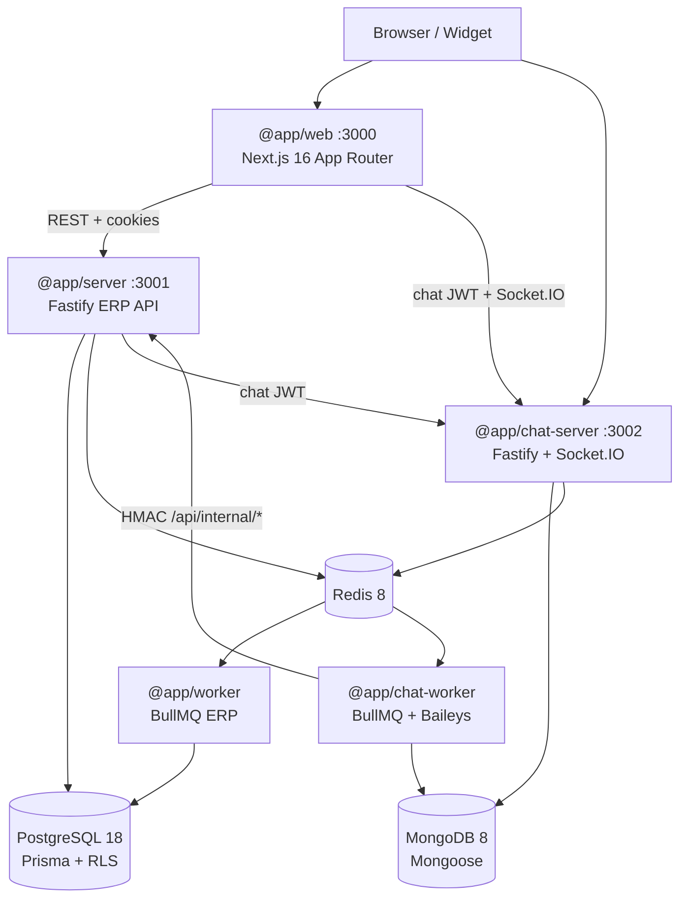
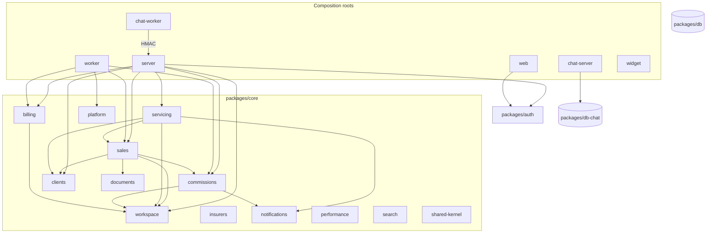

# Architecture Refactoring Roadmap — Bens Seguros

> **Date:** 2026-09-19  
> **Status:** proposal — no code changes in this document  
> **Scope:** full architecture & engineering restructure  
> **Constraint:** product is early; radical change is allowed if it reduces accidental complexity  
> **Optimizes for:** simplicity, cohesion, changeability — not pattern completeness

### Relationship to existing docs

A modular-architecture effort already exists:

| Document                                                                                             | Role after this proposal                                                                                                                                                                             |
| ---------------------------------------------------------------------------------------------------- | ---------------------------------------------------------------------------------------------------------------------------------------------------------------------------------------------------- |
| [`architecture/2026-09-13-modular-architecture.md`](architecture/2026-09-13-modular-architecture.md) | Historical only (already superseded). Do **not** follow: consumer gateways, domain events, outbox, UnitOfWork, 14 contexts with `module.ts` ceremony.                                                |
| [`architecture/context-map.md`](architecture/context-map.md)                                         | **Keep the module names and allowed DAG.** Update after ADR-2 (DI) and ADR-3 (Biome) land.                                                                                                           |
| [`architecture/2026-09-13-migration-plan.md`](architecture/2026-09-13-migration-plan.md)             | **Superseded for sequencing and DI.** Keep as a catalogue of _what to move_ (lead intake, CSV, alerts, internal routes). Do not keep “abstract-class tsyringe tokens” or “eslint-plugin-boundaries”. |
| [`ARCHITECTURE-DECISIONS.md`](ARCHITECTURE-DECISIONS.md) MOD-1                                       | Module map stays. DI decision is **replaced by ADR-2** in this document.                                                                                                                             |
| This file                                                                                            | Canonical roadmap for agents.                                                                                                                                                                        |

**Already done (do not redo):** `organization` + `member` + `invitation` live under `modules/workspace/`; `packages/auth/src/identity-service.ts` exists; `ResolveMembership` / `GetUserStatus` are plain classes composed in `apps/server/src/lib/workspace-queries.ts` **without tsyringe**. That file is the composition pattern to copy.

---

# 1. Executive Summary

Bens Seguros is an early-stage multi-tenant ERP for Brazilian insurance brokers, plus a real-time chat intake plane (WhatsApp / Meta / widget). The runtime split is justified. The **in-process** architecture is heavier than the product needs.

The live system is a **modular monolith with a global DI container**, 21 mostly-CRUD modules, and a root barrel that re-exports Prisma adapters. Domain richness exists in three places (`Proposal`, `Commission`, chat `Conversation`). Everything else is Light CRUD with hexagonal ceremony (interface + one Prisma class + injectable use case + string token + `container.resolve` in the route).

**Direction:** stay a modular monolith. Collapse modules that share a lifecycle. Replace the global container with **explicit composition** (already proven on workspace membership). Keep ports only where a vendor can actually change. Replace ESLint+Prettier (three rules) with Biome. Enforce the module DAG with a dedicated checker, not a second linter. Do not introduce microservices, events, CQRS, or extra packages for folder aesthetics.

Estimated duration if executed by agents with human review: **8–12 weeks** of sequential PRs. Highest risk is not the folder moves — it is **relocating Prisma writes that currently bypass domain rules** (CSV import, internal HMAC routes, workers) without a Postgres-backed test harness.

---

# 2. Current Architecture

## 2.1 Runtime map



Two planes:

| Plane    | Apps                                   | Data                    | Why it is a real boundary                                              |
| -------- | -------------------------------------- | ----------------------- | ---------------------------------------------------------------------- |
| **ERP**  | `web`, `server`, `worker`              | PostgreSQL              | Multi-tenant insurance operations, billing, RBAC                       |
| **Chat** | `chat-server`, `chat-worker`, `widget` | MongoDB + Redis pub/sub | Socket.IO, Baileys process state, different deploy (`Dockerfile.chat`) |

Joins: chat JWT issued by server; HMAC internal API; shared Redis; chat-worker still imports `@repo/core` and `@repo/db` for entitlements and AI usage.

## 2.2 Monorepo (live)

```
apps/          6 apps     web, server, chat-server, chat-worker, worker, widget
packages/     10 packages core, auth, db, db-chat, env, shared, ai,
                          billing-port, asaas-adapter, aggilizador (UNUSED)
config/        3 packages typescript-config, eslint-config, prettier-config
```

Workspace DAG is **acyclic**. No `@app/*` imports another app. File counts (`.ts`/`.tsx`, excluding generated/dist): `web` ~1416, `core` ~356, `server` ~336, remaining apps/packages much smaller.

### Package graph

```
@repo/env, @repo/billing-port          (leaves)
@repo/aggilizador                      (leaf, zero consumers)
@repo/shared  → env
@repo/db      → env
@repo/db-chat → shared
@repo/ai      → env
@repo/auth    → db, env
@repo/asaas-adapter → billing-port, env
@repo/core    → auth, billing-port, db, env, shared

@app/server      → asaas-adapter, auth, billing-port, core, db, env, shared
@app/web         → auth, core/legal only, env, shared
@app/chat-server → db, db-chat, env, shared     (no core, no auth package)
@app/chat-worker → ai, core, db, db-chat, env, shared
@app/worker      → billing-port, core, db, env, shared
@app/widget      → (no @repo/*)
```

## 2.3 What the code actually is (not what folders claim)

| Layer                               | Reality                                                                                                                                                                                                                       |
| ----------------------------------- | ----------------------------------------------------------------------------------------------------------------------------------------------------------------------------------------------------------------------------- |
| **Pattern mix**                     | Modular monolith + Light Hexagonal (ports that almost never have a second adapter) + DDD Full in 3 aggregates + a **global tsyringe service locator** in HTTP handlers                                                        |
| **Domain**                          | Rich: `Proposal`, `Commission`, chat `Conversation`. Anemic: Client, Policy, Claim, Assistance, Endorsement, Occurrence, Insurer, Document. State machines for Claim/Assistance live in use cases (`update-claim-status.ts`). |
| **Application**                     | ~one class per operation, `@injectable()`, string tokens (`@inject('ClientRepository')`). Many are 15–30 line pass-throughs.                                                                                                  |
| **Infrastructure**                  | 22 repository interfaces ↔ 22 Prisma classes. Dual Prisma clients (`prisma` vs `prismaAdmin`). RLS on 23 tables. Mongo tenant plugin **returns without scoping** if ALS tenant is missing.                                    |
| **Presentation**                    | Fastify + Zod type provider + OpenAPI/Scalar. Every authenticated route: `container.resolve(UseCase)`. Web: Orval → React Query. Chat UI: hand-rolled client to `:3002`.                                                      |
| **Composition**                     | `apps/server/src/container-registrations.ts` (~123 `container.register*` calls) **already `new`s repositories**, then re-registers them in a global container so routes can `resolve`. Dual wiring.                           |
| **Exception that shows the target** | `apps/server/src/lib/workspace-queries.ts`: `export const resolveMembership = new ResolveMembership(prisma)` — no container, no decorator, `Pick<PrismaClient, 'member'>`.                                                    |

## 2.4 Core modules today (21)

`ai-usage`, `assistance`, `audit`, `cep`, `claim`, `client`, `commission`, `contact`, `dashboard`, `document`, `endorsement`, `goal`, `insurer`, `notification`, `occurrence`, `policy`, `proposal`, `search`, `subscription`, `vehicle-lookup`, `workspace`.

**Import cycles (production):** proposal ⇄ contact, proposal ⇄ policy, proposal ⇄ document, goal ⇄ dashboard.

**Root barrel** `packages/core/src/index.ts` does `export *` from every module, including `Prisma*Repository` and mappers — the public API of “core” is the entire internals.

## 2.5 Frontend (live vs docs)

- App Router only, 26 features, ~415 `'use client'` files.
- Data: Orval + React Query. **Zustand is not installed.** Density toggle does not exist. RSC data loading is aspirational.
- Chat/channels/ai-agents talk to `chat-server` outside OpenAPI.
- `src/proxy.ts` is the Next 16 auth/CSP gate (no `middleware.ts`).
- `features/org` vs `features/organization` is a naming split, not a domain split.

## 2.6 Tooling / CI (live)

ESLint enforces **three rules**: `no-explicit-any`, `no-unused-vars`, `no-console` (allow warn/error). `eslint-plugin-import` and `eslint-config-next` are declared and unused. Prettier + Tailwind class sort. Husky + lint-staged. No Lefthook. No Biome.

CI: lint → typecheck → build (PRs) → test. `pnpm audit`, coverage, `.quality-gates` are **non-blocking**. **No Postgres service.** Playwright E2E (1 spec) is not in CI. `db:generate` uses a dummy URL.

---

# 3. Current Problems

Each item answers: problem, where, complexity, alternative, why simpler, impact, regression risk, worth it now?

## Critical

### C1 — Global service locator hides the real graph

1. **Problem:** HTTP handlers and tests depend on a process-wide `container`. Dependencies are string tokens, so a module can resolve another module’s repository without importing it.
2. **Where:** `packages/core/src/container.ts`; `apps/server/src/container-registrations.ts`; ~100 routes like `apps/server/src/routes/v1/clients/get-client.ts` (`container.resolve(GetClient)`); `apps/server/src/__tests__/helpers/mock-use-case.ts`.
3. **Complexity:** 121 `@injectable` classes, 123 registrations, `reflect-metadata` + `experimentalDecorators` on every Node tsconfig, dual wiring (composition root already constructs objects).
4. **Alternative:** explicit composition root per app. Pass use cases into `registerXRoutes(app, deps)`. Copy `workspace-queries.ts`.
5. **Why simpler:** the graph is visible; workers already do this; tests `new UseCase(fakeRepo)` without a container.
6. **Impact:** large mechanical change across server routes; delete tsyringe from core/server/chat-server.
7. **Regression:** wiring mistakes (forgotten dep) fail at boot if we add a boot spec that constructs the graph once.
8. **Worth it:** **yes.** This is the load-bearing accident. Keeping tsyringe “with abstract class tokens” (MOD-1) preserves the container and the decorator tax.

### C2 — Sales lifecycle split across four modules with cycles

1. **Problem:** lead → proposal → policy → endorsement is one language and one lifecycle, split into four packages-in-all-but-name.
2. **Where:** `packages/core/src/modules/{contact,proposal,policy,endorsement}`; `create-proposal.ts` injects `PolicyRepository` + `ContactRepository`; `issue-policy.ts` orchestrates client, contact, proposal, commission.
3. **Complexity:** four public surfaces, three cycles, `IssuePolicy` as a god use case.
4. **Alternative:** one `modules/sales/{leads,proposals,policies}` (endorsement under policies). Intra-module imports allowed.
5. **Why simpler:** cycles become local; one public `index.ts`.
6. **Impact:** ~70 files `git mv` + import updates; HTTP unchanged.
7. **Regression:** low if move-then-change; typecheck catches broken relative imports.
8. **Worth it:** **yes.** Highest-cohesion merge in the repo.

### C3 — Prisma writes outside the module that owns the table

1. **Problem:** routes, workers, and chat-worker write sales/billing/claim rows and skip domain rules.
2. **Where:** `routes/internal/leads/create-lead.ts`, `create-claim.ts`; `apps/worker/src/processors/csv-import-processor.ts`; `expire-policies-processor.ts`; `send-quote-email-processor.ts`; `chat-worker` entitlements + AI usage via `prismaAdmin`; commission routes `prisma.user.findUnique`.
3. **Complexity:** two truths for “how a policy/lead/claim is created”. CSV import already skips `IssuePolicy` (synthetic proposal, commission 0).
4. **Alternative:** named use cases on the owning module; processors/routes only validate, call, log.
5. **Why simpler:** one writer per table (modular-design principle 8).
6. **Impact:** medium; must preserve quirks (chat `dataSaved: true` even when nothing persisted — known bug, relocate don’t fix).
7. **Regression:** **high** without DB-backed tests. CI has no Postgres.
8. **Worth it:** **yes, after a DB harness.** Doing this before Postgres-in-CI is unsafe.

### C4 — Tenant isolation has fail-open paths

1. **Problem:** Mongo plugin does not scope queries when ALS tenant is missing. DI repos use `prismaAdmin` (RLS bypass) and filter `organizationId` in application SQL. Two isolation mechanisms, neither universal.
2. **Where:** `packages/db-chat/src/plugins/tenant-scope-plugin.ts` (`if (!tenantId) return`); `packages/db/src/index.ts` (`prismaAdmin`); core Prisma repositories.
3. **Complexity:** reviewers cannot answer “is this query tenant-safe?” without tracing the client.
4. **Alternative:** Mongo plugin throws if tenant missing (fail-closed) except a documented allowlist. ERP: keep `prismaAdmin` for workers, but every write goes through a module that **requires** `organizationId`. Internal HMAC routes keep `createTenantClient` (RLS).
5. **Why simpler:** one explicit rule per plane.
6. **Impact:** small code, large security value.
7. **Regression:** background jobs that forgot to set ALS will start failing — that is the point; fix callers.
8. **Worth it:** **yes, immediately** (small PR, not a rewrite).

## High

### H1 — 21 modules; many are features or lookups, not domains

CEP, vehicle-lookup, endorsement, occurrence, assistance, goal, dashboard, ai-usage, audit as “modules” inflate the map. Merge per §7.

### H2 — Root barrel + leaked Prisma types

`packages/core/src/index.ts` and every `modules/*/index.ts` export `Prisma*Repository`. Apps can (and do) construct adapters. Public surface is not a surface.

### H3 — `@repo/aggilizador` is dead weight

20 TS files, tests, CLAUDE.md claims server uses it. **Zero** `from '@repo/aggilizador'` imports. Agents and humans assume a quote integration that does not exist.

### H4 — ESLint does not enforce the rules the project believes it has

Three generic rules. CLAUDE.md bans `as`, `eslint-disable`, `process.env`, empty catch, barrels, missing pt-BR diacritics — **none of that is automated**. `eslint-plugin-import` unused. Paying for two tools (ESLint + Prettier) plus a Tailwind plugin for almost no lint value.

### H5 — CI cannot catch persistence regressions

No Postgres in CI. Route tests mock `container.resolve`. Moving queries (C3) is guesswork.

### H6 — Chat-worker coupled to ERP Postgres

`baileys-manager.ts` builds `GetEntitlementsForOrg` with `prismaAdmin`. `record-ai-usage-adapter.ts` same. Chat cannot deploy independently of ERP schema, contradicting the two-plane story.

### H7 — Dual Contact ubiquitous language

ERP `Contact` (lead) vs chat `Contact` (conversation participant). Same word, different aggregate. Integration bugs waiting.

### H8 — `/api/docs` is public

Scalar + OpenAPI at `/api/docs` and `/api/docs/openapi.json` with relaxed CSP. Conflicts with SECURITY-SPEC S13.

## Medium

### M1 — Claim/Assistance state machines in use cases, not entities

`update-claim-status.ts`, `update-assistance-status.ts`. Inconsistent with Proposal/Commission.

### M2 — Notification templates imported by domain use cases

Commission/claim use cases import `notification/infrastructure/email-templates/*`. Delivery module leaked into core language.

### M3 — `shared` is a grab-bag

Chat queues, HMAC, crypto, insured-object Zod, billing cache keys, rate limits — one barrel `export *`. Subpath exports exist but the root barrel still dumps everything.

### M4 — Frontend docs describe a different app

Zustand, density, Server-first Suspense data zones: not in code. Agents following `FRONTEND-PATTERNS.md` will invent stores.

### M5 — Chat transport lives under `features/chat`

`features/channels` and `features/ai-agents` import chat internals. Settings cannot exist without the inbox module.

### M6 — Bull Board queue drift

`apps/server/src/bull-board.ts` lists `chat-incoming-message`; runtime is `chat-process-incoming`. Several ERP/chat queues missing.

### M7 — Cookie flags not explicit

SECURITY-SPEC wants `sameSite: 'lax'`, `httpOnly`, `secure`. `createAuth` relies on Better Auth defaults.

### M8 — Orval pipeline docs are stale

`ARCHITECTURE-DECISIONS.md` GAP-1 says spec is committed at `packages/shared/api-spec.json` and CI diffs it. Live Orval reads `http://localhost:3001/api/docs/openapi.json`. No committed spec check.

## Low

### L1 — `features/org` vs `features/organization`

### L2 — Widget duplicates `SOCKET_EVENTS` instead of `@repo/shared`

### L3 — Web imports `@repo/core/legal` instead of a tiny constants module or API

### L4 — Many Get/List use cases are pass-throughs (acceptable if DI ceremony dies)

### L5 — No metrics/tracing beyond Sentry — acceptable at this stage (see §15)

---

# 4. Architectural Principles

1. **Fewer boundaries until pain is real.** Folders are not packages. Packages are not services.
2. **One writer per table.** Cross-module access is a public function on the owner, not Prisma from the caller.
3. **Ports exist for vendors and process boundaries**, not for every repository. Prisma is the database. Do not pretend it is swappable.
4. **Composition is explicit and local.** The app `bootstrap/` file constructs the graph. Routes receive functions/objects. No global container.
5. **DDD Full only where there is an invariant.** Proposal, Commission, Conversation, later Claim. CRUD modules are vertical slices (validate → persist → present).
6. **Queries may read owned tables directly.** No repository required for `listX` with zero rules — but they still live in the owning module, not in the route.
7. **Chat stays a separate deployable.** Do not extract `packages/conversations` until chat-server and chat-worker share a domain module that hurts. HMAC is the anti-corruption layer toward ERP.
8. **No new concept without a second use.** No event bus, outbox, gateway-per-consumer, UnitOfWork, microservices, Kafka.
9. **Machine-check the DAG.** A documented graph that agents can violate is theatre.
10. **Move, then change.** A PR that relocates files does not rewrite rules. A PR that relocates rules does not also rename.
11. **HTTP contracts stay frozen** during the refactor (`generate:api` zero diff) unless a task explicitly versions an endpoint.
12. **Preserve known quirks; fix them later.** Relocating a bug is in scope. Silently “improving” chat lead consent or CSV import is not.

---

# 5. Target Architecture

```text
Modular monolith (ERP)
+ domain-oriented modules inside @repo/core
+ light hexagonal (vendor ports only)
+ explicit composition roots
+ pragmatic DDD (rich aggregates only where invariants exist)
+ separate chat deployable (already earned)
```



### Per-module internal shape (use only the layers that exist)

Rich module (`sales`, `commissions`, `servicing`):

```
sales/
  index.ts                 # public API — use cases, errors, view types
  domain/                  # aggregates, errors, repository *types* (not DI tokens)
  application/             # commands + queries
  infrastructure/          # Prisma adapters, email copy owned by this module
```

Simple module (`insurers`, `search`):

```
insurers/
  index.ts
  application/             # list/get/create/update
  infrastructure/          # prisma-insurer-repository.ts
```

No `module.ts`, no `CONTEXT.md` mandate, no consumer-owned gateway ports, no in-process event dispatcher.

### Composition (target)

```ts
// apps/server/src/bootstrap/compose.ts
export function composeServer(deps: {
  db: PrismaClient
  redis: Redis
  auth: Auth
}) {
  const clients = composeClients(deps.db)
  const sales = composeSales(deps.db, { clients, commissions, documents })
  return { clients, sales /* ... */ }
}

// apps/server/src/routes/v1/clients/get-client.ts
export function getClientRoute(app: FastifyInstance, clients: ClientsApi) {
  app.route({
    handler: async (request, reply) => {
      const client = await clients.getClient.execute({
        id: request.params.id,
        organizationId: request.organizationId!,
      })
      return reply.send({ success: true, data: client })
    },
  })
}
```

Repository **types** stay for testing. They are not tsyringe tokens. Swappable ports (cache, storage, billing, email, CEP, plate lookup) remain TypeScript interfaces with 2+ implementations or a realistic second vendor.

---

# 6. Target Repository Structure

Do **not** rename `apps/server` → `apps/api`. Do **not** invent `packages/domain` + `packages/infrastructure`. Those are layer packages; we want **module** packages.

```
apps/
  web/                      # unchanged layout; small cleanups in Phase 7
  server/
    src/
      bootstrap/
        compose.ts          # ERP composition root (replaces container-registrations.ts)
        compose.spec.ts     # boot: every route module can be constructed
      app.ts
      server.ts
      routes/               # Fastify only — no Prisma, no @repo/db
      middlewares/
  worker/
    src/
      bootstrap/compose.ts
      processors/           # call modules only
  chat-server/              # keep; local compose already small
  chat-worker/              # no @repo/db / @repo/core after T5.x
  widget/

packages/
  core/
    src/
      shared-kernel/        # money, domain-error, cursor-page, json
      platform/             # audit, storage, lookups, csv, cache
      modules/
        sales/{leads,proposals,policies}/
        commissions/
        servicing/{claims,occurrences,assistance}/
        clients/
        insurers/
        documents/
        workspace/{organization,members,invitations}/
        billing/            # subscription + ai-usage
        notifications/
        performance/{goals,dashboard}/
        search/
        compliance/         # LGPD anonymize process (thin)
      index.ts              # DELETE — only subpath exports remain
    package.json            # exports: ./sales, ./commissions, ...
  auth/                     # Better Auth + CASL + identity-service + entitlements types
  db/                       # Prisma schema, clients, RLS SQL
  db-chat/                  # Mongoose models + tenant plugin (fail-closed)
  env/
  shared/                   # subpath exports only; no root export *
  billing-port/             # KEEP — real vendor contract
  asaas-adapter/            # KEEP — Asaas behind billing-port
  ai/                       # KEEP — vendor wrapper; only chat-worker consumes it
  aggilizador/              # DORMANT — keep code, remove from CLAUDE.md “used by server”

config/
  typescript-config/
  biome/                    # replaces eslint-config + prettier-config
```

**Not created:** `packages/conversations`, `packages/domain`, extra app.

---

# 7. Module Boundaries

## Domain map

| Module            | Type          | Kind                    | UL                                                             | Cohesion now → after | Action                                    |
| ----------------- | ------------- | ----------------------- | -------------------------------------------------------------- | -------------------- | ----------------------------------------- |
| **sales**         | Core          | Domain Full             | Contato, Proposta, Etapa, Checklist, Cotação, Apólice, Endosso | 5–9 → 8              | Merge contact+proposal+policy+endorsement |
| **commissions**   | Core          | Domain Full             | Comissão, Split, Aprovação, Estorno                            | 9                    | Stay                                      |
| **servicing**     | Core-adjacent | Domain Light→promote SM | Sinistro, Ocorrência, Assistência                              | 4 → 8                | Merge claim+occurrence+assistance         |
| **conversations** | Core          | Domain Full             | Conversa, Canal, Fila                                          | 8                    | Stay in chat apps (not a package yet)     |
| **clients**       | Supporting    | CRUD + LGPD             | Cliente, CPF/CNPJ, Anonimização                                | 7                    | Stay                                      |
| **workspace**     | Supporting    | ACL over Better Auth    | Organização, Membro, Convite                                   | 8                    | Stay (already grouped)                    |
| **billing**       | Supporting    | Feature                 | Plano, Assinatura, Entitlements, Uso de IA                     | 7                    | Merge subscription+ai-usage               |
| **documents**     | Supporting    | Feature                 | Anexo, Storage                                                 | 6                    | Stay; lose proposal trigger               |
| **insurers**      | Supporting    | CRUD catalog            | Seguradora                                                     | 7                    | Stay                                      |
| **notifications** | Generic       | Delivery                | Notificação, e-mail                                            | 6                    | Stay; templates move to owner modules     |
| **performance**   | Supporting    | Read model              | Meta, Dashboard                                                | 4 → 8                | Merge goal+dashboard                      |
| **search**        | Generic       | Read model              | Busca                                                          | 7                    | Stay                                      |
| **platform**      | Generic       | Infra                   | Audit, CEP, placa, CSV, cache, storage                         | —                    | Fold audit+cep+vehicle-lookup             |
| **compliance**    | Generic       | Process                 | LGPD delete                                                    | —                    | Thin wrapper over clients+audit           |

### Cross-domain cohesion (important pairs)

| A           | B                       | Score | Issue                 | Rule                                                                               |
| ----------- | ----------------------- | ----- | --------------------- | ---------------------------------------------------------------------------------- |
| proposal    | contact                 | 8     | Cycle                 | Same module (`sales`)                                                              |
| proposal    | policy                  | 7     | Cycle                 | Same module (`sales`)                                                              |
| proposal    | document                | 5     | Cycle                 | `sales.AttachProposalDocument` calls documents; documents do not import sales      |
| policy      | commission              | 7     | Sync `OnPolicyIssued` | `sales.IssuePolicy` → `commissions.CreateCommissionForPolicy` (public, idempotent) |
| claim       | occurrence / assistance | 6–8   | Fragmentation         | Same module (`servicing`)                                                          |
| goal        | dashboard               | 7     | Cycle                 | Same module (`performance`)                                                        |
| ERP Contact | chat Contact            | 2     | Homonym               | Rename chat model to **Participant** when chat is next touched                     |
| billing     | workspace               | 5     | Org trial             | billing may read workspace public API only                                         |
| cep/vehicle | proposal                | 2     | Lookups               | platform; sales calls lookups                                                      |

Chat → ERP: HMAC only (`/api/internal/*`). Never Prisma from chat-worker after Phase 5.

---

# 8. Dependency Rules

```
routes / processors / AI tools
        ↓
module public index.ts  (application)
        ↓
module domain

infrastructure adapters
        ↓
domain types + Prisma (owned delegates only)
```

| From                            | May import                                                          | Must not import                                                             |
| ------------------------------- | ------------------------------------------------------------------- | --------------------------------------------------------------------------- |
| `apps/server/src/routes/**`     | `@repo/core/<module>`, `@repo/auth`, Zod schemas local to the route | `@repo/db`, Prisma, `Prisma*Repository`, tsyringe                           |
| `apps/worker/src/processors/**` | `@repo/core/<module>`                                               | `@repo/db` (except until each processor is migrated; then zero)             |
| `apps/chat-worker`              | `@repo/ai`, `@repo/db-chat`, `@repo/shared`, `@repo/env`            | `@repo/core`, `@repo/db`                                                    |
| `apps/web`                      | `@repo/auth`, `@repo/shared` subpaths, Orval                        | `@repo/core` (move legal constants), `@repo/db`                             |
| `modules/sales`                 | clients, documents, commissions, workspace, platform, shared-kernel | servicing, performance, other module internals                              |
| `modules/commissions`           | workspace, notifications, platform, shared-kernel                   | sales internals (only called **by** sales)                                  |
| `modules/servicing`             | sales, clients, workspace, notifications                            | commissions                                                                 |
| `shared-kernel`                 | nothing in the repo                                                 | —                                                                           |
| `platform`                      | shared-kernel                                                       | any `modules/*`                                                             |
| `packages/auth`                 | `@repo/db`, `@repo/env`                                             | `@repo/core` (entitlements **types** live in auth; billing produces values) |
| Domain folder                   | same module domain/application types                                | Fastify, Prisma client class, Redis, Zod HTTP schemas                       |
| Application folder              | domain + other module **index.ts**                                  | Fastify, React                                                              |
| Infrastructure                  | domain types, `@repo/db`, vendors                                   | Fastify routes                                                              |

**Zod:** HTTP/OpenAPI schemas stay in `apps/server/src/routes/**/_schemas.ts`. Domain parsing (insured object, CPF) may use Zod in `shared` or the owning module. Do not share one Zod schema between OpenAPI and domain unless it is already the case and changing it would break Orval.

**Prisma:** only in `packages/db`, module `infrastructure/`, `@repo/auth` identity tables, and composition roots that **pass** the client in. Narrow type per module: `type SalesDb = Pick<PrismaClient, 'contact' \| 'proposal' \| 'proposalChecklistItem' \| 'policy' \| 'endorsement' \| '$transaction'>`.

**Redis / BullMQ:** composition roots and `platform` cache. Modules receive a `CacheService` / queue port, they do not construct `IORedis`.

**Enforcement (ADR-3):** `dependency-cruiser` (or equivalent) in CI, error after each area is clean. Not ESLint — we are removing ESLint.

---

# 9. Stack Review

| Technology                  | Current                          | Recommendation                                            | Reason                                                                                   |
| --------------------------- | -------------------------------- | --------------------------------------------------------- | ---------------------------------------------------------------------------------------- |
| Node.js 22                  | Runtime                          | **Keep**                                                  | LTS, matches Docker images                                                               |
| TypeScript 5.9 strict       | Everywhere                       | **Keep**                                                  | `noUncheckedIndexedAccess` is load-bearing                                               |
| pnpm 9                      | Workspace                        | **Keep**                                                  | Fine; no yarn/npm rewrite                                                                |
| Turborepo                   | Pipeline                         | **Keep**                                                  | Needed for 6 apps; cheap                                                                 |
| Next.js 16                  | `apps/web`                       | **Keep**                                                  | App Router + `proxy.ts` already on 16; dashboard SPA does not need a different framework |
| React 19                    | web + widget                     | **Keep**                                                  |                                                                                          |
| Fastify 5                   | server, chat-server              | **Keep**                                                  | Fast, Zod type provider, OpenAPI. Express/Nest would add ceremony                        |
| tsyringe                    | core + server + chat-server      | **Remove**                                                | See ADR-2. Global locator + 1:1 registrations                                            |
| Prisma 7 + PostgreSQL 18    | ERP                              | **Keep**                                                  | RLS + schema are real assets                                                             |
| Mongoose + MongoDB 8        | chat                             | **Keep**                                                  | Conversation documents fit Mongo; not worth unifying on Postgres now                     |
| Redis 8                     | cache, queues, Socket.IO adapter | **Keep**                                                  |                                                                                          |
| BullMQ 5                    | both workers                     | **Keep**                                                  | Do not add Kafka/RabbitMQ                                                                |
| Zod                         | env, HTTP, some domain           | **Keep**                                                  |                                                                                          |
| Better Auth + CASL          | auth                             | **Keep**                                                  | Roles/entitlements work; tighten cookies/docs                                            |
| Orval + React Query         | web ERP                          | **Keep**                                                  | Do not hand-write REST hooks                                                             |
| Zustand                     | documented, unused               | **Do not add**                                            | nuqs covers URL state; no global UI store needed                                         |
| ESLint 9                    | 3 rules                          | **Replace**                                               | ADR-1                                                                                    |
| Prettier + tailwind plugin  | format                           | **Replace** with Biome formatter; verify class sort       | ADR-1                                                                                    |
| Biome                       | unused                           | **Adopt**                                                 | ADR-1                                                                                    |
| Husky + lint-staged         | pre-commit                       | **Keep**, point at Biome                                  | Lefthook not present; no reason to switch                                                |
| Vitest                      | unit/route                       | **Keep**                                                  |                                                                                          |
| Playwright                  | 1 E2E spec, not in CI            | **Keep**, add 1 smoke job later                           | Not a rewrite                                                                            |
| Docker multi-stage          | server + chat images             | **Keep**                                                  |                                                                                          |
| GitHub Actions              | CI + tag deploy                  | **Keep**; add Postgres service; make audit blocking later |                                                                                          |
| Pino                        | logs                             | **Keep**                                                  |                                                                                          |
| Sentry                      | errors + light traces            | **Keep**; do not add OTel/Prometheus yet                  | §15                                                                                      |
| `@fastify/swagger` + Scalar | OpenAPI                          | **Keep**; protect with auth                               | H8                                                                                       |
| Vercel AI SDK               | chat-worker                      | **Keep** behind `@repo/ai`                                |                                                                                          |
| Asaas                       | billing                          | **Keep** behind `billing-port`                            |                                                                                          |
| Aggilizador SDK             | unused package                   | **Dormant**                                               | Do not wire until quote feature exists                                                   |
| Nest / tRPC / GraphQL       | —                                | **Do not introduce**                                      |                                                                                          |

### Per-technology cards (required format, condensed)

```text
Technology: tsyringe
Current usage: 121 injectables, 123 server registrations, routes call container.resolve
Problem solved: test doubles, swappable cache/storage
Complexity introduced: string tokens, reflect-metadata, dual wiring, hidden graph
Keep / Replace / Remove: Remove
Alternative: explicit compose.ts + constructor injection
Migration difficulty: High (mechanical, many files)
Recommendation: Phase 2+6; start with one module (clients)

Technology: ESLint + Prettier
Current usage: 3 ESLint rules + Prettier + prettier-plugin-tailwindcss
Problem solved: no-any, no-console, unused vars, format, Tailwind class order
Complexity introduced: 2 config packages, unused plugins, slow Node lint vs Rust
Keep / Replace / Remove: Replace
Alternative: Biome 2 formatter+linter; dependency-cruiser for architecture
Migration difficulty: Medium (one format tsunami PR, then delete ESLint)
Recommendation: Phase 1, first large PR after docs freeze

Technology: Prisma
Current usage: dual clients, RLS, 23 tenant tables
Problem solved: typed access, migrations
Complexity introduced: prisma vs prismaAdmin confusion; repos inject admin
Keep / Replace / Remove: Keep
Alternative: none at this stage
Migration difficulty: n/a
Recommendation: narrow Pick<> per module; do not split schema files until modules stabilize

Technology: Next.js
Current usage: App Router SPA, client-heavy React Query
Problem solved: dashboard + auth cookies + marketing pages
Complexity introduced: docs claim RSC data loading that is not used
Keep / Replace / Remove: Keep
Alternative: Vite SPA — not worth the auth/cookie rewrite
Migration difficulty: n/a
Recommendation: document client-Query-first; do not force RSC fetches

Technology: Fastify
Current usage: ERP + chat HTTP, Zod, Swagger
Problem solved: typed HTTP + OpenAPI for Orval
Keep: yes. Nest would add modules-on-modules.

Technology: BullMQ + Redis
Current usage: 10 ERP queues + 9 chat queues
Keep: yes. Fix Bull Board names. Do not add a second broker.
```

---

# 10. Architecture Decisions

Extract to `docs/adr/` when implementing the matching phase. Until then, this section is the ADR.

## ADR-1 — Replace ESLint + Prettier with Biome

**Status:** proposed  
**Context:** ESLint config is three generic rules. Prettier handles format. Tailwind class sort is a Prettier plugin. CLAUDE.md policies are not encoded. CI already runs `tsc` separately.

**Decision:** Biome 2 as the only formatter/linter for `ts`/`tsx`/`json`/`css`. `pnpm lint` → `biome check`. `lint-staged` → `biome check --write`. Keep `pnpm typecheck` (`tsc --noEmit`). Architecture DAG via `dependency-cruiser`, not ESLint.

**Consequences:**

- `biome migrate eslint` / `biome migrate prettier` as starting config.
- Map: `no-explicit-any` → `noExplicitAny`; `no-console` allow warn/error → `noConsole` with allowlist; `no-unused-vars` `^_` → `noUnusedVariables`.
- Tailwind class sort: enable Biome `useSortedClasses` (or equivalent in the chosen Biome version). If class sort is worse than `prettier-plugin-tailwindcss` on a sample of `apps/web` files, **keep only that Prettier plugin** for `tsx` until Biome matches — one exception, documented. Do not keep full Prettier.
- One format PR will touch thousands of files. Land it **before** module moves.
- TypeScript coverage does not regress: `tsc` stays a blocking CI gate. Biome is not a typechecker.
- Custom CLAUDE.md rules (`as` ban, `process.env` ban, pt-BR diacritics) remain **review policy** until a cheap custom check exists. Do not block Biome on encoding them.

**Rejected:** keep ESLint “for boundaries only” (two lint runtimes). Lefthook. Ultracite preset (extra opinion layer).

## ADR-2 — Explicit composition instead of tsyringe

**Status:** proposed (replaces MOD-1 “abstract class tokens”)  
**Context:** composition root already `new`s repositories. Workspace queries already avoid the container. Workers never used it. Almost every repository has one implementation.

**Decision:** delete tsyringe and `reflect-metadata` from `@repo/core`, `@app/server`, `@app/chat-server`. Each app has `bootstrap/compose.ts`. Routes receive a typed API object. Repository **interfaces remain as TypeScript types** for fakes. String tokens go away.

**Rejected:** NestJS DI. Keep tsyringe with abstract classes (still a global container, still decorators). Delete all repository types (hurts unit tests for Full modules).

**Migration:** one module at a time. `clients` first (CRUD, good specs). Do not migrate all 123 registrations in one PR.

## ADR-3 — Enforce the module DAG with dependency-cruiser

**Status:** proposed  
**Decision:** `dependency-cruiser` config committed at repo root, run in CI. Start `warn` (comment on PR), flip each rule to error when violations for that rule hit 0. Forbidden: `routes/**` → `@repo/db`; module A internals imported by module B; `shared-kernel` importing modules.

**Rejected:** eslint-plugin-boundaries (depends on ESLint). Manual review only.

## ADR-4 — Keep billing-port + asaas-adapter as packages

**Status:** proposed  
**Decision:** they are a real vendor boundary (8 + 16 files, tests, canonical events). Folding them into `core` saves two `package.json`s and couples Asaas HTTP types to domain. Not worth it.

**Rejected:** fold into `packages/core/modules/billing/infrastructure`.

## ADR-5 — Aggilizador stays dormant

**Status:** proposed  
**Decision:** keep `packages/aggilizador` source (future auto-quote). Remove claims that server uses it. Do not add a dependency until a quote feature is scheduled. Optionally exclude from default `turbo` `build` if it slows CI — only if measured.

## ADR-6 — Do not extract `packages/conversations` in this roadmap

**Status:** proposed  
**Decision:** chat already has two apps and a DB package. Extracting a third package is coordination cost. Rename chat `Contact` → `Participant` opportunistically.

## ADR-7 — Policy lives in `sales`, not a `portfolio` context

**Status:** already in revised MOD-1; **reaffirmed**  
**Reason:** proposal ⇄ policy cycle; issuance is the end of the sales lifecycle. A separate portfolio context was the over-engineered first draft.

## ADR-8 — Do not force RSC data fetching on the dashboard

**Status:** proposed  
**Decision:** authenticated ERP UI stays client React Query. Update `FRONTEND-PATTERNS.md` to match. Marketing pages may stay Server Components.

## ADR-9 — Observability stays Pino + Sentry

**Status:** proposed  
**Decision:** no Prometheus, no OpenTelemetry collector, no APM purchase. Keep `x-request-id`. Fix Bull Board. Add Sentry spans around HMAC and billing webhooks if noise appears.

## Decisions that need human approval before agents execute

| ID    | Decision                           | Default if silent                          |
| ----- | ---------------------------------- | ------------------------------------------ |
| ADR-1 | Biome replaces ESLint+Prettier     | Proceed                                    |
| ADR-2 | Remove tsyringe                    | Proceed — this is the main fork from MOD-1 |
| ADR-5 | Leave aggilizador in repo unused   | Proceed                                    |
| C4    | Mongo tenant plugin fail-closed    | Proceed                                    |
| H8    | Auth-gate `/api/docs`              | Proceed                                    |
| H5    | Postgres service in CI (~+1–2 min) | Proceed                                    |
| —     | Rename chat Contact → Participant  | Defer to first chat PR                     |

If ADR-2 is rejected, fall back to MOD-1 abstract tokens — still add `compose` for **new** code, freeze tsyringe for old modules, and do not expand `@injectable`.

---

# 11. Migration Strategy

**Rules (from the Sep 2026 plan, still valid):**

- One task ≈ one PR. `main` stays deployable.
- No HTTP contract change unless the task says so.
- No destructive schema change.
- BullMQ payloads unchanged.
- Move, then change.
- Default rollback = `git revert` of the merge commit.
- Characterization specs **before** moving logic that currently lives in routes/workers.

**Compatibility:** `@repo/core` root barrel remains until T6.1 so apps keep compiling while folders move.

**Deploy order when chat-worker stops using Postgres:** ship `server` (new HMAC entitlements route) → `worker` (AI usage queue) → `chat-worker`. Rollback reverse.

**Do not mix** the Biome format PR with any logic PR.

---

# 12. Roadmap

```text
Phase 0 — Freeze the target (docs + checker in warn)
Phase 1 — Tooling (Biome, Husky, CI Postgres)
Phase 2 — Composition foundation (clients module as the template)
Phase 3 — Module merges (sales, servicing, performance, billing, platform)
Phase 4 — Push Prisma out of edges (internal routes, workers, CSV)
Phase 5 — Chat/ERP isolation + money/commission handoff
Phase 6 — Kill container, barrels, unused wiring
Phase 7 — Frontend honesty + small structure
Phase 8 — Security hardening + observability hygiene
Phase 9 — Cleanup (docs, CLAUDE.md, skills, dormant packages)
```

Phase 0+1 are the foundation. Phase 3 is the largest domain win. Phase 4 is the highest regression risk (needs Phase 1 Postgres). Phase 6 is only safe after most routes no longer `container.resolve`.

---

# 13. Tasks

Effort: **S** ≤ 0.5 day, **M** 1–2 days, **L** 3–5 days (agent + review). Risk: L/M/H.

## Phase 0 — Freeze

### T0.1 — Make this roadmap the single source of truth

- **Description:** Update `docs/ARCHITECTURE-DECISIONS.md` MOD-1 DI bullet to point at ADR-2. Add a banner at the top of `docs/architecture/2026-09-13-migration-plan.md`: superseded for sequencing/DI; still a move catalogue. Point `CLAUDE.md` architecture line at this file. Do not rewrite the old plan.
- **Objective:** agents stop following the event-bus design or “keep tsyringe with abstract tokens”.
- **Affects:** `docs/ARCHITECTURE-DECISIONS.md`, `docs/architecture/2026-09-13-migration-plan.md`, `CLAUDE.md`
- **Depends on:** none
- **Risk:** L — **Effort:** S
- **Done when:** grep for “abstract class tokens” in live guidance only appears as “superseded”; this file is linked from CLAUDE.md.

### T0.2 — dependency-cruiser in warn mode

- **Description:** Add `dependency-cruiser` with rules from §8. CI runs it `continue-on-error: true` and prints violation counts. Commit `.dependency-cruiser.cjs` + a short `docs/architecture/forbidden-deps.md` listing current hotspots (`routes/**` → `@repo/db`, core cycles).
- **Objective:** baseline coupling before moving files.
- **Affects:** root `package.json`, `.github/workflows/ci.yml`, new config file
- **Depends on:** T0.1
- **Risk:** L — **Effort:** M
- **Done when:** CI comment or log shows a count; a fixture file that imports `@repo/db` from a route is reported.

## Phase 1 — Tooling

### T1.1 — Adopt Biome (format tsunami)

- **Description:** Add `biome.json` via `biome migrate prettier` + `biome migrate eslint`. Match printWidth 80, semi false, singleQuote, trailing commas es5-equivalent, noConsole allowlist, noExplicitAny, noUnusedVariables `_`. Run `biome check --write` on the repo. Replace `pnpm lint` and lint-staged. Delete `config/eslint-config` and `config/prettier-config` **only after** a sample of web components keeps Tailwind class order acceptable (check `apps/web/src/features/proposals` and `components/ui`). Keep `tsc`.
- **Objective:** one tool, fast lint/format, no mixed diffs later.
- **Affects:** entire tree formatting; root scripts; Husky; CI lint step; app `lint` scripts
- **Depends on:** T0.1 (so the PR description cites ADR-1)
- **Risk:** M (noise, class-sort drift) — **Effort:** L
- **Done when:** `pnpm lint` is Biome; ESLint binary not used; `pnpm typecheck` still passes; CI green; no `eslint` in lint-staged.

### T1.2 — Postgres in CI + core DB harness

- **Description:** Add `postgres:18` service to `.github/workflows/ci.yml`. Before `pnpm test`, run `pnpm db:push:dev` (schema + RLS). Add `packages/core/test/db-harness.ts` (transaction-per-test, seed org). Vitest project `*.db.spec.ts`. Port `prisma-client-repository.spec.ts` as proof. Document `docker compose up -d` as local prerequisite.
- **Objective:** persistence moves in Phase 4 cannot ship untested.
- **Affects:** `.github/workflows/ci.yml`, `packages/core/vitest.config.ts`, new harness
- **Depends on:** none (can parallel T1.1)
- **Risk:** M (flakes) — **Effort:** M
- **Done when:** a DB spec runs in CI with RLS enabled; harness rolls back per test.

### T1.3 — Encode two cheap policy checks (optional in same PR as T1.1)

- **Description:** Biome `noRestrictedGlobals` / similar for `process.env` in `packages/**` and `apps/server/**` (allow `packages/env` and `apps/web` `NEXT_PUBLIC_*`). Do **not** attempt pt-BR diacritics lint in this phase.
- **Objective:** one CLAUDE.md ban becomes real.
- **Affects:** `biome.json`
- **Depends on:** T1.1
- **Risk:** L — **Effort:** S
- **Done when:** a dummy `process.env.FOO` in `packages/core` fails lint; `packages/env/src/index.ts` still passes.

## Phase 2 — Composition foundation

### T2.1 — Compose `clients` without tsyringe

- **Description:** Remove `@injectable` / `@inject` from `packages/core/src/modules/client/**`. Add `packages/core/src/modules/client/compose-clients.ts` returning `{ getClient, listClients, ... }`. In `container-registrations.ts`, register the composed object **or** pass it alongside the container. Change **client routes only** to take `clients: ClientsApi` instead of `container.resolve`. Keep other modules on tsyringe. Add `compose-clients.spec.ts` constructing with a fake repo.
- **Objective:** prove ADR-2 on the simplest module; template for the rest.
- **Affects:** `modules/client/**`, `apps/server/src/routes/v1/clients/**`, `container-registrations.ts`, client route specs (`mock-use-case` → passed fake)
- **Depends on:** T0.2
- **Risk:** M — **Effort:** M
- **Done when:** client routes have zero `container.resolve`; `GetClient` has no tsyringe import; existing client tests pass; HTTP contract unchanged.

### T2.2 — Server boot composition spec

- **Description:** `apps/server/src/bootstrap/compose.spec.ts` builds the (partial) graph with fakes and asserts `getClientRoute` can register. Expand this spec each time a module leaves the container.
- **Objective:** missing constructor args fail in CI, not in production boot.
- **Affects:** `apps/server/src/bootstrap/`
- **Depends on:** T2.1
- **Risk:** L — **Effort:** S
- **Done when:** spec fails if `composeClients` forgets `deleteClient`.

### T2.3 — Workspace public API: stop exporting Prisma adapters

- **Description:** Remove `PrismaOrganizationRepository`, `PrismaMemberRepository`, `PrismaInvitationRepository` from `modules/workspace/index.ts`. Server compose/container imports them from `infrastructure/` paths **temporarily** (allowlisted in cruiser). Add `composeWorkspace`.
- **Objective:** first public surface that matches §8.
- **Affects:** `workspace/index.ts`, server registrations, cruiser allowlist
- **Depends on:** T2.1
- **Risk:** L — **Effort:** S
- **Done when:** `from '@repo/core'` (or workspace index) cannot import `PrismaMemberRepository`.

## Phase 3 — Module merges

Move-only PRs. No logic edits. Root barrel re-exports old names.

### T3.1 — Merge sales folders

- **Description:** `git mv` `contact`, `proposal`, `policy`, `endorsement` → `modules/sales/{leads,proposals,policies}` (endorsement under `policies/endorsement` or `policies/`). `sales/index.ts` re-exports the union of the four old indexes (same symbol names). Update `packages/core/src/index.ts` to export sales. Intra-sales relative imports replace cross-module imports.
- **Objective:** kill three cycles by making them local.
- **Affects:** ~70 core files + specs; core barrel
- **Depends on:** T0.1
- **Risk:** M (merge conflicts with proposal work) — **Effort:** L
- **Done when:** no `modules/proposal` directory; `pnpm --filter @repo/core test` green; `generate:api` zero diff.

### T3.2 — Shared JSON types

- **Description:** `shared-kernel/json.ts` with `JsonValue` / `JsonObject`. Endorsement/occurrence stop importing each other’s repo types.
- **Objective:** remaining type-only coupling gone.
- **Affects:** 3–4 files
- **Depends on:** T3.1
- **Risk:** L — **Effort:** S
- **Done when:** no endorsement import from occurrence.

### T3.3 — Merge servicing

- **Description:** `git mv` claim, occurrence, assistance → `modules/servicing/{claims,occurrences,assistance}`. Public union index.
- **Affects:** those modules + barrel
- **Depends on:** T3.1 (schedule independently if needed)
- **Risk:** L — **Effort:** M
- **Done when:** three old folders gone; tests green.

### T3.4 — Merge performance, billing, platform

- **Description:** goal+dashboard → `performance`; subscription+ai-usage → `billing`; audit+cep+vehicle-lookup → `platform/{audit,lookups}` (storage port move if still under documents). Root barrel compatibility.
- **Affects:** listed modules
- **Depends on:** T3.1
- **Risk:** L — **Effort:** M
- **Done when:** cycles goal⇄dashboard gone; `modules/cep` gone.

### T3.5 — Deduplicate proposal checklist sync (logic, after move)

- **Description:** Characterization specs on create-proposal vs advance-proposal-stage checklist loops, then extract internal `sync-stage-checklist.ts` (not exported).
- **Affects:** `sales/proposals/application/*`
- **Depends on:** T3.1
- **Risk:** M — **Effort:** M
- **Done when:** both use cases call one helper; specs assert same item keys/completion as before.

## Phase 4 — Edges use modules

Requires T1.2.

### T4.1 — `sales.CaptureLead`

- **Description:** Move `routes/internal/leads/create-lead.ts` rules into `sales/leads/application/capture-lead.ts`. Preserve phone dedup, owner = oldest active member, `consentLgpd: true`, TRAVEL→OTHER. Route: HMAC validate → use case → same JSON. Characterization spec **before**.
- **Affects:** internal create-lead route, new use case, contact `findByPhone`
- **Depends on:** T3.1, T1.2
- **Risk:** H (RLS: today `tenantPrisma`, repos `prismaAdmin`) — **Effort:** M
- **Done when:** route has no Prisma; DB spec proves org scoping; chat-worker contract unchanged.

### T4.2 — Invert documents → proposals

- **Description:** `sales.AttachProposalDocument` = upload + checklist complete. Document upload route dispatches `entityType === 'PROPOSAL'` there. `upload-document` use case loses `AutoCompleteChecklistItems`. Grep all `UploadDocument` callers first.
- **Affects:** document use case, document routes, new sales command
- **Depends on:** T3.1
- **Risk:** H (silent loss of auto-complete) — **Effort:** M
- **Done when:** documents module does not import sales; CNH upload still completes checklist (spec + smoke).

### T4.3 — Internal list/update routes through modules

- **Description:** `list-proposals`, `list-policies`, `update-client` (internal) call sales/clients queries. Queries receive **tenant client**, not `prismaAdmin`. Snapshot response specs before.
- **Affects:** `routes/internal/leads/*`
- **Depends on:** T4.1, T1.2
- **Risk:** H — **Effort:** M
- **Done when:** those files do not import `@repo/db`; RLS spec: other org rows invisible.

### T4.4 — Worker sales writes

- **Description:** `ExpireDuePolicies`, `MarkQuoteSent` in sales. Processors call them. Same `updateMany` semantics; pass `now` from processor.
- **Affects:** `expire-policies-processor.ts`, `send-quote-email-processor.ts`
- **Depends on:** T3.1, T1.2
- **Risk:** M — **Effort:** M
- **Done when:** processors have no `prismaAdmin.policy/proposal` writes; DB spec for expiry boundaries.

### T4.5 — CSV import through clients + sales

- **Description:** Characterization fixture on current processor (counts + pt-BR messages). Then `clients.ImportClientRow` + `sales.ImportPolicyRow` reproducing **exact** current behavior (synthetic proposal, no commission, skip existing policy number). Processor keeps batching. Do not “fix” D4 in this PR.
- **Affects:** `csv-import-processor.ts`, two use cases
- **Depends on:** T3.1, T1.2
- **Risk:** H (perf + message parity) — **Effort:** L
- **Done when:** fixture counts/messages identical; processor has no direct client/policy creates; 5k-row timing ≤ +20% locally.

### T4.6 — Alert queries owned by modules

- **Description:** `FindStagnantProposals`, `FindExpiringPolicies`, `FindPendingCommissions`, stalled claims query. Processors keep org loop, idempotency, copy (including missing diacritics — do not fix S20 here).
- **Affects:** `apps/worker/src/processors/alerts/*`
- **Depends on:** T3.1, T3.3, T1.2
- **Risk:** M — **Effort:** M
- **Done when:** alert processors do not query proposal/policy/commission/claim tables.

## Phase 5 — Isolation and money

### T5.1 — HMAC entitlements for chat-worker

- **Description:** `GET /api/internal/billing/entitlements/:organizationId`. chat-worker uses HMAC + 3s timeout; on failure behave as today (connection attempt fails). Cache keys unchanged. Deploy server first.
- **Affects:** new internal route, `baileys-manager.ts`, subscription cache
- **Depends on:** T3.4 billing merge (or can use current `GetEntitlementsForOrg`)
- **Risk:** H (WhatsApp connectivity) — **Effort:** M
- **Done when:** `baileys-manager.ts` does not import Prisma; spec for allowed/blocked/down.

### T5.2 — AI usage via ERP queue

- **Description:** chat-worker enqueues `billing.record-ai-usage`; `apps/worker` records it. Remove `@repo/core` and `@repo/db` from chat-worker `package.json`. Move `ContactSource` type to `@repo/shared` if still imported from db.
- **Affects:** `record-ai-usage-adapter.ts`, worker processor, chat-worker package.json
- **Depends on:** T5.1
- **Risk:** M (eventual consistency of usage) — **Effort:** M
- **Done when:** chat-worker package.json has no core/db; processor idempotent by message id.

### T5.3 — `CreateCommissionForPolicy` public + idempotent

- **Description:** Replace `OnPolicyIssued` with public commissions command; `IssuePolicy` calls it. Second call with same `policyId` returns existing non-reversal commission. Rate 0 → no commission.
- **Affects:** `issue-policy.ts`, commission application
- **Depends on:** T3.1
- **Risk:** M — **Effort:** M
- **Done when:** `OnPolicyIssued` deleted; spec double-issue → one commission; smoke issue policy.

### T5.4 — Money kernel

- **Description:** `shared-kernel/money.ts`: branded `Cents`, `BasisPoints`, `applyBasisPoints`, `reaisToCents`. Calculator + CSV import use it. Table-driven rounding specs matching current outputs. Domain rename `commissionPercentageInCents` → `commissionBasisPoints` internally; **API field name unchanged**.
- **Affects:** calculator, proposal domain, CSV, presenter alias
- **Depends on:** T3.1
- **Risk:** M (rounding) — **Effort:** M
- **Done when:** `generate:api` zero diff; calculator outputs unchanged.

### T5.5 — Templates owned by commissions/servicing

- **Description:** Move email templates next to the owning module. `notifications` exports dispatcher + layout only.
- **Affects:** commission/claim use cases, template files
- **Depends on:** T3.3
- **Risk:** L — **Effort:** S
- **Done when:** commissions do not import `notification/infrastructure`.

### T5.6 — `servicing.RegisterClaimFromChat`

- **Description:** Move internal `create-claim.ts` (152 lines) into servicing. Preserve S9 response (`dataSaved: true` even when nothing persisted) with a code comment + ticket pointer. Do not fix.
- **Affects:** internal create-claim, new use case
- **Depends on:** T3.3, T4.3
- **Risk:** H — **Effort:** M
- **Done when:** route has no Prisma; snapshot of response body unchanged.

## Phase 6 — Kill the container

### T6.1 — Compose remaining ERP modules; delete route `container.resolve`

- **Description:** Repeat T2.1 for sales, commissions, servicing, workspace leftovers, documents, insurers, notifications, performance, search, billing, platform. `container-registrations.ts` shrinks to zero and is deleted. `packages/core/src/container.ts` deleted. Strip `experimentalDecorators` / `emitDecoratorMetadata` from Node tsconfig if unused. Chat-server: replace its 6 `registerInstance` tokens the same way (small).
- **Objective:** no service locator on the request path.
- **Affects:** all remaining routes, chat-server registry, tsconfigs, package.json deps
- **Depends on:** T2.1, T3.1, T3.3, T3.4; preferably Phase 4 done so new use cases are composed once
- **Risk:** H (mechanical miss) — **Effort:** L (split 1 PR per module if the diff is huge)
- **Done when:** grep `container.resolve` is empty in `apps/`; grep `@injectable` empty in `packages/core`; boot spec constructs full graph; `tsyringe` not in core/server package.json.

### T6.2 — Subpath exports; delete root barrel

- **Description:** `packages/core/package.json` `exports`: `./sales`, `./commissions`, … Codemod app imports. Each `index.ts` exports no `Prisma*`, `*Mapper`.
- **Affects:** core package.json, ~130 app files
- **Depends on:** T6.1 (or do per-module as each compose lands)
- **Risk:** M — **Effort:** L
- **Done when:** `from '@repo/core'` (root) does not exist in apps; cruiser forbids it.

### T6.3 — Flip cruiser rules to error

- **Description:** Routes cannot import `@repo/db` (allowlist: `tenant-middleware.ts` for `createTenantClient` only, `app.ts` composition). Core internals cannot be imported across modules.
- **Depends on:** T6.2, T4.x complete
- **Risk:** L — **Effort:** S
- **Done when:** CI fails a forbidden import; allowlist documented.

### T6.4 — Narrowed Prisma types per module

- **Description:** `SalesDb`, `CommissionsDb`, etc. Repositories take the Pick type. Reach-through writes fail compile.
- **Depends on:** T3.1, T6.1
- **Risk:** M (hidden `prisma.client` inside sales repos) — **Effort:** M
- **Done when:** typecheck fails a deliberate `db.commission.create` inside a sales repo (add a type test).

## Phase 7 — Frontend

### T7.1 — Align frontend docs with reality

- **Description:** Edit `docs/FRONTEND-PATTERNS.md` / `docs/UI-PATTERNS.md`: client React Query is the data layer; no Zustand; `proxy.ts` not middleware; density not implemented. Remove Orval path that cites `packages/shared/api-spec.json` or implement that pipeline (prefer **document the live URL** unless you also add a committed spec — do not promise CI spec diff without building it).
- **Affects:** those docs, GAP-1 in ARCHITECTURE-DECISIONS.md
- **Depends on:** none
- **Risk:** L — **Effort:** S
- **Done when:** a new agent reading FRONTEND-PATTERNS would not add Zustand.

### T7.2 — Extract `lib/chat-client`

- **Description:** Move `features/chat/lib/chat-api.ts`, socket helpers, channel icons/types needed by settings into `src/lib/chat-client/` (or `features/chat-transport/`). `channels` and `ai-agents` import that, not inbox UI. Use Orval `createChatToken` inside `getChatToken` if the generated client already exists.
- **Affects:** `apps/web/src/features/chat`, `channels`, `ai-agents`, `auth` logout token clear
- **Depends on:** T7.1
- **Risk:** M — **Effort:** M
- **Done when:** `features/channels` has no import from `features/chat/components`.

### T7.3 — Rename `features/org` → fold into `organization`

- **Description:** Merge org switcher/create into `features/organization`.
- **Depends on:** none
- **Risk:** L — **Effort:** S
- **Done when:** one feature folder.

### T7.4 — Widget uses `@repo/shared` socket events

- **Description:** Depend on `@repo/shared/socket-events` (or a tiny export) instead of duplicated constants. Keep widget otherwise independent.
- **Depends on:** none
- **Risk:** L — **Effort:** S
- **Done when:** widget has no local copy of event name strings.

### T7.5 — Legal constants off `@repo/core`

- **Description:** Move `CURRENT_TERMS_VERSION` / `CURRENT_PRIVACY_VERSION` to `@repo/shared/legal` or `@repo/auth`. Web stops importing `@repo/core`.
- **Depends on:** none
- **Risk:** L — **Effort:** S
- **Done when:** `apps/web` package.json has no `@repo/core`.

## Phase 8 — Security & hygiene

### T8.1 — Mongo tenant plugin fail-closed

- **Description:** If `getCurrentTenantId()` is null, throw a dedicated error unless `this.getFilter().tenantId` is already set **or** the call is in an allowlisted migration script. Add a spec: missing ALS → query does not return other tenants’ documents.
- **Affects:** `packages/db-chat/src/plugins/tenant-scope-plugin.ts`, callers that forgot ALS
- **Depends on:** none (do early; can be Phase 1)
- **Risk:** M — **Effort:** S
- **Done when:** spec proves unscoped find cannot run; chat-server still lists conversations for a logged-in agent.

### T8.2 — Protect `/api/docs`

- **Description:** Require session (or `manage all`) for Scalar and `openapi.json`. Keep Orval working for local dev via authenticated fetch or a `pnpm generate:api` that uses a loopback exception **only in NODE_ENV=development**.
- **Affects:** `apps/server/src/app.ts` swagger/scalar registration
- **Depends on:** none
- **Risk:** M (break generate:api) — **Effort:** S
- **Done when:** unauthenticated GET `/api/docs` is 401 in test; `generate:api` documented and still works for developers.

### T8.3 — Explicit cookie attributes

- **Description:** Set `sameSite: 'lax'`, `httpOnly`, `secure` (prod) in `createAuth` so SECURITY-SPEC S5 is visible in repo.
- **Affects:** `packages/auth/src/index.ts`
- **Depends on:** none
- **Risk:** M (auth breakage if Better Auth already sets them differently) — **Effort:** S
- **Done when:** config is explicit; login smoke still sets cookie.

### T8.4 — Bull Board queue names from `CHAT_QUEUES` + ERP constants

- **Description:** Single source of queue names; include missing ERP queues; delete `chat-incoming-message`.
- **Affects:** `apps/server/src/bull-board.ts`, `packages/shared/src/chat-constants.ts`
- **Depends on:** none
- **Risk:** L — **Effort:** S
- **Done when:** board list ⊆ runtime queues; no stale names.

### T8.5 — Promote Claim (and Assistance) status tables into entities

- **Description:** After servicing merge, move `VALID_TRANSITIONS` into `Claim` / `Assistance` methods. Use case calls `claim.transitionTo(status)`.
- **Affects:** servicing domain + update-status use cases
- **Depends on:** T3.3
- **Risk:** L — **Effort:** S
- **Done when:** transitions live in domain specs, not only the use case.

## Phase 9 — Cleanup

### T9.1 — CLAUDE.md + skills match the new layout

- **Description:** Update `bens-ddd-module` skill: no tsyringe requirement; compose function; subpath exports; Full vs Light. Remove aggilizador “used by server”. List Biome instead of ESLint.
- **Depends on:** T1.1, T6.1
- **Risk:** L — **Effort:** S
- **Done when:** skill does not mention `@injectable` as mandatory.

### T9.2 — Member lookup consolidation (only if still duplicated)

- **Description:** If after Phase 4/5 there are still raw `member.findMany` for notification recipients, add `workspace.findRecipientsByRoles` — **not** a large `MemberDirectory` facade in advance. YAGNI: skip if ≤2 call sites remain.
- **Depends on:** T4.6, T5.5
- **Risk:** L — **Effort:** S
- **Done when:** grep `NOTIFY_ROLES` has one definition in `@repo/auth/roles`.

### T9.3 — Delete dead DI leftovers and unused deps

- **Description:** Remove `reflect-metadata` from workers if only imported for tsyringe. Remove unused `eslint-plugin-import` etc. (should already be gone with T1.1). Confirm `@repo/aggilizador` has no workspace dependents.
- **Depends on:** T6.1, T1.1
- **Risk:** L — **Effort:** S
- **Done when:** `pnpm why tsyringe` is empty; `pnpm why eslint` empty (or only transitive).

---

# 14. Migration Order

```text
T0.1  docs freeze
T8.1  Mongo fail-closed          ┐ can start immediately (security)
T8.2  docs auth                  │
T8.4  Bull Board names           ┘
T0.2  cruiser warn
T1.2  Postgres CI                ┐ parallel with T1.1
T1.1  Biome                      ┘
T1.3  process.env lint
T7.1  frontend docs honesty      (anytime)
T2.1  compose clients            ← first architectural code change
T2.2  boot spec
T2.3  workspace public surface
T3.1  sales merge
T3.2  json kernel
T3.3  servicing merge
T3.4  performance/billing/platform
T3.5  checklist helper
T5.4  money kernel               (after sales exists)
T5.3  commission handoff
T4.2  invert documents
T4.1  CaptureLead
T4.3  internal reads
T4.4  worker writes
T4.6  alerts
T4.5  CSV                        (hardest parity; last in Phase 4)
T5.5  templates
T5.6  RegisterClaimFromChat
T5.1  entitlements HMAC
T5.2  AI usage queue
T6.1  delete tsyringe            (module by module if needed)
T6.4  Pick<> Prisma
T6.2  subpath exports
T6.3  cruiser error
T7.2–T7.5  frontend structure
T8.3  cookies
T8.5  claim entity SM
T9.x  docs/skills/deps
```

**Do not start T4.x before T1.2.**  
**Do not start T6.1 as one giant PR** — split per module following the T2.1 template.  
**Do not run T1.1 after T3.1** — format tsunami on top of moves is unreviewable; Biome first.

---

# 15. Definition of Done

The refactor is done when **all** of the following are true:

1. `tsyringe`, `@injectable`, and `container.resolve` are gone from `packages/core`, `apps/server`, `apps/chat-server`.
2. `@repo/core` is consumed only via subpath exports; no Prisma adapter types on those exports.
3. `modules/` matches §7 (sales, commissions, servicing, clients, workspace, billing, documents, insurers, notifications, performance, search, compliance + platform + shared-kernel).
4. `dependency-cruiser` (or successor) is a **blocking** CI check for the rules in §8.
5. `apps/server/src/routes/**` and migrated processors do not import `@repo/db` except the documented `createTenantClient` allowlist.
6. `apps/chat-worker` does not depend on `@repo/core` or `@repo/db`.
7. Mongo tenant plugin is fail-closed; proven by a spec.
8. `/api/docs` is not anonymously readable in non-dev.
9. `pnpm lint` is Biome; `pnpm typecheck` and `pnpm test` still block CI; Postgres-backed `*.db.spec.ts` run in CI.
10. `generate:api` produces zero unintended diff vs main for frozen endpoints.
11. Smoke flows still work: login + org switch, invite, proposal → policy → commission, CNH checklist, chat lead capture, CSV import, dashboard.
12. CLAUDE.md / `bens-ddd-module` describe compose + subpaths, not tsyringe.
13. No new packages, brokers, or event buses were added.

**Not required:** 100% coverage, RSC dashboard rewrite, `packages/conversations`, wiring Aggilizador, fixing S1–S20 product bugs, Nest, microservices.

---

# 16. Risks

| Risk                                                    | Mitigation                                                                       |
| ------------------------------------------------------- | -------------------------------------------------------------------------------- |
| Format PR (Biome) conflicts with all open branches      | Land T1.1 on a quiet day; tell contributors to rebase; do not combine with logic |
| ADR-2 mechanical misses (undefined use case at runtime) | T2.2 boot spec expanded per module; fail fast at `listen` if compose throws      |
| RLS downgrade when moving off `tenantPrisma`            | T1.2 harness; DB specs with two orgs; internal routes keep tenant client (T4.3)  |
| Chat lead/claim contract drift                          | Snapshot specs before move; do not fix S8/S9/S14 in the same PR                  |
| CSV import perf/message regression                      | Characterization fixture; timing budget; keep batching in the processor          |
| WhatsApp entitlements HMAC (T5.1)                       | Deploy order; fail the same way as today’s DB error; 3s timeout                  |
| Proposal PRs in flight during T3.1                      | Freeze proposal feature work for that merge window                               |
| Agents follow old modular-architecture.md               | T0.1 banners; this file linked from CLAUDE.md                                    |
| Scope creep (“while we’re here, fix commissions split”) | Explicit out-of-scope list below                                                 |
| Two isolation mechanisms remain (`prismaAdmin` + RLS)   | Accept for workers; document; do not pretend DI repos are RLS-enforced           |

### Out of scope (separate tickets)

Endorsement/renewal issuance bugs, cancellation vs commissions, fake `dataSaved`, quota enforcement, LGPD scope expansion, self-approval, alert diacritics, OpenAPI spec committed to git, Playwright in CI for all journeys, extracting conversations package, replacing Asaas, introducing Aggilizador quotes.

---

## Commit / PR strategy

| PR           | Contents                                                         |
| ------------ | ---------------------------------------------------------------- |
| PR 0         | T0.1 docs freeze                                                 |
| PR 0b        | T0.2 cruiser warn                                                |
| PR 1         | T1.1 Biome only (no logic)                                       |
| PR 1b        | T1.2 Postgres CI + harness                                       |
| PR 1c        | T8.1 Mongo fail-closed (can be before PR 1)                      |
| PR 2         | T2.1–T2.3 clients composition template                           |
| PR 3         | T3.1 sales `git mv`                                              |
| PR 3b–3d     | T3.2–T3.4 other merges                                           |
| PR 4         | T3.5 checklist helper                                            |
| PR 5         | T5.3 + T5.4 money/commission (domain, frozen API)                |
| PR 6         | T4.2 documents invert                                            |
| PR 7         | T4.1 CaptureLead                                                 |
| PR 8         | T4.3 internal reads                                              |
| PR 9         | T4.4 worker sales writes                                         |
| PR 10        | T4.6 alerts                                                      |
| PR 11        | T4.5 CSV (own PR — hard)                                         |
| PR 12        | T5.5 templates + T5.6 chat claim                                 |
| PR 13        | T5.1 + T5.2 chat isolation (coordinate deploys)                  |
| PR 14…       | T6.1 one PR per remaining module if diffs are large, else one PR |
| PR N         | T6.2 barrel removal                                              |
| PR N+1       | T6.3 cruiser error                                               |
| Frontend PRs | T7.x independent after T7.1                                      |
| Hygiene      | T8.2–T8.4, T9.x                                                  |

Avoid a single mega-PR. **Exception:** T1.1 Biome **must** be one PR (format-only) even if huge — splitting format is worse.

---

# Recommended first task

**T0.1 — Freeze this document as the source of truth**, then **T0.2 — architecture checker in warn mode**.

Those two do not make the code simpler yet; they stop agents from implementing the _wrong_ simpler (event bus, extra packages, Nest, “abstract tsyringe tokens”). Immediately after, **T1.1 Biome** (so later PRs are not format-contaminated) and **T1.2 Postgres in CI** (so Phase 4 is safe). The first _code_ architecture change is **T2.1 compose `clients`**, because it is the pattern every later module PR copies.

---

## Appendix A — Problem → task index

| Problem                 | Tasks                        |
| ----------------------- | ---------------------------- |
| C1 Global container     | T2.1, T2.2, T6.1             |
| C2 Sales cycles         | T3.1, T3.2, T3.5, T4.2, T5.3 |
| C3 Prisma at edges      | T1.2, T4.1–T4.6, T5.6, T6.3  |
| C4 Tenant fail-open     | T8.1, T4.3, T6.4             |
| H1 Fragmentation        | T3.1, T3.3, T3.4             |
| H2 Barrels              | T2.3, T6.2                   |
| H3 Aggilizador          | ADR-5, T9.1                  |
| H4 ESLint theatre       | T1.1, T1.3                   |
| H5 No DB in CI          | T1.2                         |
| H6 Chat-worker Postgres | T5.1, T5.2                   |
| H7 Dual Contact         | ADR-6 (opportunistic rename) |
| H8 Public docs          | T8.2                         |
| M1 Claim SM             | T8.5                         |
| M2 Templates            | T5.5                         |
| M4 Frontend docs        | T7.1                         |
| M5 Chat transport       | T7.2                         |
| M6 Bull Board           | T8.4                         |
| M7 Cookies              | T8.3                         |
