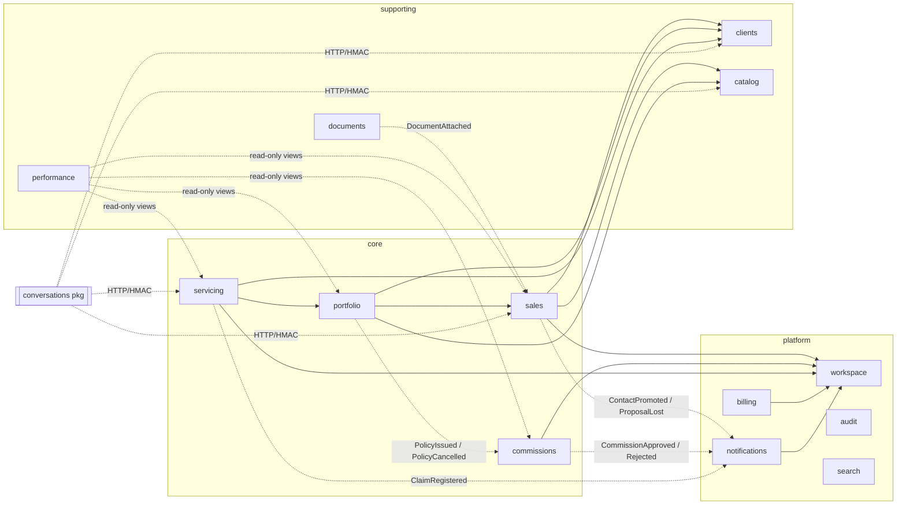

# Modular Architecture — Bens Seguros (target)

> **Date:** 2026-09-13 · **Input:** [`docs/audits/2026-09-13-domain-analysis.md`](../audits/2026-09-13-domain-analysis.md) (C#, D#, S# references point there) · **Snapshot:** `main` @ `833fff33`
>
> **Status:** proposal. It turns the as-is domain map into bounded contexts, module rules, and a migration path. It is not an implementation plan — each phase in §10 needs its own plan in `docs/superpowers/plans/`.

---

## 0. Decisions at a glance

| # | Decision | Why |
|---|---|---|
| A1 | **Stay a modular monolith.** Contexts live in `packages/core` as folders, not as 14 new npm packages. The only new package is `packages/conversations` (chat already runs in separate apps on a separate DB). | Boundaries enforced by lint + `exports`, not by package count. Avoids coordination cost the team doesn't need yet. |
| A2 | **14 modules in 3 tiers** (§1), down from 23 flat modules + logic spread over 4 apps. | Group by ubiquitous language (§1 of the analysis), not by table. |
| A3 | **Each context = `domain/` + `application/` + `infrastructure/` + `index.ts` + `module.ts` + `CONTEXT.md`.** Light hexagonal: ports live in `domain/`, adapters in `infrastructure/`. | Rules must be predictable for AI agents: the same five places in every context. |
| A4 | **Commands go through the domain; queries are vertical slices** that may read the context's own tables directly. | No repository ceremony for list/export/get screens with zero business rules. |
| A5 | **`index.ts` is the only importable file of a context.** It exports use cases, contract types, errors, and events — never repositories, mappers, or Prisma adapters. The root `export *` barrel is removed. | Today `@repo/core` re-exports every module wholesale, including `Prisma*Repository` (violates the CLAUDE.md barrel rule and P1 "well-defined boundaries"). |
| A6 | **Cross-context sync calls use a consumer-owned port** (`domain/ports/<provider>-gateway.ts`) with an adapter that calls the provider's `index.ts`. | Dependencies become greppable (`ls */domain/ports`), testable with fakes, and swappable for HTTP later. |
| A7 | **Cross-context reactions use domain events** (in-process dispatcher; transactional outbox for money/external side-effects). | Breaks the 4 import cycles (proposal⇄contact, proposal⇄policy, proposal⇄document, goal⇄dashboard) and moves notification copy out of use cases (S17). |
| A8 | **Edges are thin.** HTTP routes, internal HMAC routes, BullMQ processors, and AI tools call use cases only; they never import `@repo/db`. | Today 38 route/worker/chat-worker files import `@repo/db` and carry rules (D2, D4, D10, S8, S9). |
| A9 | **One writer per table.** Prisma schema split into one file per context; FKs across contexts allowed, cross-context writes are not. Cross-context reads only via ports — except the two declared read-model contexts (`performance`, `search`). | P8 state isolation without giving up referential integrity in a single Postgres. |
| A10 | **Boundaries are machine-checked** (ESLint boundaries + an architecture spec), not just documented. | An agent that breaks a boundary gets a lint error, not a review comment weeks later. |

---

## 1. Context map

### 1.1 Modules

**Tier 1 — Core business** (rich domain, most change)

| Context | Owns (aggregates / tables) | Absorbs today's | Language |
|---|---|---|---|
| `sales` | `Contact` (lead), `Proposal` + `ProposalChecklistItem`, `ChecklistConfig`, quote sending | `contact`, `proposal`, promotion part of `client`, `send-quote-email` worker logic, internal `create-lead` rules | Contato, Proposta, Etapa, Quadro, Checklist, Cotação |
| `portfolio` | `Policy`, `Endorsement`, renewal & endorsement *requests*, policy PDF, expiry | `policy`, `endorsement`, `expire-policies` worker, policy CSV import | Apólice, Vigência, Endosso, Renovação, Cancelamento |
| `commissions` | `Commission` (incl. reversal), calculator | `commission` | Comissão, Split, Aprovação, Estorno |
| `servicing` | `Claim` (+ status machine as entity), `Occurrence`, `Assistance` | `claim`, `occurrence`, `assistance`, internal `create-claim` rules | Sinistro, Ocorrência, Assistência |
| `conversations` *(package)* | `Conversation`, `Message`, `Channel`, `AiAgent`, `Participant` (renamed chat contact) | `chat-server/{domain,application}`, chat-worker `*-helper.ts`, AI tools' rules | Conversa, Canal, Atendente, Fila, Agente de IA |

**Tier 2 — Supporting**

| Context | Owns | Absorbs |
|---|---|---|
| `clients` | `Client` (insured party), document hash dedup, LGPD anonymization | `client` |
| `performance` | `Goal`, dashboard read model, alert rules | `goal`, `dashboard`, worker `alerts/*` |
| `catalog` | `Insurer`, **`InsuranceBranch`/product vocabulary (single source, D7)**, vehicle & address lookups | `insurer`, `vehicle-lookup`, `cep`, `packages/aggilizador` adapter |
| `documents` | `Document` (typed attachment, storage) | `document` |

**Tier 3 — Generic / platform**

| Context | Owns | Absorbs |
|---|---|---|
| `workspace` | `Organization`, `Member` (roles, active, split %), `Invitation`, member directory | `organization`, `member`, `invitation` |
| `billing` | `Plan`, `Subscription`, `Invoice`, `PaymentMethod`, `WebhookEvent`, `AiUsageRecord`, **Entitlements projection**, quota checks (S10) | `subscription`, `ai-usage`, `billing-port`, `asaas-adapter`, 4 billing processors |
| `notifications` | `Notification`, templates & pt-BR copy, recipient rules, email provider | `notification` + templates currently imported by commission/claim |
| `audit` | `AuditLog`, archive, LGPD audit scrub | `audit`, `audit-archive` worker |
| `search` | global search read model | `search` |

Identity & auth stay in `packages/auth` (Better Auth + CASL). It **consumes** the `billing` Entitlements contract and nothing else from core.

### 1.2 Why these boundaries (split/merge test)

- **`contact` + `proposal` merge into `sales`**: same language, same lifecycle, constant mutual calls (cycle proposal⇄contact). Splitting them was a technical seam.
- **`clients` stays separate from `sales`**: used by `portfolio`, `servicing`, `sales`, LGPD — different lifecycle (a Client outlives every proposal) and distinct invariants (document dedup, anonymization).
- **`endorsement` merges into `portfolio`**: cohesion score 4 with two disconnected models (D6); one owner is the prerequisite to fixing S1.
- **`occurrence` + `assistance` merge into `servicing`**: shared language; `endorsement → occurrence` coupling (score 1) disappears.
- **`goal` + `dashboard` + alerts merge into `performance`**: removes goal⇄dashboard cycle; all are reads over other contexts' facts.
- **`cep` + `vehicle-lookup` + `insurer` + branch vocabulary → `catalog`**: reference data consumed by everyone, changes rarely, no transactional coupling.
- **`conversations` is the only extracted package**: different DB (Mongo), different deploy (`deploy-chat.yml`), two apps already duplicate its aggregate (D5). All six split criteria hold.
- **Not split further:** `billing` and `workspace` stay single modules; sub-units inside (plans vs invoices) share one lifecycle.

### 1.3 Dependency graph (allowed directions)



Solid = sync call through a consumer port. Dotted = event or out-of-process call. **The solid graph must stay a DAG.**

Two current cycles need a direction decision:

- **proposal ⇄ policy** → `portfolio` depends on `sales`, never the reverse. Starting a renewal or endorsement becomes a `portfolio` command (`StartRenewal`, `RequestEndorsement`) that reads its own Policy, builds the snapshot, and calls `sales.CreateProposal` with it. `sales` stores the snapshot as an opaque value object and no longer looks up policies.
- **proposal ⇄ document** → `documents` knows nothing about proposals. It publishes `DocumentAttached { entityType, entityId, documentType }`; `sales` subscribes and runs checklist auto-completion.

---

## 2. Physical layout

```
packages/
  core/src/
    shared-kernel/            # tiny, stable (see §6)
    contexts/
      sales/
        CONTEXT.md            # agent entry point (§8)
        index.ts              # public API — the ONLY file importable from outside
        module.ts             # DI registration for this context
        domain/
          proposal/           # aggregate: proposal.ts, checklist-config.ts, errors.ts, *.spec.ts
          contact/
          events.ts           # events this context publishes
          ports/              # repositories + gateways to other contexts
            proposal-repository.ts
            clients-gateway.ts
        application/
          commands/           # one file per use case, spec next to it
            advance-proposal-stage.ts
            advance-proposal-stage.spec.ts
          queries/            # vertical slices, read-only
            list-proposals.ts
            export-proposals-csv.ts
          handlers/           # reactions to other contexts' events
            on-document-attached.ts
        infrastructure/
          prisma-proposal-repository.ts
          proposal-mapper.ts
          clients-gateway-adapter.ts
      portfolio/ commissions/ servicing/ clients/ performance/
      catalog/ documents/ workspace/ billing/ notifications/ audit/ search/
    platform/                 # technical helpers, NOT domain: event dispatcher, outbox, csv, cache, unit-of-work
  conversations/src/          # same shape as a context: domain/ application/ infrastructure/ index.ts
  db/prisma/schema/           # one .prisma file per context (§7)

apps/
  server/src/
    modules.ts                # composition root: registerSalesModule(container, deps) ... (replaces 564-line container-registrations.ts)
    routes/v1/<context>/<resource>/<endpoint>.ts
    routes/internal/<context>/...
  worker/src/processors/<context>/<job>-processor.ts
  chat-server/src/            # transport only: http/, socket/, pubsub/
  chat-worker/src/            # transport + vendors only: brokers/, baileys/, ai/, processors/, tools/
  web/src/features/<feature>/ # unchanged (already feature-based); see §9
```

`packages/core/package.json` exports one subpath per context and nothing else:

```jsonc
"exports": {
  "./sales": "./src/contexts/sales/index.ts",
  "./portfolio": "./src/contexts/portfolio/index.ts",
  // ...one per context
  "./platform": "./src/platform/index.ts"   // dispatcher/outbox/UoW wiring for composition roots
}
```

Apps import `@repo/core/sales`, never `@repo/core` root and never a deep path.

---

## 3. Inside a context — layer rules

| Layer | Contains | May import | Must not import |
|---|---|---|---|
| `domain/` | Entities, value objects, domain services, errors, events, **port interfaces** | own `domain/`, `shared-kernel` | `tsyringe`, `@repo/db`, `@repo/env`, any vendor SDK, other contexts |
| `application/commands` | Use cases that change state; orchestrate aggregate + ports; publish events | own `domain/`, `shared-kernel`, `platform` (UoW, dispatcher types), `tsyringe` | `@repo/db`, `infrastructure/`, other contexts (use a gateway port) |
| `application/queries` | Read-only slices: list, get, export, counts | own `domain/` types, `shared-kernel`, `@repo/db` **for the context's own tables only** | writes; other contexts' tables (except `performance`, `search`) |
| `application/handlers` | Event subscribers; call own commands | same as commands | anything a command can't import |
| `infrastructure/` | Prisma repos, mappers, vendor adapters, gateway adapters | everything above, `@repo/db`, `@repo/env`, SDKs, **other contexts' `index.ts`** (gateway adapters only) | other contexts' internals |
| `index.ts` | Public exports | own layers | — (it exports no infrastructure except `register<Ctx>Module`) |
| `module.ts` | `register<Ctx>Module(container, deps)` — binds ports to adapters, subscribes handlers | own layers | — |

**What goes in `index.ts`** (contract): command/query classes, their input/output DTO types, error classes & codes, published event types, enums/VOs other contexts or the UI need. **Never:** repositories, mappers, `Prisma*` classes, internal helpers.

**DDD Full vs Light stays**: `sales`, `commissions`, `conversations` keep rich aggregates. Light contexts may have a thin entity or none — but a **state machine is always an entity method, never a use-case switch** (move `UpdateClaimStatus` rules into `Claim`, same pattern as `Commission`). `portfolio` should be promoted to Full when S1/S2 are resolved (the analysis calls Policy under-modeled).

**When is a vertical slice enough?** If the operation has no invariant to protect (list, get, export, dashboard, search, counts), write it as a query slice: one file, optional Zod input, direct Prisma read of own tables, spec with a test DB or a fake. If it changes state, it is a command and goes through the domain — even if "simple" today (create/delete).

---

## 4. Cross-context communication

### 4.1 Sync: consumer-owned gateway port

```ts
// portfolio/domain/ports/sales-gateway.ts  (owned by the consumer)
export interface SalesGateway {
  getIssuableProposal(input: { organizationId: string; proposalId: string }): Promise<IssuableProposal | null>
  confirmIssuance(input: { organizationId: string; proposalId: string; policyId: string }): Promise<void>
}

// portfolio/infrastructure/sales-gateway-adapter.ts  (the only place that imports @repo/core/sales)
@injectable()
export class SalesGatewayAdapter implements SalesGateway { /* delegates to sales public queries/commands, maps DTOs */ }
```

Rules:

- The port expresses **what the consumer needs**, in the consumer's language (`IssuableProposal`, not `ProposalProps`).
- Adapters only delegate and map — no rules (avoids "facades that aren't thin").
- Initial edges (the whole list should fit on one screen; review any addition):

| Consumer | Port | Provider operations |
|---|---|---|
| sales | `ClientsGateway` | `registerInsuredParty` (dedup by document hash), `getClientSummary` |
| sales | `CatalogGateway` | `getInsurer`, `branches` |
| sales | `MemberDirectory` | `defaultLeadOwner` (makes S8 an explicit rule), `isActiveMember` |
| portfolio | `SalesGateway` | `getIssuableProposal`, `confirmIssuance`, `createProposalFromPolicy` |
| portfolio | `ClientsGateway` | `getInsuredForIssuance` (address check) |
| servicing | `PortfolioGateway` | `findActivePolicyForClient`, `getPolicySummary` |
| commissions | `MemberDirectory` | `getCommissionSplit` (resolves S3 once decided) |
| notifications | `MemberDirectory` | `recipientsByRoles` (single place for D11) |
| billing | `WorkspaceGateway` | `countActiveMembers` (quota checks, S10) |

### 4.2 Async: domain events

- Events are plain typed objects in `<ctx>/domain/events.ts`, named `<context>.<PastTense>`, carrying enough data that handlers don't call back (enriched payload): e.g. `portfolio.PolicyIssued { organizationId, policyId, proposalId, salespersonId, premiumCents, commissionBasisPoints, occurredAt }`.
- `platform/event-dispatcher.ts`: after the command's transaction commits, dispatch to in-process handlers registered by each `module.ts`. A handler failure is logged with context and **does not fail the command**.
- **Outbox** (`platform/outbox`, one `OutboxEvent` table) for events whose loss is unacceptable or that cause external side-effects: written in the same transaction, relayed to BullMQ by the worker, handlers idempotent by `eventId` or a natural key.

| Event | Publisher | Subscribers | Delivery |
|---|---|---|---|
| `documents.DocumentAttached` | documents | sales (checklist auto-complete) | in-process |
| `sales.ContactPromoted` | sales | sales (checklist `client_data`) | in-process |
| `sales.ProposalLost` | sales | notifications, performance (optional) | in-process |
| `sales.QuoteRequested` | sales | sales worker slice (PDF + email, sets `sentToClientAt` via command — D10) | outbox |
| `portfolio.PolicyIssued` | portfolio | commissions (`CreateCommissionForPolicy`, idempotent by `policyId`), portfolio (PDF) | **outbox** |
| `portfolio.PolicyCancelled` | portfolio | commissions (policy decision S2) | **outbox** |
| `portfolio.PolicyExpired` | portfolio | performance, notifications | outbox |
| `commissions.CommissionApproved` / `Rejected` | commissions | notifications | outbox |
| `servicing.ClaimRegistered` | servicing | notifications | outbox |
| `billing.EntitlementsChanged` | billing | auth cache invalidation | in-process + Redis |
| `clients.ClientAnonymized` | clients | audit, sales, documents, conversations (S12) | outbox |

`OnPolicyIssued` stops being injected into `IssuePolicy`; commission creation becomes a handler. Consistency moves from "same call" to "same transaction via outbox" — commissions appear within seconds, and a unique `(policyId, isReversal=false)` constraint guarantees exactly one.

### 4.3 Cross-context transactions

Default: **one command = one context = one transaction.** Exceptions are listed here and nowhere else:

1. `portfolio.IssuePolicy` + `sales.confirmIssuance` — share a `UnitOfWork` so a proposal can reach `POLICY_ISSUED` only together with a Policy row (fixes S7). `advance` to `POLICY_ISSUED` from the kanban is removed or routed to issuance (product decision).

`platform/unit-of-work.ts` exposes `run(fn)`; the Prisma adapter opens an interactive transaction with the RLS tenant set. Gateway adapters accept the transaction context implicitly (AsyncLocalStorage), so ports stay tech-free.

### 4.4 Out-of-process: conversations → ERP

`chat-worker` deploys separately, so it must not touch Postgres. Today it imports `@repo/db` (4 files, incl. `capture-lead`, `ai-bot-processor`, `baileys-manager`, `record-ai-usage-adapter`) and `@repo/core` — both are removed.

- `packages/conversations/domain/ports/erp-gateway.ts`: `captureLead`, `saveInsuredAssetData`, `searchClient`, `listProducts`, `registerClaim`.
- Adapter: HMAC HTTP client to `apps/server/routes/internal/<context>/*`, with **5 s timeout, 2 retries with backoff, idempotency key = `conversationId + tool call id`**.
- Internal routes are thin: they call `sales.CaptureLead`, `sales.RecordAssetDataFromChat`, `servicing.RegisterClaimFromChat`. Rules now in routes (oldest member as owner, URGENT priority, latest-ending policy, fake `dataSaved: true` — S8/S9) move into those commands and return an explicit result (`{ status: 'REGISTERED' | 'PENDING_BROKER_REVIEW' }`).
- `listProducts` comes from `catalog` via the API — the hardcoded chat `PRODUCTS` list disappears (D7).
- AI usage metering goes through a `billing` internal endpoint instead of direct Prisma writes.

---

## 5. Identity & naming (resolving the collisions)

| Term today | Target name | Context | Rule |
|---|---|---|---|
| Mongo chat `Contact` | **`Participant`** | conversations | Channel identity (phone / social IDs). Holds `leadRef: { contactId }` returned by `captureLead`. `clientId` removed — resolved via ERP when needed. |
| PG `Contact` | `Contact` (UI "Contato") | sales | Lead owned by a salesperson. |
| PG `Client` | `Client` (UI "Cliente/Segurado") | clients | Insured legal party. Referenced by id from sales, portfolio, servicing. |
| `salespersonId` | `salespersonId: UserId` | shared-kernel type | Resolution to role/split/active goes through `MemberDirectory` only. |
| Endorsement (board type) | `EndorsementRequest` | sales ↔ portfolio | A proposal whose `boardType = ENDORSEMENT`, created by `portfolio.RequestEndorsement`. |
| Endorsement (record) | `Endorsement` | portfolio | Applied change on a policy, created by issuing an EndorsementRequest (S1/D6 — product decision on whether it versions the policy). |
| "Issued" | stage `POLICY_ISSUED` ⇔ Policy exists | sales + portfolio | Enforced by §4.3 exception 1. |
| Premium | `estimatedPremiumCents` (proposal) vs `premiumCents` (policy) | sales / portfolio | AI may set the estimate only when empty (S15). |
| `commissionPercentageInCents` | `commissionBasisPoints` | sales | Rename with migration (S4). |
| Notification `type`/`entityType` strings | `NotificationType` union owned by notifications | notifications | Free strings rejected (S19). |

---

## 6. Shared kernel — the complete list

`packages/core/src/shared-kernel/` may contain **only**:

- `ids.ts` — `OrganizationId`, `UserId` branded types
- `money.ts` — `Cents`, `BasisPoints`, `applyBasisPoints()` (commission math, S4)
- `insurance-branch.ts` — the one `InsuranceBranch` union (+ Zod schema); Prisma enum, AI tools and Aggilizador map to it (D7)
- `insured-object-details.ts` — moved from `@repo/shared` because sales, portfolio and the AI tool share it
- `domain-error.ts` — base error with `code`; `handle-domain-error` maps by code
- `cursor-page.ts` — cursor pagination types
- `clock.ts` — `Clock` port (quote validity, expiry, alerts)

Adding a file requires an entry in `docs/ARCHITECTURE-DECISIONS.md`. Technical helpers (CSV, cache-aside, crypto, event dispatcher, outbox, UoW) go to `platform/`, which **domain code never imports**.

`@repo/shared` keeps cross-*app* transport concerns only (socket events, HMAC, rate-limit constants, Sentry/pino redaction).

---

## 7. Persistence ownership

- Prisma schema split into `packages/db/prisma/schema/<context>.prisma` (multi-file schema — confirm the config for the installed Prisma 7 during Phase 0). File name = owning context = only writer.
- Cross-context **foreign keys are kept** (single Postgres, integrity is cheap). Cross-context **writes are forbidden**; cross-context **reads** go through gateways.
- **Declared read-model exceptions:** `performance` and `search` may read other contexts' tables, but only through SQL views or query files in their `infrastructure/read-models/`, each listing the tables it touches at the top. Schema changes to a listed table must update the view (enforced by a spec that runs the views).
- `prisma` vs `prismaAdmin` choice is made in `infrastructure/` only (unchanged rule, now in one layer).
- Denormalized copies (D9: `clientId`/`insurerId` on Claim, Assistance, Commission) are allowed as **snapshots written by the owner at creation from event/gateway data**, documented in the owner's `CONTEXT.md`. `Commission.clientId` is filled from the `PolicyIssued` payload (S18).
- `billingManagedExternally` (D8): `billing` owns it; `Organization` column dropped after migration.
- MongoDB: `packages/db-chat` keeps connection + Mongoose models; repositories move to `packages/conversations/infrastructure`.

---

## 8. Making it safe for AI agents

### 8.1 `CONTEXT.md` per context (≤ 80 lines, fixed headings)

```md
# <context>
## Purpose            (2–3 lines; what decisions happen only here)
## Language           (term → meaning; pt-BR UI label)
## Owns               (aggregates, tables, schema file)
## Public API         (commands, queries, events published — mirrors index.ts)
## Consumes           (gateway ports → provider; events subscribed)
## Invariants         (numbered business rules; spec file that proves each)
## Not here           (common wrong guesses, e.g. "commission creation → commissions handler")
```

`CLAUDE.md` gets one line: *"Before editing `packages/core/src/contexts/<x>`, read its `CONTEXT.md`. Cross-context changes: read `docs/architecture/context-map.md`."* The mermaid graph (§1.3) and event table (§4.2) move to `context-map.md` as the single living copy.

### 8.2 Mechanical enforcement

| Check | Tool | Catches |
|---|---|---|
| Layer rules (§3) + "only `index.ts` across contexts" + solid graph edges (§1.3) | ESLint boundaries rules in `config/eslint-config` (e.g. `eslint-plugin-boundaries` element types `domain`/`application`/`infrastructure`/`context-index`/`shared-kernel`/`platform`) | deep imports, domain → infra, new undeclared context edge |
| `@repo/db` banned in `apps/*/routes`, `apps/*/processors`, `apps/chat-*` | `no-restricted-imports` per app | A8 regressions |
| Public surface | `packages/core/src/contexts/architecture.spec.ts`: each `index.ts` exports no `Prisma*`, `*Repository` class, `*Mapper` | leaky exports |
| One writer per table | spec scanning `infrastructure/` for `prisma.<model>.(create|update|delete|upsert)` against the schema file owner | reach-through writes |
| Event handler idempotency | handler spec template runs each handler twice | duplicate side-effects |

### 8.3 Recipes (go into `bens-ddd-module` skill)

- **New use case:** `application/commands/<verb-noun>.ts` + spec → export in `index.ts` → register in `module.ts` → route in `apps/server/routes/v1/<ctx>/`.
- **Need data from another context:** add a method to your gateway port → implement in the adapter via provider `index.ts` → if the provider lacks the operation, add a query there first. Never import provider internals.
- **Something must happen when X happens elsewhere:** subscribe a handler to the provider's event; if the event lacks data, enrich the event, don't call back.
- **New screen with a list:** query slice in the owning context; no repository method.

---

## 9. Edges

- **HTTP routes** (`apps/server/routes/v1/<context>/…`): validate (Zod) → CASL → resolve use case → map result/error → audit. Business checks like ownership ("salesperson approving own commission", S13) belong in the command, receiving `actor: { userId, role }` as input.
- **Workers** (`apps/worker/processors/<context>/…`): parse job → call command/handler → log. `expire-policies` → `portfolio.ExpireDuePolicies`; `csv-import` → `clients.ImportClients` / `portfolio.ImportPolicies` (uses the same issuance invariants, with an explicit `origin: 'IMPORT'` that decides commission/goal treatment — D4, S16); alerts → `performance.RunAlert(kind)` with copy from `notifications` (S20).
- **Queues** named `<context>.<job>` so Bull Board, logs and Sentry group by context.
- **Web** (`apps/web/features/*`) stays as is — already feature-sliced and decoupled by the generated Orval client. Only change: OpenAPI tags = context names, so `@/api/endpoints/<context>/` mirrors the backend map.

---

## 10. Observability & failure containment

- Logger: `logger.child({ context: 'sales', useCase: 'AdvanceProposalStage', organizationId })` created in the DI resolution of each use case; Sentry tag `context`.
- Every event carries `eventId`, `correlationId` (request id / job id) propagated into handlers and outbox jobs.
- Health: per-app today; the outbox relay reports lag per context.
- Failure rules:
  - notification/email/PDF failures never fail a business command (event/outbox).
  - gateway calls inside a request are in-process — no timeout needed; HTTP gateways (conversations → ERP) have timeout + retry + idempotency key.
  - chat keeps working when the ERP API is down: tools return a "registered for broker follow-up" result and enqueue a retry, instead of pretending data was saved (S9).
  - billing gate failures (Asaas down) fall back to cached entitlements (existing `subscription-cache`), never to open access.

---

## 11. Migration path

Each phase leaves `main` green (5 quality gates) and is independently shippable. Behavior changes are isolated in Phase 5.

| Phase | Scope | Key moves | Exit criteria |
|---|---|---|---|
| **0 — Guardrails** | no runtime change | Add boundary lint in **warn** mode; `architecture.spec.ts`; `context-map.md`; empty `CONTEXT.md` skeletons; split Prisma schema into per-context files | Lint report lists every current violation (baseline) |
| **1 — Regroup** | moves + imports only | `git mv` modules into `contexts/<ctx>`; per-context `index.ts` without infra exports; subpath `exports`; remove root barrel; split `container-registrations.ts` into `module.ts` files; move `shared` → `shared-kernel`/`platform` | All apps import `@repo/core/<ctx>`; lint `error` for deep imports |
| **2 — Thin edges** | logic relocation, same behavior | 38 `@repo/db` edge files → queries/commands; internal `create-lead`/`create-claim` rules into commands; `SendQuote` + worker unified; alerts copy into notifications | `no-restricted-imports` on `@repo/db` in edges = error |
| **3 — Break cycles** | events | Event dispatcher + outbox; `DocumentAttached`; `PolicyIssued` → commissions handler; templates out of commission/claim; renewal/endorsement start moves to portfolio; goal/dashboard merged | Solid graph is a DAG; boundary lint = error everywhere |
| **4 — Conversations** | chat | `packages/conversations`; chat-server/chat-worker use one aggregate; `ErpGateway` over HMAC; `Participant` rename; chat-worker off `@repo/db` & `@repo/core` | chat-worker has zero Postgres access |
| **5 — Domain gaps** | **behavior, needs product decisions** | S1 endorsement/renewal issuance, S2 cancel → commissions, S3 split, S7 issuance atomicity, S10 quotas, S12 LGPD scope via `ClientAnonymized`, S13 self-approval, S14 consent, S15 AI premium overwrite, S4 rename | One ticket per S#, each with an explicit owner decision |

Phases 1–2 are mostly mechanical and good agent work (one context per PR, `sales` last because it is the most coupled). Phases 3–4 change runtime flow and need a spec + plan each.

---

## 12. Open questions (need a human decision)

1. **Issuance model (S1, S7):** does an ENDORSEMENT/RENEWAL issuance create a new Policy, a new policy version, or mutate the source? This decides whether `portfolio` gets a `PolicyVersion` concept.
2. **Kanban `POLICY_ISSUED`:** may users drag a card there without issuing, or does that column open the issue-policy dialog?
3. **Policy cancellation (S2):** reverse PAID commissions, reject pending ones, or only flag for manual review?
4. **Quotas (S10):** hard block or soft warning per quota; which are enforced at MVP?
5. **Chat claim intake (S9):** acceptable to create a claim in `PENDING_POLICY_MATCH` when no policy is found, instead of dropping it?
6. **Outbox scope:** accept the extra `OutboxEvent` table + relay now (Phase 3), or keep synchronous commission creation until S2 is decided?
