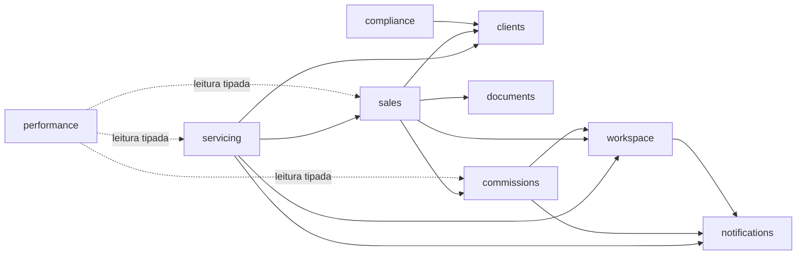

# Context Map — Bens Seguros

> **Documento vivo.** Fonte única dos módulos, de quem é dono de cada tabela e das dependências permitidas. Atualize na mesma PR que adicionar um módulo ou uma dependência entre módulos.
>
> **Status:** alvo aprovado (MOD-1, revisado). Migração: [`2026-09-13-migration-plan.md`](2026-09-13-migration-plan.md). Decisão: `ARCHITECTURE-DECISIONS.md` → MOD-1. O design [`2026-09-13-modular-architecture.md`](2026-09-13-modular-architecture.md) foi substituído pela revisão e serve só como racional histórico.

---

## 1. Módulos

Tudo em `packages/core/src/`.

| Módulo          | Localização                                            | Owns (modelos Prisma)                                                                                                                                         | Absorve os módulos atuais                                            | Tipo     |
| --------------- | ------------------------------------------------------ | ------------------------------------------------------------------------------------------------------------------------------------------------------------- | -------------------------------------------------------------------- | -------- |
| `shared-kernel` | `shared-kernel/`                                       | — (ids, money `Cents`/`BasisPoints`, domain-error, cursor-page, json)                                                                                         | `shared`                                                             | kernel   |
| `platform`      | `platform/{audit,storage,lookups,csv,cache}`           | AuditLog, AuditLogArchive                                                                                                                                     | `audit`, `cep`, `vehicle-lookup`, `document/domain/storage-provider` | técnico  |
| `sales`         | `modules/sales/{leads,proposals,policies}`             | Contact, Proposal, ProposalChecklistItem, Policy, Endorsement                                                                                                 | `contact`, `proposal`, `policy`, `endorsement`                       | domínio  |
| `commissions`   | `modules/commissions`                                  | Commission                                                                                                                                                    | `commission`                                                         | domínio  |
| `servicing`     | `modules/servicing/{claims,occurrences,assistance}`    | Claim, Occurrence, Assistance                                                                                                                                 | `claim`, `occurrence`, `assistance`                                  | domínio  |
| `clients`       | `modules/clients`                                      | Client                                                                                                                                                        | `client`                                                             | simples  |
| `insurers`      | `modules/insurers`                                     | Insurer                                                                                                                                                       | `insurer`                                                            | simples  |
| `documents`     | `modules/documents`                                    | Document                                                                                                                                                      | `document`                                                           | simples  |
| `workspace`     | `modules/workspace/{organization,members,invitations}` | Organization, Member, Invitation (User, Session, Account, TwoFactor, Verification, TermsAcceptance são escritos pelo Better Auth; workspace é ACL sobre eles) | `organization`, `member`, `invitation`                               | simples  |
| `billing`       | `modules/billing`                                      | Plan, Subscription, Invoice, PaymentMethod, WebhookEvent, AiUsageRecord                                                                                       | `subscription`, `ai-usage`                                           | simples  |
| `notifications` | `modules/notifications`                                | Notification (só entrega; templates ficam no módulo dono do texto)                                                                                            | `notification`                                                       | simples  |
| `performance`   | `modules/performance/{goals,dashboard}`                | Goal                                                                                                                                                          | `goal`, `dashboard`                                                  | simples  |
| `search`        | `modules/search`                                       | — (busca global, só leitura)                                                                                                                                  | `search`                                                             | simples  |
| `compliance`    | `modules/compliance`                                   | — (processo de anonimização de cliente)                                                                                                                       | — (novo, Step 6.3)                                                   | processo |

Fora de `core`: `packages/auth` (Better Auth + CASL) é dono do contrato `@repo/auth/entitlements` (produzido por `billing`) e de `@repo/auth/roles`; `auth` nunca importa `@repo/core`. `packages/conversations` é posterior e não faz parte deste mapa.

---

## 2. Dependências permitidas (imports em processo)

Import sempre pelo `index.ts` público do provider.

| Módulo          | Pode importar                                                                                             |
| --------------- | --------------------------------------------------------------------------------------------------------- |
| `shared-kernel` | nada                                                                                                      |
| `platform`      | `shared-kernel`                                                                                           |
| `sales`         | `clients`, `documents`, `commissions`, `workspace`                                                        |
| `servicing`     | `sales`, `clients`, `workspace`, `notifications`                                                          |
| `commissions`   | `workspace`, `notifications`                                                                              |
| `workspace`     | `notifications`                                                                                           |
| `compliance`    | `clients`                                                                                                 |
| `clients`       | —                                                                                                         |
| `insurers`      | —                                                                                                         |
| `documents`     | —                                                                                                         |
| `billing`       | —                                                                                                         |
| `notifications` | —                                                                                                         |
| `performance`   | — (leitura tipada somente-leitura das tabelas de `sales`, `commissions`, `servicing`; escrita só em Goal) |
| `search`        | — (leitura somente-leitura)                                                                               |

Todo módulo pode importar `platform` e `shared-kernel`; `platform` não importa nenhum módulo.

- **O grafo sólido deve permanecer acíclico.** Ordem topológica: `notifications` → `workspace` → `commissions` → `clients`, `documents` → `sales` → `servicing`.
- Nova linha ou nova seta = revisão de arquitetura na PR.
- Cada módulo recebe um tipo Prisma restrito (`Pick<PrismaClient, delegates próprios>`); escrita em tabela de outro módulo não compila.

---

## 3. Dependências fora de processo

| Origem             | Destino                           | Via                                 | Módulos chamados                                                                                                                                                |
| ------------------ | --------------------------------- | ----------------------------------- | --------------------------------------------------------------------------------------------------------------------------------------------------------------- |
| `apps/chat-worker` | `apps/server` `routes/internal/*` | HTTP + HMAC (`INTERNAL_API_SECRET`) | `sales` (captura de lead, propostas/apólices do contato), `clients` (atualização vinda do chat), `servicing` (sinistro vindo do chat), `billing` (entitlements) |
| `apps/chat-worker` | `apps/worker`                     | BullMQ (Redis compartilhado)        | `billing` (registro de uso de IA)                                                                                                                               |

Ports existem só para fornecedores externos e para essas chamadas chat → ERP.
