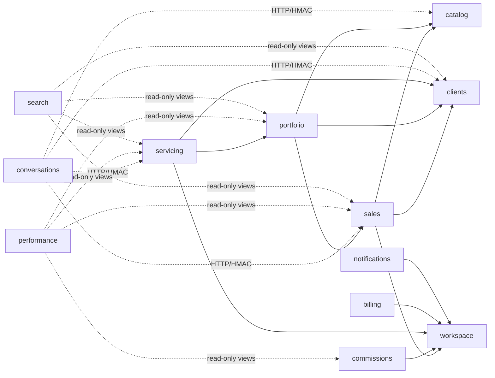

# Context Map — Bens Seguros

> **Documento vivo.** Fonte única do mapa de contextos, dependências permitidas e catálogo de eventos. Atualize na mesma PR que adicionar um gateway, um evento ou um contexto.
>
> **Status:** alvo (MOD-1, proposta). Racional e migração: [`2026-09-13-modular-architecture.md`](2026-09-13-modular-architecture.md). Decisão: `ARCHITECTURE-DECISIONS.md` → MOD-1.

---

## 1. Contextos

| Tier | Contexto | Localização | Owns | DDD |
|---|---|---|---|---|
| core | `sales` | `packages/core/src/contexts/sales` | Contact, Proposal, ProposalChecklistItem | Full |
| core | `portfolio` | `packages/core/src/contexts/portfolio` | Policy, Endorsement | Light → Full |
| core | `commissions` | `packages/core/src/contexts/commissions` | Commission | Full |
| core | `servicing` | `packages/core/src/contexts/servicing` | Claim, Occurrence, Assistance | Light |
| core | `conversations` | `packages/conversations` | Conversation, Message, Channel, AiAgent, Participant (Mongo) | Full |
| supporting | `clients` | `packages/core/src/contexts/clients` | Client | Light |
| supporting | `performance` | `packages/core/src/contexts/performance` | Goal, dashboard/alert read models | Light |
| supporting | `catalog` | `packages/core/src/contexts/catalog` | Insurer, InsuranceBranch/products, vehicle & CEP lookups | Light |
| supporting | `documents` | `packages/core/src/contexts/documents` | Document | Light |
| platform | `workspace` | `packages/core/src/contexts/workspace` | Organization, Member, Invitation | Light |
| platform | `billing` | `packages/core/src/contexts/billing` | Plan, Subscription, Invoice, PaymentMethod, WebhookEvent, AiUsageRecord, Entitlements | Light |
| platform | `notifications` | `packages/core/src/contexts/notifications` | Notification, templates, recipient rules | Light |
| platform | `audit` | `packages/core/src/contexts/audit` | AuditLog, AuditLogArchive | Light |
| platform | `search` | `packages/core/src/contexts/search` | global search read model | — |

Fora de `core`: `packages/auth` (Better Auth + CASL) consome apenas o contrato Entitlements de `billing`.

---

## 2. Dependências permitidas

- Seta sólida = chamada síncrona via gateway port do consumidor. **O grafo sólido deve permanecer DAG.**
- Tracejada = fora do processo (HMAC) ou leitura declarada via views.
- `documents`, `clients`, `catalog`, `workspace`, `audit` não dependem de nenhum contexto de negócio.

---

## 3. Gateways (dependências síncronas)

| Consumidor | Port | Provider | Operações |
|---|---|---|---|
| sales | `ClientsGateway` | clients | `registerInsuredParty`, `getClientSummary` |
| sales | `CatalogGateway` | catalog | `getInsurer`, `branches` |
| sales | `MemberDirectory` | workspace | `defaultLeadOwner`, `isActiveMember` |
| portfolio | `SalesGateway` | sales | `getIssuableProposal`, `confirmIssuance`, `createProposalFromPolicy` |
| portfolio | `ClientsGateway` | clients | `getInsuredForIssuance` |
| servicing | `PortfolioGateway` | portfolio | `findActivePolicyForClient`, `getPolicySummary` |
| servicing | `MemberDirectory` | workspace | `isActiveMember` |
| commissions | `MemberDirectory` | workspace | `getCommissionSplit` |
| notifications | `MemberDirectory` | workspace | `recipientsByRoles` |
| billing | `WorkspaceGateway` | workspace | `countActiveMembers` |
| conversations | `ErpGateway` (HTTP) | sales, servicing, clients, catalog | `captureLead`, `saveInsuredAssetData`, `searchClient`, `listProducts`, `registerClaim` |

Nova linha nesta tabela = revisão de arquitetura na PR.

---

## 4. Catálogo de eventos

| Evento | Publicador | Assinantes | Entrega |
|---|---|---|---|
| `documents.DocumentAttached` | documents | sales | in-process |
| `sales.ContactPromoted` | sales | sales | in-process |
| `sales.ProposalLost` | sales | notifications, performance | in-process |
| `sales.QuoteRequested` | sales | sales (worker: PDF + email) | outbox |
| `portfolio.PolicyIssued` | portfolio | commissions, portfolio (PDF) | outbox |
| `portfolio.PolicyCancelled` | portfolio | commissions | outbox |
| `portfolio.PolicyExpired` | portfolio | performance, notifications | outbox |
| `commissions.CommissionApproved` | commissions | notifications | outbox |
| `commissions.CommissionRejected` | commissions | notifications | outbox |
| `servicing.ClaimRegistered` | servicing | notifications | outbox |
| `billing.EntitlementsChanged` | billing | auth (cache) | in-process + Redis |
| `clients.ClientAnonymized` | clients | audit, sales, documents, conversations | outbox |

Regras: nome `<contexto>.<PassadoPascalCase>`; payload enriquecido (handler não chama de volta); todo evento carrega `eventId`, `organizationId`, `correlationId`, `occurredAt`; handlers idempotentes.

---

## 5. Transações entre contextos (exceções)

| # | Fluxo | Contextos | Motivo |
|---|---|---|---|
| 1 | `portfolio.IssuePolicy` + `sales.confirmIssuance` | portfolio, sales | Etapa `POLICY_ISSUED` só existe junto com a Policy (S7) |

Qualquer outra escrita atômica entre contextos é proibida.

---

## 6. Leituras cruzadas declaradas

| Contexto leitor | Views / queries | Tabelas lidas |
|---|---|---|
| performance | `infrastructure/read-models/*` | proposals, policies, commissions, claims, goals |
| search | `infrastructure/read-models/*` | clients, contacts, proposals, policies, claims |

Cada arquivo de read-model lista no topo as tabelas que toca.
