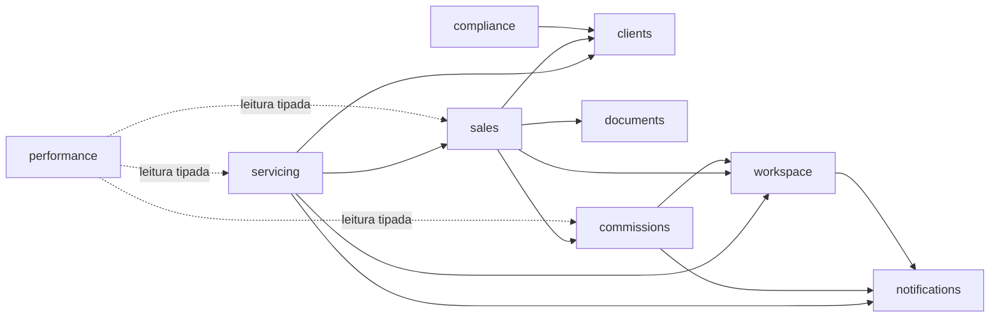

(imports em processo)

Import sempre pelo `index.ts` público do provider.

| Módulo          | Pode importar                                                                                             |
| --------------- | --------------------------------------------------------------------------------------------------------- |
| `shared-kernel` | nada                                                                                                      |
| `platform`      | `shared-kernel`                                                                                           |
| `sales`         | `clients`, `documents`, `commissions`, `workspace`                                                        |
| `servicing`     | `sales`, `clients`, `workspace`, `notifications`                                                          |
| `commissions`   | `workspace`, `notifications`                                                                              |
| `workspace`     | `notifications`                                                                                           |
| `compliance`    | `clients`                                                                                                 |
| `clients`       | —                                                                                                         |
| `insurers`      | —                                                                                                         |
| `documents`     | —                                                                                                         |
| `billing`       | —                                                                                                         |
| `notifications` | —                                                                                                         |
| `performance`   | — (leitura tipada somente-leitura das tabelas de `sales`, `commissions`, `servicing`; escrita só em Goal) |
| `search`        | — (leitura somente-leitura)                                                                               |

Todo módulo pode importar `platform` e `shared-kernel`; `platform` não importa nenhum módulo.

- **O grafo sólido deve permanecer acíclico.** Ordem topológica: `notifications` → `workspace` → `commissions` → `clients`, `documents` → `sales` → `servicing`.
- Nova linha ou nova seta = revisão de arquitetura na PR.
- Cada módulo recebe um tipo Prisma restrito (`Pick<PrismaClient, delegates próprios>`); escrita em tabela de outro módulo não compila.

---
